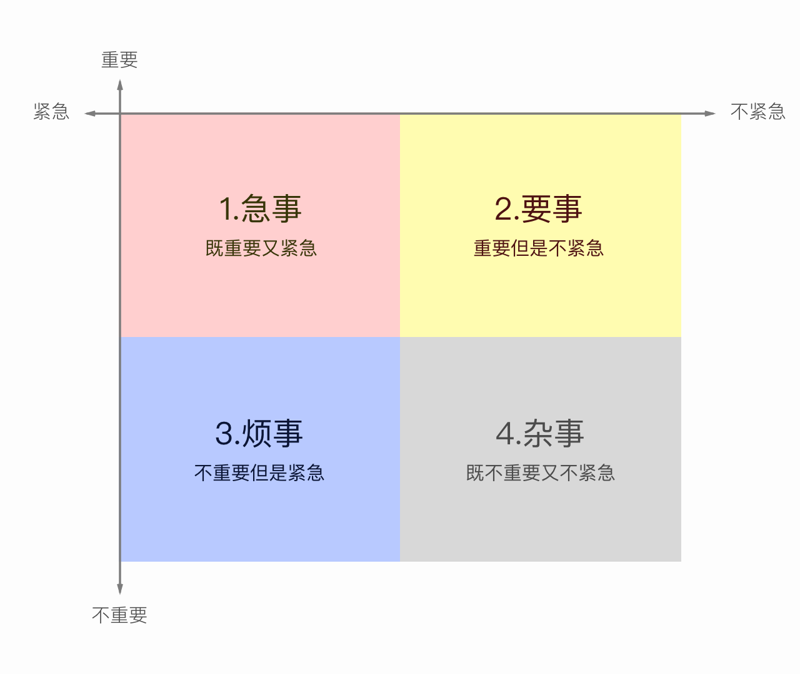
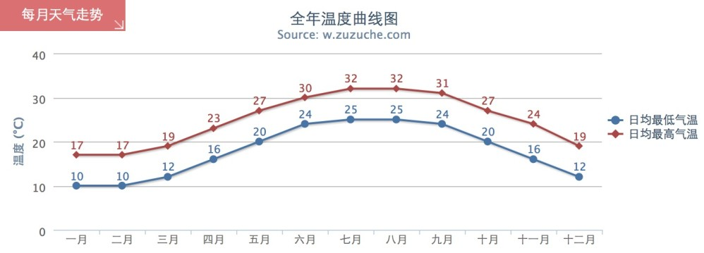
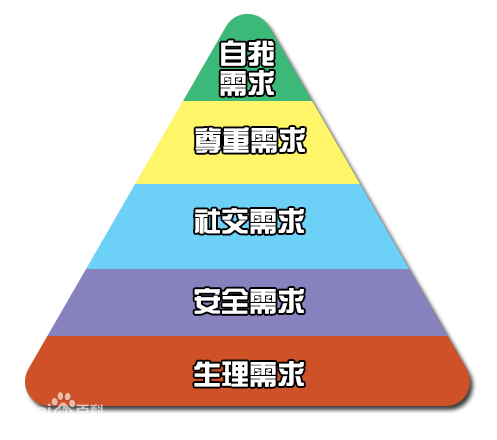
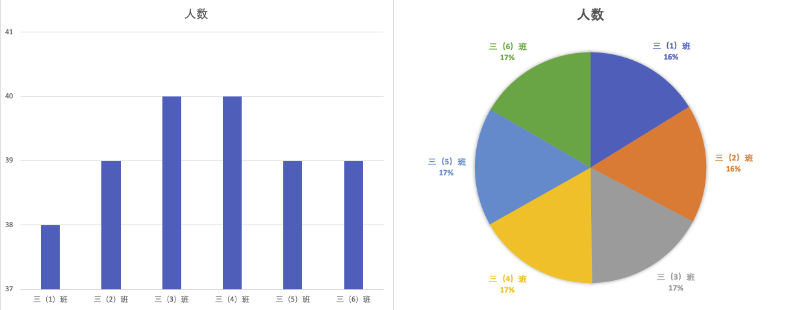
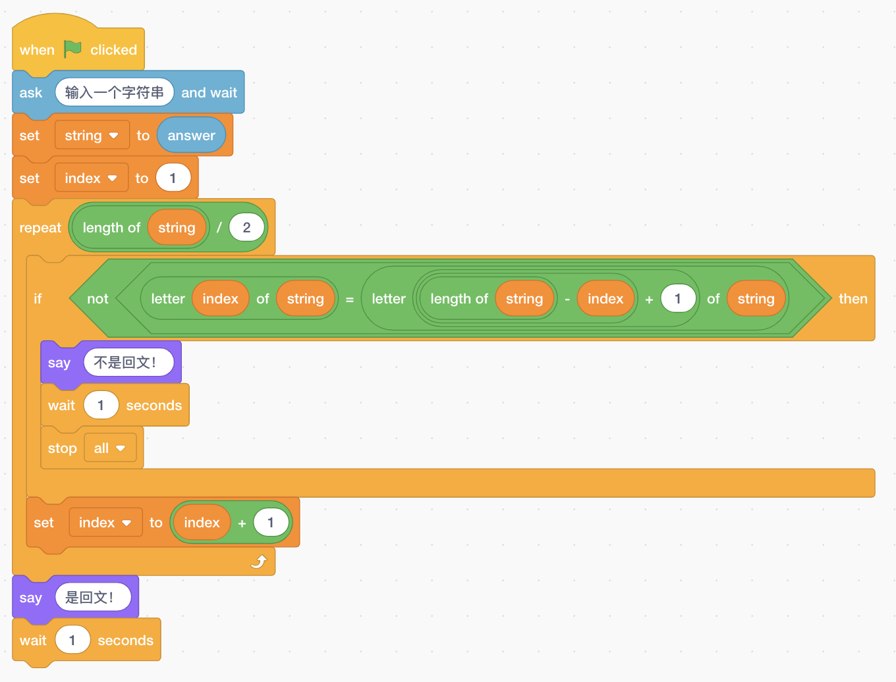

# Letters for Evan

<span id='novel-toc'></span>

## 小说目录

* [第1章 历史](#novel-chapter-001)
* [第2章 错误](#novel-chapter-002)
* [第3章 故宫](#novel-chapter-003)
* [第4章 怪兽](#novel-chapter-004)
* [第5章 药水](#novel-chapter-005)

---

<span id='cs-toc'></span>

## 计算机科学讲义

1. [序言 & 启动](#cs-chapter-001)
2. [项目管理概述](#cs-chapter-002)
3. [项目管理方法论](#cs-chapter-003)
4. [项目管理工具](#cs-chapter-004)
5. [开始 - 讲义大纲](#cs-chapter-005)

### Level 1A

6. [计算机系统——设备](#cs-chapter-006)
7. [计算机系统——硬件和软件](#cs-chapter-007)
8. [计算机系统——故障排除](#cs-chapter-008)
9. [网络和互联网——网络安全](#cs-chapter-009)
10. [数据和分析——存储](#cs-chapter-010)
11. [数据和分析——搜集/可视化/转化](#cs-chapter-011)
12. [数据和分析——推论和模型](#cs-chapter-012)
13. [算法和编程——算法](#cs-chapter-013)
14. [算法和编程——变量](#cs-chapter-014)
15. [算法和编程——控制](#cs-chapter-015)

---
<!--

<span id='cs-chapter-xxx'></span>

我亲爱的儿子：

爱你的爸爸

[回目录](#cs-toc)

第2章 错误

每个皇帝都有长生不老的梦想，哪怕是刚当上皇帝的年轻的朱允炆。

成本
固定时间
体检项目详细介绍
著名的书/著作介绍
税收的作用
巴菲特
核能、核裂变、核聚变
超出预期
通信技术
关于坚持和放弃
前天我们谈到了分工合作，这是个很大的话题，我打算用几天时间和你聊聊。
成本
利润
ROI
机会成本

CS讲义：序言：大纲，主要内容，写作计划，研究方法等
编程知识只是庞大的计算机科学（Computer Science）体系中的一部分。
计算机体系结构：硬件+操作系统+软件，架构图
图林 & 冯·诺伊曼
比尔盖茨和乔布斯

赫胥黎的名言：
> “试着去学一切的一点皮毛，和某些皮毛的一切。”（Try to learn something about everything and everything about something.）

## 2020年？月？日，星期？，？

<span id='cs-chapter-015'></span>

我亲爱的儿子：

计算机科学讲义之：**算法和编程——控制**（CSTA Identifier `1A-AP-10`）

先看标准是怎么说的：

> **开发程序与序列和简单的循环，以表达思想或解决问题。**<br>
编程被用作创建反映广泛兴趣的产品的工具。控制结构指定在程序中执行指令的顺序。序列是程序中指令的顺序。例如，在编写一个简单的动画故事时，如果对话的顺序不正确，那么这个故事就没有意义。如果编写机器人程序的命令顺序不正确，机器人将无法完成所需的任务。循环允许一个代码序列重复多次。例如，在一个显示蝴蝶生命周期的程序中，可以将一个循环与移动命令相结合，以允许角色的连续但可控的移动。

还记得2019年12月18日的算法讲义吗？

爱你的爸爸

[回目录](#cs-toc)

Q：圆周率是如何计算的？

-->

## 2020年12月15日，星期二，晴

我亲爱的儿子：

继续昨天的例子。

爱你的爸爸

## 2020年12月14日，星期一，晴

我亲爱的儿子：

又开始给你写信了，请原谅爸爸过去这段时间的偷懒行为。从现在开始，我会通过写信的方式回答你提出的问题。你知道吗？在人类探索世界的历史中，有时候提出问题比解决问题更有价值。比如一万年前的原始人，是绝对不会提出“是地球绕着太阳转，还是太阳绕着地球转”这样的问题的，因为他们连地球是球形的都不知道。

想要提出有价值的问题，需要你有丰富的知识储备，并且具备好奇而善于思考的心灵。老爸的好答案在期待你的好问题哦。

今天的问题是：股票为什么会涨跌？这是个很大的话题，需要从股票的起源和原理说起，我分几次来写。

世界第一张股票是在十七世纪的时候，由荷兰东印度公司所发行的。为了让你听得懂，爸爸不介绍和股票直接相关的股份制公司和现代公司制度，这是另外一个很大的话题，我们以后再讨论。

让我们举一个简单的例子来说明股票的原理。假定你有一家包子铺，但是缺少发展经营所需的资金（用于租房子、雇佣工人、购买设备和原材料等），于是出让包子铺的一部分所有权，并以股份的形式在股票交易所（股市）进行交易，换取一定资金。这个过程就是发行股票。

假定你出让10%的股权，发行1000股股票，发行价每股1元。爸爸对你包子铺的发展前景比较认可，于是出资100元购买了100股股票，相当于总发行量的10%，即公司总股份的`10% × 10% = 1%`。爸爸成为了你包子铺占股1%的“股东”。

这时，你包子铺的“市值”（即市场价值）为`100 ÷ 1% = 10000`元。

公开发行的股票是可以在股票交易所（股市）自由流通（买卖）的。有买有卖，股价就会产生波动，从而导致股票涨跌。

我们明天继续。

爱你的爸爸

## 2020年3月4日，星期三，晴

我亲爱的儿子：

今天继续和你分享爸爸看到的一篇文章：经常看书的人和不看书的人有什么区别？

> 小说读多了，你会见到各种跌宕起伏的人生，各种丑恶和挣扎，各种低劣和媚俗，各种憔悴和不甘，各种无奈和幽暗，你会读到各种人世间沉沦的故事，从此之后你不管面对什么事，都是你内心深处早已体验过的黑暗桥段。
>
> 历史读多了，你会见到各种大势，各种被命运洪流裹挟而去的微小个体，你会发现人的渺小，世事的既定和多变，愚蠢的重复和偶然闪现的微光，那微光如昙花一现，以至于你毫无信心能在有生之年遇见。
>
> 哲学读多了，你会见到各种价值观的形成，各种质疑的微妙，你会发现自己原本坚定相信的不过是一场虚妄，你原本嗤之以鼻的居然蕴含道理，你会不再执着于曾经那些坚守，你会用更思辨的目光看到这个亦真亦假的世界。
>
> 社会学读多了，你会发现那些司空见惯的事情，其实都其来有自，你会发现人类社会不过是一张想象中的草图，自以为是的运作，你会发现有些温暖的事情，其实背后都隐藏着冰凉的考虑和目光，你是系统的一分子，你轻若浮萍。
>
> 人类学读多了，你会发现人类不过就是一种奇特的动物，你会发现我们没有什么高尚，没有什么特殊，我们只是披着一张现代文明的外衣，行鼠窃狗偷之事，我们只是一边诉说着一个个虚假的故事，一边满足着各种贪欲。

和你共享。

爱你的爸爸

## 2020年3月3日，星期二，晴

我亲爱的儿子：

今天爸爸看到一些不错的小习惯，摘抄一些对你有用的条目，和你分享一下：

> 16、推门的时候如果身后有人可以帮忙扶一下，这既是应有的素质，也防止门关的过快夹到后边的人。
> 
> 18、电脑下载的东西别放C盘。下载时尽量给每个文件做好备注，不然以后会很乱。
> 
>19、每天坚持早上七点之前起床，晚上十一点之前入睡，清晨的粥比晚上的酒好喝。
>
>24、每周固定抽出两个小时的时间来进行阅读。无论什么时候都不要忘记提升自己，互联网固然是好，可是你仔细想想，每次你准备打开电脑看个视频学东西的时候，是不是莫名其妙的就打开了游戏玩了起来，每次总说玩一会就好，但是玩着玩着时间就都过了。你的时间就是这么浪费的。
>
>30、打喷嚏时不要对着人，禁止随地吐痰。
>
>31、晚上脱衣服时把它规制好放在床边，会减少第二天起床的困难程度。
>
>34、穿过有门帘的地方时回头看一下，如果身后有人就帮他举一下门帘，不然打到身上还是很难受的。
>
>35、如果是自己下车比较方便，下车后为别人护一下头，不用太刻意，待到大家都下车后再顺手把门关上。一般不注意的话别人都会以为你只是想关车门。
>
>37、少吃含糖的东西和碳酸饮料，不仅会发胖的厉害，还会使皮肤老化。
>
>41、心情不好的时候可以去适当运动，身体上的劳累会减少心理上的压力。
>
>42、多说谢谢你。当别人帮助完你的时候，记得说一句“谢谢你”，谢谢是随口一说，谢谢你是表明了一种态度。

爱你的爸爸

## 2020年3月2日，星期一，晴

我亲爱的儿子：

今天下午，有一位同事向爸爸提出辞职。他辞职的理由是：

1. 经常加班，他不能适应团队的工作节奏；
2. 他认为我们正在使用的技术不是他希望从事的；
3. 他认为自己在公司没有成长空间。

我和他聊了两个小时，最初我希望他能留下，因为他的工作能力还不错，之前表现出来的工作态度也还可以。但是通过交谈，我发现他存在几个明显的问题：

1. 主动沟通的意愿和能力太差。对团队、对工作有意见，不第一时间提出，而是选择在无法忍受的时候直接辞职；
2. 不坦诚。通过谈话我发现，他真实的辞职理由可能是嫌工资太低，想要出去寻找更高工资的工作；
3. 对自己、对公司不负责任。他在还没有找到新工作的情况下，贸然提出辞职，这是对自己不负责任；而他在我们的项目非常紧张，急需人员的情况下辞职，是对项目和公司不负责任的行为。

综上，爸爸认为，虽然他工作能力还可以，但缺乏起码的诚信和责任，不能算是一个好员工，因此，对他的辞职我不再感到惋惜。我也希望他在未来的工作中能够成长，懂得珍惜，学会责任。

以上是爸爸今天上班的一点见闻，我和你共勉。

爱你的爸爸

## 2020年3月1日，星期日，雨

我亲爱的儿子：

对不起，这段时间因为各种原因，爸爸停止了每天写给你的信。今天是三月的第一天，爸爸决定重新开始过去坚持了半年的写作。在过去的半年中，我已经累计写了近两百篇，十万多字，真是一件很不容易的事。

但坚持更难。因为忙，以及各种特殊情况（春节奶奶来这里、没有时间、还有惰性等），在过去的一个月里，爸爸还是偷懒了，除了2月10号的开工邮件，爸爸整整停写了一个月。

但爸爸看到了你在这一个月里的进步，虽然在假期，以及因为疫情不能去上学，你还是在通过各种方式进行学习，你的英语和电脑水平都突飞猛进。这种对比，让爸爸非常惭愧，我下定决心，从今天开始，继续我的写作。

从今天起，请你继续监督爸爸。谢谢你，我亲爱的儿子。

爱你的爸爸

## 2020年2月10日，星期一，晴

我亲爱的儿子：

今天是上班的第一天，爸爸给同事们写了一封信，也发给你看看。

> 各位技术部的小伙伴，今天是我们年后回到工作岗位的第一天。在这个特殊的假期，我们经历了突如其来的疫情，推迟复工、甚至无法返沪。。。我们的团队从2月1日开始在家工作，大家克服远程办公的不便，虽然没有打卡、也无法监督，但是大家以极大的热情和自律，积极推动项目进展。虽然在家办公，很多人比平时上班时间还长，加班更晚，谢谢大家为团队，为项目的付出！
>
> 这次疫情，给很多企业带来了生与死的挑战。大家也知道，爱贝是以运营线下加盟店为主的公司，疫情导致的停课停学，对爱贝的冲击是很大的。集团为了支持加盟商度过难关，还主动推出了2020年1月和2月的权益金限免政策，这相当于全年1/6的收入。在这样的情况下，公司竭尽全力，为大家准备口罩和手套，并花费重金为每一位员工进行病毒检测。这是爱贝人的精神，也是责任和担当。
>
>当此时刻，集团的很多同事，远在家中，通过夜以继日的工作，克服各种困难，推出了爱贝线上课程。同时，在我们的努力下，爱贝迪的直播公开课也同步上线了。
>
>但我们也看到，爱贝迪现有的系统和课程体系，还不能很好的支持线上开课。疫情终将过去，通过这次事件，我们看到了挑战，也看到了机会，线上线下融合式教学，必然成为未来教育行业的趋势。
>
>技术部承担着爱贝迪线上产品开发的重担，我们的很多产品在设计之初也考虑了横向支持集团其他业务的可能。在这样的大趋势下，我们深感责任重大，既充满斗志，又战战兢兢；既希望把基础打牢，又希望早日上线，支持业务。
>
>让我们一起努力，做出优异的成绩，克服困难，抓住机遇，共创爱贝迪和爱贝集团的美好未来。也期待因疫情尚未归队的兄弟早日回归，大家并肩战斗！

爱你的爸爸

## 2020年1月30日，星期四，晴

<span id='cs-chapter-014'></span>

我亲爱的儿子：

计算机科学讲义之：**算法和编程——变量**（CSTA Identifier `1A-AP-09`）

先看标准是怎么说的：

> **通过使用数字或其他符号来表示信息，模拟程序存储和操作数据的方式。**<br>
现实世界中的信息可以用计算机程序来表示。学生可以用拇指朝上/朝下表示是/否，写算法时用箭头表示方向，或者用数字、象形文字或其他符号表示字母或单词进行编码和解码。

上次介绍了算法。算法除了描述完成一件事情的步骤和方法外，还需要处理数据。

我们来看这样一个算法:

```text
两个数的和(a, b):
    返回 a + b;
```

```text
调用算法：两个数的和(2, 3)，返回5；
调用算法：两个数的和(10, 20)，返回30；
```

在这个算法中，需要计算两个数的和。算法中用于表示这两个数的符号`a`和`b`就是变量（variable）。变量，顾名思义，就是可以变的量。对算法而言，需要处理的数据是不确定的，当计算2和3的和时，`a=2，b=3`，当计算10和20的和时，`a=10，b=20`。

变量就是用来存储算法需要处理的数据的。变量有两个最重要的特征：

* **变量名**：为了在算法中使用变量，需要给变量一个名字，如上面算法中的`a`和`b`；
* **变量值**：变量在程序实际运行的过程中，每一时刻都有一个确定的值，如上面的`两个数的和(2, 3)`中，`a=2，b=3`。

变量的名字一旦确定，在程序中不可改变；但变量值在程序运行中是可以改变的。比如，用`age`表示你的年龄，今年`age=10`，到明年age就要增加`1`，变成`age=10`。

顺便说一下，在计算机编程语言中，有一个很基本，但看上去也有点“奇怪”的语句，叫赋值语句（assignment），比如把age增加1的语句如下：

```text
age = age + 1;
```

这里的`=`符号不是“等于”的意思哦。因此，这个语句不是表示“age等于age+1”，这在数学上是不成立的。这个语句的意思是：把age的值+1，然后再“赋值”给age自己。于是，当这条赋值语句被执行后，它的值就增加1了。

爱你的爸爸

[回目录](#cs-toc)

## 2020年1月29日，星期三，晴，大年初五

我亲爱的儿子：

你知道吗？大年初五在正月里也是比较重要的日子。我在2020年1月21日的信里写过，初五迎财神，同时，初五也是“过年”的最后一天，过完初五，就算是过完年了，商店开门、工厂上班、整个社会基本恢复正常运作。在有些地方，也把正月十五（元宵节，又叫小年）看作过年的最后一天，不过现在多数人不这么想，因为整个社会的节奏都很快，很少有人能悠闲的在家休息到正月十五之后才开始工作。

好吧，我们也把今天作为过年的最后一天。从明天开始，虽然还没有开始上班上学，但是我们应该逐步回到正常的作息，白天你学习，爸爸在做饭之余，也要抽出点时间工作和看书了。当然，毕竟还是在假期，我们每天还是可以有一定时间娱乐、看电视、玩iPad的。

爱你的爸爸

## 2020年1月28日，星期二，阴，大年初四

我亲爱的儿子：

今天我们搭了一天乐高，都没时间写信，哈哈，征得你的同意，暂停一次哦。

爱你的爸爸

## 2020年1月27日，星期一，雨，大年初三

我亲爱的儿子：

今天我们总算出门了，带着奶奶开车兜了一圈，见识了肺炎阴影笼罩下，春节期间的上海街头，空空荡荡的，没有多少人，车子也很少。这是对自己负责，也对大家负责的行为。传染病当前，我们普通人帮不上什么忙，唯一能做的，就是尽可能待在家里，减少传播疾病的可能，这是当前对国家和社会最大的帮助。

今天我们还搭了积木，明天应该可以全部完工。很期待遥控的积木车开起来的样子，一定很好玩。

爱你的爸爸

## 2020年1月26日，星期日，雨，大年初二

我亲爱的儿子：

今天是继续窝在家里的日子，除了吃，玩iPad、手机、电脑，就只有看电视了。我们和全国的很多人一样，都在关注新型冠状病毒肺炎的情况。这一次和十多年前的非典一样，全社会一起，抗击疾病。大家齐心协力，一定能克服困难，战胜病毒。

你知道吗？历史上最严重的瘟疫是发生在十四世纪的黑死病，导致全世界死亡7500万人。下面是参考资料，你可以看看。

参考资料：

* [盘点人类最严重的十大"瘟疫"](https://baike.baidu.com/tashuo/browse/content?id=4c205afcd2f71334abb51101)

其他方面，今日无事，明天继续，哈哈哈。

爱你的爸爸

## 2020年1月25日，星期六，雨，大年初一

我亲爱的儿子：

今天是鼠年大年初一（正月初一），拜年的日子。

爸爸小时候，大年初一都是被爷爷的鞭炮声吵醒，然后爷爷会来到爸爸床边，相互说一些吉利的话，爷爷还会给爸爸嘴里塞一块糖呢。

起床穿新衣，拿压岁钱，吃汤圆，然后就出门拜年啦。就像2020年1月19日的信里写的，那是小朋友最开心的时候，因为呀，不光可以拿红包，还可以吃到很多糕点和糖果呢。

今年的春节在上海过，本就没有亲戚可以走动，加上肺炎传播的风险，连出门都免了。好在有电话和网络，虽然和亲戚们相隔百里甚至千里万里，但依然阻隔不了大家相互拜年。我想，有这么一个时候，让亲人和朋友可以记起对方，相互问候，这就是中国“年”的意义吧。

参考资料:

* [大年初一](https://baike.baidu.com/item/%E6%AD%A3%E6%9C%88%E5%88%9D%E4%B8%80/2655408?fromtitle=%E5%A4%A7%E5%B9%B4%E5%88%9D%E4%B8%80&fromid=9974377&fr=aladdin)

爱你的爸爸

## 2020年1月24日，星期五，雨，除夕

我亲爱的儿子：

今天是2019年猪年的最后一天，明天就是鼠年啦。除夕夜，除了贴春联、放鞭炮，最重要的事情就是看春节联欢晚会了。从1983年开始举办的春晚，至今已经30多年了。从爸爸记事的时候起，和家人一起吃年夜饭，看春晚，已经成为一种习惯。每个除夕的晚上，从吃完晚饭开始，一直看到凌晨12点多，对小时候的爸爸来说，是难得的放肆机会。我想，对你来说，也一样吧？

猪年，再见咯！鼠年，我们来啦！

爱你的爸爸

## 2020年1月23日，星期四，雨

我亲爱的儿子：

今天我们终于贴好对联了，谢谢你的帮忙。你知道吗？贴对联的时候如果没有人在旁边帮忙看着，是很容易贴歪的。

今天聊聊送礼吧。

送礼一般会选择实用的东西，如衣服、食物等。长辈一般不用给晚辈回礼，但如果是平辈之间送礼，就要回赠礼物，所谓“来而不往非礼也”，意思是说，人家给你送了礼，你需要回礼给对方。回礼的物品一般不能和别人送礼的物品相同，那会显得你很不用心；回礼也不能比原来的礼物贵重或便宜太多。太贵重会让对方不舒服，太便宜会显得你没有诚意。

每到过年的时候，爷爷奶奶和爸爸也要送礼。爸爸送礼是作为晚辈，给姨奶奶、舅爷爷等长辈送，表达敬意。爷爷奶奶送礼通常是作为平辈，给自己的兄弟姐妹和好朋友送礼，表达亲情和友谊。当然也有给亲戚朋友家的小孩（晚辈）送礼的情况，这是作为长辈表达对晚辈的爱意。

送出去的礼物，既要适合对方的身份，比如，不能给姨奶奶送文具，也不能给小朋友送保健品；也要价格合适，太贵或太便宜都不太好。送礼真是一门很深的学问呢。

> 世界各国都有送礼的习俗，传统意义上都是送些实物的东西。送礼是普遍存在的社会现象，它存在于人类社会的各个时期、各个地区。一件理想的礼品 对赠送者和接受者来说，都能表达出某种特殊的愿望，传递出某种特殊的信息。中国人一向崇尚礼尚往来。《礼记·曲礼上》说：“礼尚往来，往而不来，非礼也，来而不往，亦非礼也。”

参考资料：

* [送礼](https://baike.baidu.com/item/%E9%80%81%E7%A4%BC/210780)

爱你的爸爸

## 2020年1月22日，星期三，雨

我亲爱的儿子：

爸爸这几天忙于为年后的一个会议准备PPT，以及过年前的项目冲刺，所以都没时间带你去吃捞王，也没时间回来贴对联、陪奶奶。好在有你，我想奶奶在这里应该不孤单。

今天晚上我终于写的差不多了，明天上午就可以完成第一个版本，春节后再用1-2天时间修改一下，应该就可以了。

明天晚上如无意外，爸爸可以准时下班，回来带你去吃猪肚鸡，好不好？还有，关于过年的信，今天来不及写了，暂停一次，明天继续。

## 2020年1月21日，星期二，晴

我亲爱的儿子：

过年的另一个活动是放鞭炮、看烟花。大城市这些年出于保护环境和消防安全的考虑，已经禁止燃放鞭炮和烟花了，这让我们少了不少乐趣，感觉“年味儿”少了很多。不过社会在进步，过去不环保不安全的习俗逐渐被改变，这符合时代发展的需要。

在爸爸小时候，人们还意识不到环保的问题。过年放鞭炮是必做的活动。

腊月里，大人们就会买好鞭炮，还会趁着天气好的时候，拿到院子里晒一晒，防止受潮。

一般我们家会放三次鞭炮：

* 除夕晚上：鞭炮炸响，和旧的一年告别。同时，在关于“年”这个怪兽的传说中，鞭炮的响声可以吓跑怪兽，怪兽跑了，大家就“过年”了。爸爸会和爷爷一起放，给爷爷递鞭炮，爷爷负责点火，而我一般早就捂着耳朵躲得远远的了。

* 初一早上：当爸爸还在睡觉的时候，爷爷早就起床，在院子里炸响新年的第一声鞭炮，把我叫醒。新年的鞭炮声意味着喜庆和热闹。

* 初五晚上：放鞭炮，迎财神。财神是财富的化身，希望财神能来到家里，带来财富和幸运。

大都数人家也都在这三个时间放鞭炮，只不过时间有先有后。所以啊，除夕晚上、初一早上和初五晚上，鞭炮声此起彼伏，不绝于耳，想要安静地看电视或睡懒觉，那是不可能的啦。

小孩子们也会用自己的零花钱，买些小鞭炮、掼炮或烟花玩。还会想出很多花样，比如点着了扔到水里，如果时间刚刚好的话，可以炸出水花来。太早了，鞭炮会被水熄灭；太晚了，会提前爆炸。也会玩一些恶作剧，比如趁大人不注意，把鞭炮扔到炉子里，突然炸响，把大人吓一跳。

不知不觉，爸爸已经写了5个月，10万多字了。我希望，这些文字就和爸爸小时候过过的年一样，也会成为记忆，刻在你的脑海里。

爱你的爸爸

## 2020年1月20日，星期一，晴

我亲爱的儿子：

今天聊聊吃。中国人特别重视吃，每到过年的时候，表现的特别突出。

爸爸小时候也没现在这么多零食，偶尔吃到一块糖或饼干，是很高级的享受。在爸爸10岁之前，甚至连肉都不是每天吃得到的，家里每个月攒钱买几次肉，对小朋友来说，也是非常开心的事。

但是不管平时怎么节省，每到过年，家里一定会准备很多很多吃的。通常进入腊月就开始准备了。腊月里由于天气寒冷，即使没有冰箱也能很好的储备食物，因此，大人们会杀鸡杀鱼，和买来的猪肉、羊肉一起，用盐、香料等腌制后风干起来。到了过年的时候，风干的肉可以清蒸，也能红烧，吃起来有一种自然的腊味，特别美味。

还以用猪肉拌上香料、盐、酱油、料酒等，和肠衣做成香肠，一条条的挂起来吹干。以前奶奶会做好多，有些自己吃，有些送人。成片的香肠挂在那里，是一道特别的风景。有几次挂的太低，便宜了家里的猫，夜里偷吃了好几根，哈哈哈。

除了鸡鸭鱼肉，还会准备糖果、糕点、花生和瓜子。过年的时候不光自己吃，还用来招待客人。昨天说到，小孩子最喜欢拜年了。拿到的红包通常交给爸爸妈妈，自己其实得不到，但大人们塞在孩子们口袋里的糖果和点心，可是实实在在的进了自己的小肚子的。

除了这些，爸爸印象最深的是“蒸馒头、大饼和包子”。“蒸”，取“蒸蒸日上”的意思，腊月里“蒸”一“蒸”，象征着来年一整年顺顺利利，日子蒸蒸日上。在“蒸”之前，要提前好几天准备发面和包子馅儿。发面的过程很有趣，面粉中加入酵母粉，用热水揉成面团，再用被子捂起来保暖，用不了一天，酵母就会发酵，在面团里产生大量极其微小的气泡，使面团的体积变成原来的好几倍。用这样的发面蒸出来的馒头和包子，才会松软可口。包子馅儿也是重头戏。有肉的、青菜的、萝卜丝的、还有豆沙的。

到了“蒸”的那一天，通常好几家人一起合作，有的负责烧火加水，有的负责做馒头、做饼，有的负责包包子，有的负责掌握火候，有的负责起锅。大家一边工作，一边聊天，一边品尝蒸出来的食物，是很有意思的社交活动。每到这一天，小孩子们也特别开心，因为，他们可以敞开了吃。爸爸小的时候，有一年，每一笼蒸出来的包子，我就吃一个，结果一天下来吃了几十个，小肚子都撑坏啦。

爱你的爸爸

## 2020年1月19日，星期日，晴

我亲爱的儿子：

爸爸小的时候，新衣服可不像现在这么稀松平常。小孩子会尽可能穿亲戚或朋友家的哥哥（姐姐）穿过的衣服，等自己个子长高了，就把嫌小的衣服鞋子给别的弟弟（妹妹）穿。所以小孩子经常穿旧衣服。由于大家都一样，也没有人觉得衣服不好看或丢人。

但小孩子过年是一定要穿新衣服的。家长们会在腊月（农历12月）里给自己的孩子准备好漂亮的新衣服和新鞋子。有的是买的，有的甚至是自己做的呢。小朋友们也很期待，腊月里时不时把新衣服偷偷拿出来看一看，试一试。

家里条件好的，大人们也给自己做新衣服；条件不好的，大人们舍不得做新衣服，就只能继续穿去年的衣服啦。

到了除夕，除了大扫除、贴春联，还要洗澡，把自己也洗的干干净净的。那个时候家里都没有淋浴房，大家都到澡堂子里洗澡。由于人很多，浴室里站满了光溜溜的人，连个坐的地方都找不到，现在想起来，真是太有趣了。

大年初一，小朋友们都穿着漂漂亮亮的新衣服出去拜年啦。吃糖果、拿红包、放鞭炮，开心极了。有一次，爸爸的一个小伙伴放鞭炮，把自己的新衣服烧了个洞，哭了好久呢。

爱你的爸爸

## 2020年1月18日，星期六，阴

我亲爱的儿子：

今天早上出发前，我帮奶奶家里贴好了春联。正好最近在和你聊过年的事儿，今天就说说春联吧。

> 春联，又称“春贴”、“门对”、“对联”，是过年时所贴的红色喜庆元素“年红”中一个种类。它以对仗工整、简洁精巧的文字描绘美好形象，抒发美好愿望，是中国特有的文学形式，是华人们过年的重要习俗。当人们在自己的家门口贴年红（春联、福字、窗花等）的时候，意味着过春节正式拉开序幕。

> 每逢春节，无论城市还是农村，家家户户都要挑漂亮的红春联贴于门上，辞旧迎新，增加喜庆的节日气氛。春联的另一来源是春贴，古人在立春日多贴“宜春”二字，后渐渐发展为春联，表达了中国劳动人民一种辟邪除灾、迎祥纳福的美好愿望。据说这一习俗起于宋代，在明代开始盛行。

爸爸小时候，家里贴春联是爷爷的工作，爸爸通常也会很开心的帮忙。要贴的地方可不少：窗户上要贴窗花、墙上要贴福字、门上要贴对联、门楣上要贴横批、门框上也要贴两幅细长的对联。而且所有的门都要贴哦。有些人家连养鸡的鸡舍都贴呢。

贴之前还要做不少准备工作：

* 打扫卫生。除夕全家总动员，打扫卫生，净宅驱赶晦气。除夕是最后一天，把家里家外都打扫一遍，只有干干净净的房屋，福禄寿星才会喜欢。打扫的时候会顺便把门窗擦洗干净，清理掉前一年贴的旧春联。

* 买春联。这是爸爸最喜欢的环节。爸爸会跟爷爷一起上街，挑选喜欢的样式和内容。当然也会顺便买点蜡烛鞭炮和好吃的啦。

* 准备浆糊。最早会自己用面粉“打浆糊”：把水烧热，然后把面粉撒进去，一边撒，一边搅和，就变成粘粘的浆糊啦。后来超市里有现成的瓶装浆糊卖，又便宜又好用，就不再自己“打浆糊”了。

到了贴春联的时候了。那也是很有技术含量的工作呢。先要在对联的背面抹上浆糊，然后小心的贴到门上。既要贴的正、又要平整，不能皱，中间不能有气泡。通常会从上面开始，从上往下抹。一边抹，一边小心的调整。还不能用手直接抹，因为手上可能沾着浆糊或水，会把对联弄脏。一般会用一块干布代替手，这样贴出的对联既平整又干净，非常美观。

爷爷在忙的时候，爸爸会给爷爷打下手：搬凳子、扶凳子、递东西、帮忙看贴的正不正、两边是否对齐等等。那真是最美好的回忆。

参考资料：

* https://baike.baidu.com/item/%E6%98%A5%E8%81%94/688396

爱你的爸爸

## 2020年1月17日，星期五，晴

我亲爱的儿子：

爸爸已经到奶奶家了，现在正坐在床上给你写信呢。我看到你的床已经收拾好，做好迎接奶奶的准备了。今晚你睡在上铺还是下铺呢？明天一大早爸爸就和奶奶出发回来了，你准备好带奶奶去哪里玩了吗？奶奶的腿不太好，你可不能带她坐地铁啊。:-)

爱你的爸爸

## 2020年1月16日，星期四，晴

我亲爱的儿子：

你最近对贴春联很感兴趣，这让爸爸想起了小时候。

爸爸小的时候，过年是大事儿。过年可以穿新衣服，吃到各种好吃的；可以放鞭炮看花灯，还可以拿压岁钱。对你来说，新衣服和好吃的平时也有，所以对过年没有太多期望；上海现在也不允许放鞭炮，这一项乐趣也没有了；花灯似乎也少见了，只有城隍庙等少数地方可以看到。

不过过年的感觉还是有的。中国人以农历新年为一年的开始，也是从年初一开始，每个人都增加一岁。过年也是团圆的时候，一家人，不管平时相隔多远，过年总要尽可能聚在一起，畅谈过去一年的收获，畅想未来一年的计划。大家把酒言欢，其乐融融。

接下来的几天，爸爸就给你讲讲我小时候是怎么过年的。最近实在太忙，爸爸只能把平时一封信的长度，拆成几次写给你了，别见怪啊，我的儿子。

爱你的爸爸

## 2020年1月15日，星期三，晴

我亲爱的儿子：

爸爸今天超过12点才给你写信，按规则，罚款100，放你iPad上了。最近爸爸发现，坚持写作越来越难了，加上工作比较忙，常常不知道写什么好。你能给我点思路吗？比如，用爸爸喜欢的问问题的方式，你提问，我回答。这样既能解答你的问题，也能解决我的问题。

爱你的爸爸

## 2020年1月14日，星期二，晴

我亲爱的儿子：

还记得2019年9月16日爸爸和你分享过的关于面试的流程吗？今天再和你分享一件关于面试的事。爸爸的公司昨天面试了一个人，到了老板的那一轮，老板觉得他不太善于表达，决定淘汰他。本来他已经没有机会了，但是他很诚恳的给老板写了一封信，表达了自己对这份工作的渴望。

以下是他的信：

```text
    非常感谢贵公司给我的面试机会。今天收到没有通过面试的通知十分遗憾也十分懊悔，遗憾错失了与爱贝一起成长的机会，懊悔自己面试表现不佳。

    从小父亲就教导我“少说多做”，不要说大话说狂话，要用行动来证明一切。所以我在工作中都是认真的，主动的，敬业的，不惜多花时间，多耗精力去完成工作，去准备工作。在完成自己工作之余，如果能帮到同事或他人，我也会在力所能及的范围内去帮助别人。在我的第一份工作中，我通过自己的积极主动学习，从一个初出茅庐的毛头小子成长为组内骨干成员，Team Leader的左膀右臂。在第二份工作中，我协助项目经理在一个月中把新项目所涉及的浩瀚繁杂的文档归纳吸收，加班加点地整理设计培训方案。项目上线初期承担了大量的基本工作，还会帮助没有经验的同事做每日例会，总结优化流程和知识库，虽然工作量巨大，依然完成的相当出色。第三份晶赞科技的工作，偏向研发环境，所以接触到了一些没经验或者不熟悉的知识，我都是自觉地自学自练，认真观摩同事的操作和讲解，去掌握去融汇。在日常工作中，办公室同事遇到问题，我都是第一时间去帮忙解决，如果是在外的同事，我也会想办法远程处理，甚至坐地铁到现场处理。虽然在晶赞只有四个月，但和运维部的几个同事已经建立了深厚的友情，得到了他们以及全公司员工的认可。

    在之前的三份工作中，我都是通过自己的工作能力，学习能力和热心主动的态度获得了同事，以及领导的认可。虽然已经不在一起工作，依然保持着友好的联系。

    父亲还教导我要“尊敬师长”，所以在面对前辈长辈的时候，我都是谨言慎行，多听少说。初次见面，别人对我的影响一般都是“话不多”，但“很乖”。这可能是我的一个缺点，不够积极主动地表现自己，但我不希望因为这个原因错失了与爱贝的缘分，因为我是非常看重爱贝的工作岗位的。不知道是否方便把我的邮件转发给柴总，如果实在不方便，依然感谢您们提供的面试机会。

    非常感谢！！！
```

老板看到信后，对他的印象有了很大改观，决定录用他。

这件事给我两个启发：

1. 良好的表达和写作能力，是他最终能得到这个工作的关键；
2. 不气馁、不放弃、坚持、主动，才有可能成功。

和你共勉。

爱你的爸爸

## 2020年1月13日，星期一，晴

我亲爱的儿子：

听说你的语文考试取得了好成绩，爸爸为你感到非常高兴，很棒！这次期末考试，虽然没有得到330分的满分，但是爸爸依然为你的成绩感到骄傲。

爸爸想了想，虽然按照约定，不能给你双倍积分，但是考虑到你付出了极大努力，并且取得了很好的成绩，爸爸给你1.5倍积分，你看怎么样？

爱你的爸爸

## 2020年1月12日，星期日，晴

我亲爱的儿子：

你说的对，爸爸必须在12点前写完信并发给你才算按时完成，所以，爸爸赶时间，完成今天的作业，哈哈。

另，爸爸买了你喜欢吃的草莓冻干，应该是脆脆的那种哦。

爱你的爸爸

## 2020年1月11日，星期六，晴

我亲爱的儿子：

爸爸今天给你出的研究任务是：调查一张纸币的相关知识。除了那张纸币，没有给你任何其他线索，这需要你学会观察，并利用观察得到的线索，通过询问、电脑搜索等方式找到答案和相关资料，并把结论整理成报告。

这是一种独立研究的能力。

* 首先，你需要找出问题。关于一张纸币，可能的问题是：这是哪个国家的纸币？相当于多少人民币（汇率）？这个国家的背景知识、历史、纸币发行的相关信息等；

* 然后，你需要从很少的线索中进行观察，找到更多的线索，然后才能利用电脑进行搜索，找到相关的信息；

* 最后，你还需要从找到的信息中提取出相关（有用的）内容，进行整理，并用合适的方式（如Word文档）汇总成一个报告。

你今天的任务完成的不错哦，爸爸为你感到骄傲！

爱你的爸爸

## 2020年1月10日，星期五，晴

我亲爱的儿子：

听说你已经得到260分了，好厉害！期待你的第三个满分哦。

今天的地铁之旅怎么样？爸爸建议你把所有去过的地铁站在地图上标出来，这样就知道去过那些地方了，下次爸爸可以陪你去不同的地方参观。记得拍照打卡哦。

爱你的爸爸

## 2020年1月9日，星期四，晴

我亲爱的儿子：

昨天我们说到了红利（bonus）。先看看红利原本的意思。简单来说，就是投资得到的分红。

> 红利是指上市公司在进行利润分配时，分配给股东的利润。一般是每xx股，派发yy元，股东在获得时，还要扣掉上交税额。普通股股东所得到的超过股息部分的利润，称为红利。

现在很多时候用红利来比喻额外的好处。比如“人口红利”，是指中国很大，人口很多，因此劳动力便宜，各行各业能以较低的人力成本提供比较便宜的产品，在价格竞争中相对有优势。2019年12月25日的信中，我们提到了中美贸易战，中国的商品比美国本土企业生产的产品便宜，是导致贸易战的一个重要原因。

中国的“人口红利”使得中国在最近几十年的发展中取得了很大优势，从建国初期一穷二白的的落后状态，成为目前全世界经济总量第二的国家。

我们还说到一个新词：“苟且红利”或“懒惰红利”，意思就是说，虽然看起来所有人都在做事，但是其中有大量的苟且者（懒惰者）。你只要稍微比他们往前一点点，就能享受到的那个红利，就是苟且红利。我们在停车场扫码缴费，就能比很多人少排队，就是这个意思。

爱你的爸爸

## 2020年1月8日，星期三，晴

我亲爱的儿子：

听说你今天沙龙数学考的不错，赞！

明天爸爸全身上下都穿灰色，全力支持你考试，哈哈。

爱你的爸爸

## 2020年1月7日，星期二，晴

我亲爱的儿子：

听说你最近的学习状态很好，在学校的词语大比拼中获得满分，爸爸非常开心。虽然爸爸没有多少时间陪你，但你还是以强大的学习动力和学习能力取得不错的成绩，爸爸为你骄傲。很快就要期末考试了，等考完试，爸爸带你去泡澡好不好？

另外，你应该考虑下，怎么欢迎奶奶过来哦。还有，你暂时睡到上铺的事情，想好了吗？

爱你的爸爸

## 2020年1月6日，星期一，晴

我亲爱的儿子：

今天有两件事和你讲一讲：

1. 下午爸爸又在公司演讲了。由于最近讲的机会比较多，所以爸爸的表现越来越好，不再那么紧张，也越来越能自如的表达自己的思想了。但是，优秀的演讲应该是轻松自如、有感染力的，爸爸还有很大的差距，我要加油！

2. 晚上爸爸公司又组织聚餐，爸爸和同事喝酒了，所以今天没有开车回来。明天早上我们要么坐公交，要么打车，看明早的时间吧。

你今天的沙龙考试怎么样啊？

爱你的爸爸

## 2020年1月5日，星期日，雨

我亲爱的儿子：

你知道吗？最近有一则新闻：从2020年1月1日起，《全国487个高速公路省界收费站全部撤销》，意思是说，高速公路上省和省（或直辖市）之间的收费站全都取消了。这次爸爸回安丰的路上，体验到这个变化了。

过去从上海去奶奶家，需要经过5个收费站：从上海进入高速的收费站、出上海的收费站、进入江苏的收费站、苏通大桥收费站、到达安丰出高速的收费站。除了从上海进入高速和到达安丰出高速的收费站，中间三个收费站经常发生拥堵，浪费了我们很多时间。

> 数据显示，撤站后在正常通行情况下，客车平均通过省界的时间由原来的15秒减少为2秒，货车通过省界时间由原来的29秒减少为3秒。

过去设置这么多收费站的原因是：每个省的高速公路都是自己出钱建设的，各个省也单独对自己境内的公路进行收费，甚至一座大桥、一个隧道都单独收费。所以从上海到奶奶家，才需要5个收费站。

为了减少收费站，提高高速公路上的通行效率，需要进行全国联网收费，统一结算，这不是一件简单的事情：

* 需要建设更多的ETC自动收费通道，并给更多的车安装ETC设备；
* 需要建设全国统一的收费结算系统，并和各个省的高速公路收费系统进行对接；
* 高速公路上的收费站需要进行拆除或改造；
* 撤销487个收费站后，全国有1.2万名收费员失去了工作，需要对他们进行安置，给他们解决就业问题。

参考资料：

* http://www.xinhuanet.com/fortune/2020-01/02/c_1125413094.htm

爱你的爸爸

## 2020年1月4日，星期六，雨

我亲爱的儿子：

爸爸很早就出发了，所以没有和你道别，让你多睡会儿。今天还下着雨，正好你在家好好复习，为期末考试做充分的准备。

下午我还和奶奶去东台看望了姨奶奶。姨奶奶带我们去东台的菜场买东西，一个售货员以为姨奶奶是奶奶的妈妈，真是太有趣了。

下午回来后，爸爸去泡了个澡，还搓了个背，真是太舒服啦。

唯一不舒服的是：安丰的晚上真的比上海冷好多啊。特别是奶奶的家里，房子太大，比我们家里冷不少，所以爸爸现在正躲在被窝里给你写信呢，嘿嘿。

爱你的爸爸

## 2020年1月3日，星期五，雨

我亲爱的儿子：

爸爸今天参加了公司组织的年度健康跑，围绕世纪公园冒雨跑了2圈，10公里。第二圈的时候，非常累，但还是咬牙坚持下来了。最后获得了第5名的成绩，还不错吧？

关于今天的跑步，还有一件趣事：本来计划好下午1点出发去世纪公园，结果因为下雨，12:30的时候，宣布取消了跑步。这时候很多人已经出发了。他们有的开车、有的打车、有的坐地铁。到12:45的时候，雨停了，公司宣布跑步活动继续进行。于是在外面的人转头再去世纪公园集合点。他们有的人在地铁站进去又出来好几次，有趣吧？

明天爸爸去安丰看奶奶，把奶奶的药带给她，顺便把奶奶给你做的肉圆带回来。你在家好好复习，记得我们关于积分double的约定哦。

后天见，我的儿子。

爱你的爸爸

## 2020年1月2日，星期四，晴

我亲爱的儿子：

刚刚我们约定，你的期末考试，总分330分，满分可以获得330积分的奖励，但是每少1分扣15积分，330 / 15 = 22，也就是说，只要你的总分高于308分，就可以得到积分奖励哦。

另外，刚刚通话的时候忘记告诉你一件有趣的事：爸爸以为下周要交一份很大的PPT，所以我今天把自己关在办公室一整天，除了吃饭上厕所，都没有离开办公室一步。结果到吃晚饭的时候才知道，那个PPT下个月才要交，所以，我还有一个月时间，哈哈。

不过“闭关”一天的效果还是不错的，没有干扰，一个人安静的工作，工作效率挺高的。

对了，还有一件事：爸爸公司明天下午组织10公里健康跑。爸爸最近又忙又感冒，好久没有跑步了，也不知道明天能不能跑完。为我加油吧！

爱你的爸爸

## 2020年1月1日，星期三，晴

我亲爱的儿子：

今天是2020年的第一天，也是21世纪20年代的第一天，从今天开始，属于你出生的10年代已经过去了，等你长大的时候，从今天开始出生的人会说，你是10年代的“老人”，就像比爸爸小的人会说爸爸是20世纪70年代的“老人”一样，哈哈。

今天我们一起讨论确定了你2020年的目标：

* 把游泳捡起来，做到可以一次游50米；
* 看完24本书（包括学校指定的阅读书目）；
* 考过PET；
* 参加一次思维100并获得奖项；
* 得到小猴编程一等奖。

我们一起加油哦！

爱你的爸爸

## 2019年12月31日，星期二，晴

我亲爱的儿子：

今天是2019年的最后一天，因为公司晚上聚餐，不能和你一起吃晚饭，很抱歉，我的儿子。

2019年，爸爸换了新的工作，比以前更忙了，以至于常常没有时间陪你，让你对爸爸生出许多怨念。但就像前天的邮件说的，爸爸这个年纪了，希望能在体力精力还跟的上的时候拼搏一次，在职业上有所成就，也能为你未来的学习攒到更多的学费，让我们的生活更加美好。

2019年，爸爸学会了坚持。过去的很多年，爸爸的体重一直维持在74公斤左右，整个人都没什么精神，跑几步就气喘吁吁。今年我坚持锻炼，体重降到了68公斤，精神体力都有明显好转，也为爸爸拼命工作提供了良好的身体条件。

2020年，爸爸希望在做好工作的基础上，有更多时间陪你一起玩耍和学习。

2020年，爸爸会继续坚持锻炼，保持最佳的体力。

2020年，爸爸会坚持阅读，拓展自己的知识面，用书本武装自己的头脑。

2020年，爸爸还会坚持给你写信，直到2020年8月6号。然后用一年的信，汇集成一本“凡凡家书”送给你。

我亲爱的儿子，你的2019总结和2020计划是什么呢？

明天就是2020年了，爸爸希望是全新的开始。

爱你的爸爸

## 2019年12月30日，星期一，晴

我亲爱的儿子：

今天你从爸爸的截图中推断出每格一个小时，并且估计爸爸的聚餐在晚上10结束，这说明你有非常细致的观察力和推理能力，非常棒！当然实际吃饭的时间不会这么准，取决于明晚的情况，可能早，也可能更晚。但爸爸应该能保证12点前到家，陪你跨年。

明晚爸爸可能又要喝酒。虽然不喜欢喝，但就像2019年11月29日的信里说的，喝酒对中国人来说，更多的是一种文化情怀和社交需要，所以，爸爸会尽可能少喝一点，尽量保证不喝醉，不然怎么回来陪你跨年啊？

好了，期待一下爸爸明晚交换来的礼物吧。对了，你们学校迎新会的礼物不错哦，挂在卧室的墙上，应该很漂亮吧？

爱你的爸爸

## 2019年12月29日，星期日，晴

我亲爱的儿子：

很抱歉，爸爸又加班到很晚才回来。本打算回来给你洗个澡的，结果和同事开会讨论问题，还是晚了。

你说的很对，爸爸说过，没有人吃得消每周工作七天。的确，最近爸爸的工作压力实在太大，不得不每天加班到很晚，周末两天都还去公司加班。爸爸因此也非常累，感冒了也因为得不到很好的休息而好的很慢。最近甚至都没时间去健身跑步了，最多中午抽空去楼下健身房走一走、洗个澡。

这的确不是正常的工作状态，但是为了能在新公司做出成绩，爸爸只能付出比其他人更多的努力。

你知道吗？爸爸43岁了，这样的年纪，在职场上已经没有多少竞争力，很多公司甚至不招35岁以上的员工。因为通常来说，年纪太大的员工精神体力都不行，无法适应高强度的工作；学习能力也不如年轻人，无法快速掌握新知识。

一方面，爸爸不认为自己的拼搏能力和学习能力不如年轻人，我要用自己的努力证明给大家看，我不仅有多年工作积累的经验，我还可以像年轻人一样努力工作，快速学习。另一方面，爸爸认为，不管一个人年纪多大，身处何位，始终应该努力工作、天天学习，不让自己落伍。

很多科学家和在事业上取得成功的人，即使在80多岁的年纪，还能保持极好的体力和脑力，做出世界级的成绩。爸爸也想像他们那样，不至于年纪大了只能喝茶聊天、打牌钓鱼，爸爸要做一个“有用”的人。

但是不管多忙多累，坚持写一年信的承诺，我一定会做到。这是爸爸的决心。爸爸相信，只有能坚持的人才能成功。

爱你的爸爸

## 2019年12月28日，星期六，晴

我亲爱的儿子：

关于下周六（1月4号）去爸爸公司拍视频的事，我想表达两个观点：

1. 学习很重要，但必要的社交和娱乐也很重要；

2. 给你分享一个成语故事：一诺千金。

> 《史记·季布栾布列传》：“得黄金百斤，不如得季布一诺。”
>
> 秦朝末年，在楚地有一个叫季布的人，性情耿直，为人侠义好助。只要是他答应过的事情，无论有多大困难，都设法办到，受到大家的赞扬。
>
> 楚汉相争时，季布是项羽的部下，曾几次献策，使刘邦的军队吃了败仗，刘邦当了皇帝后，想起这事，就气恨不已，下令通缉季布。
>
> 这时敬慕季布为人，都在暗中帮助他。不久，季布经过化装后到山东一家姓朱的人家当佣工。朱家明知他是季布，仍收留了他，后来，朱家又到洛阳去找刘邦的老朋友汝阴候夏候婴说情。刘邦在夏候婴的劝说下撤消了对季布的通缉令，还封季布做了郎中，不久又改做河东太守。
>
> 有一个季布的同乡人曹邱生，专爱结交有权势的官员，借以炫耀和抬高自己，季布一向看不起他。听说季布又做了大官，他就马上去见季布。
>
> 季布听说曹邱生要来，就虎着脸，准备发落几句话，让他下不了台。谁知曹邱生一进厅堂，不管季布的脸色多么阴沉，话语多么难听，立即对着季布又是打躬，又是作揖，要与季布拉家常叙旧。并吹捧说：“我听到楚地到处流传着‘得黄金千两，不如得季布一诺’这样的话，您怎么能有这样好的名声传扬在梁、楚两地的呢？我们既是同乡，我又到处宣扬你的好名声，你为什么不愿见到我呢？”季布听了曹邱生的这番话，心里顿时高兴起来，留下他住几个月，作为贵客招待。临走，还送给他一笔厚礼。
>
> 后来，曹邱生又继续替季布到处宣扬，季布的名声也就越来越大了。

爱你的爸爸

## 2019年12月27日，星期五，晴

我亲爱的儿子：

早上听你说你在音标考试中表现很好，爸爸很开心，这说明你非常厉害，“学霸”当之无愧。

你还说到你是在没有复习的情况下考的这么好的，关于这件事，爸爸有两个方面的看法：

* 从积极的一面看，说明你的学习领悟能力非常强，校内学习的新知识，即使在不复习的情况下，也能掌握的比较好；

* 但是从另一面看，我认为对待学习不应心存侥幸，任何时候都要准备充分。预习和复习是学习过程中的重要环节，“学而时习之”，才能更好的掌握知识。

爱你的爸爸

## 2019年12月26日，星期四，阴

我亲爱的儿子：

听说你愿意负担一部分修柜门的费用，爸爸非常高兴，这是愿意承担责任的表现。对任何人来说，“责任”和“自信”都是非常珍贵的品质，也是爸爸最希望在你身上看到的品质。

另外，听说你对爸爸有些意见，你愿意和爸爸聊一聊吗？或者，如果你不愿意当面说，写信给爸爸也可以，就像给圣诞老人写信那样，说出你觉得爸爸做的不对的地方，说出你对爸爸的期望，好不好？爸爸也可以给你回信哦。

爱你的爸爸

## 2019年12月25日，星期三，雨

我亲爱的儿子：

早上起床就看到了圣诞老人的礼物和信，开心吗？特别是圣诞老人还给爸爸写了信，即意外又惊喜。所以今天听圣诞老人的建议，陪你去看圣诞树。虽然一直下雨，但我们还是看到了美丽的圣诞树（森林），还吃了草莓冰激凌，真是一个美好的夜晚。

在回来的路上，我们讨论了国家是怎么产生的、美国两党制和中国一党制的区别、以及共和党和民主党的区别，顺便解释了中美贸易战的原因。爸爸发现，最近和你讨论的问题越来越有深度，这体现了你的知识水平和思考能力，我很欣慰。

唯一有点遗憾的是，爸爸感冒了，所以不能陪你洗澡。等我的感冒好了，我们一起去泡澡，好不好？

爱你的爸爸

## 2019年12月24日，星期二，雨

我亲爱的儿子：

爸爸今天最高兴的事情，就是晚上收到了你的圣诞祝福，真是意外的惊喜。对了，忘记问你，圣诞老人收走你的信了吗？他会给你什么礼物呢？我好期待哦。

圣诞节快乐！平安夜快乐！

爱你的爸爸

## 2019年12月23日，星期一，雨

我亲爱的儿子：

爸爸今天在公司进行了演讲，取得了不错的效果。这和爸爸这段时间的努力工作分不开，也和坚持锻炼自己的演讲能力有关（2019年8月24日邮件）。

可是晚上回来的时候，看到家里的景象，爸爸很震惊。关于你的学习效率、个人情绪和时间安排，爸爸想和你好好聊聊。我们找个周末，就你和爸爸两个人，像朋友一样好好谈一谈，好吗？

爱你的爸爸

[回目录](#cs-toc)

## 2019年12月22日，星期日，雨

我亲爱的儿子：

谢谢你今天早上提醒我给奶奶买药，爸爸是真的忘记了，你的提醒帮了爸爸和奶奶的大忙。

前两天的信中，爸爸提到了事情的重要和紧急程度，这关系到我们如何安排自己的时间。因为事情总是太多，而时间总是不够。一方面，我们要提高效率，尽可能在相同时间内完成更多的事情；另一方面，当事情多到实在完成不了的时候，需要有一定策略，决定先做什么，后做什么，甚至不做什么。

在时间管理理论中，有一个四象限法则：



四象限法则是一种常用的时间管理理论，它将需要处理的事按“重要”和“紧急”两个维度划分，并对应到四种待处理状态中，帮助你决定下一步应该做什么。

“即重要又紧急”的事情肯定要先做，“既不重要又不紧急”的事情尽量不做，这两点比较好理解。但在“重要但是不紧急”和“紧急但是不重要”的事情上，很多人会选择先做“紧急但是不重要”的事，比如，回复微信消息、接电话等。久而久之，“重要但是不紧急”的事情就被耽搁了。

时间管理理论的一个重要观念是应有重点地把主要的精力和时间集中地放在处理那些重要但不紧急的工作上，这样可以做到未雨绸缪，防患于未然。

这就是所谓的“要事第一”原则。

参考资料：
* https://help.dida365.com/tasks/a/6194691864369561600
* http://www.xuexili.com/shijianguanli/1109.html
* https://www.zhihu.com/question/20247508
* https://www.zhihu.com/question/20247508

爱你的爸爸

## 2019年12月21日，星期六，雨

我亲爱的儿子：

今天真是愉快的一天。早上我们一起参加了爸爸公司的圣诞节活动，见到了很多小伙伴，参加了很多有意思的活动（打地鼠、萝卜蹲、挖宝等），还拿了好多礼物呢。

下午的人偶舞台剧就更有意思了。勇敢而善良的阿拉丁，用自己的智慧和坚定战胜了邪恶的法师，最终赢得了所有人的尊重，也赢得了公主的爱。

我们还一起坐了地铁，8转2转6，我也是第一次坐8号线哦。

回来的时候，我还给你提了一个问题：如何用最短的时间，坐遍上海所有的地铁？期待能看到你的答案哦。

爱你的爸爸

## 2019年12月20日，星期五，晴

我亲爱的儿子：

最近你总不洗澡，这不太好。虽然有生病和早睡的原因，但我认为，为此而不顾个人卫生，是不应该的。一方面，洗澡可以让自己保持干净，这样身上才没有异味。在和别人交往时，整洁的个人形象是非常重要的；另一方面，洗澡可以洗去身上的细菌和过敏物质，对身体健康也是有好处的。

就像昨天的信里写的，我们每天都有很多事情占去我们大多时间，但总要留下一些时间，用来处理一些看似不紧急，但其实非常重要的事情，比如锻炼、洗澡和读书。

爱你的爸爸

## 2019年12月19日，星期四，晴

我亲爱的儿子：

2019年12月9日的信里说到，爸爸最近因为太忙，运动量明显减少，这让我很担心2019年在锻炼上的努力白费。不过这几天我找到了一个解决办法：每天中午早点吃饭，然后利用午休时间去公司楼下的健身房走一走，有时间的话，还可以洗个澡。这样既可以达到锻炼的目的，又能让自己一整个下午精神焕发，还不占用工作时间，真是一举多得啊。

我们经常遇到时间不够用的问题，比如没时间锻炼、没时间读书，但爸爸中午锻炼的例子说明，只要愿意，总能有办法的。

爱你的爸爸

## 2019年12月18日，星期三，晴

<span id='cs-chapter-013'></span>

我亲爱的儿子：

计算机科学讲义之：**算法和编程——算法**（CSTA Identifier `1A-AP-08`）

先看标准是怎么说的：

> **通过创建和遵循算法(分步指令集)来完成任务，对日常流程建模。**<br>
组合是将较小的任务组合成更复杂的任务。学生们可以创建并遵循制作简单食物、刷牙、准备上学、参与清洁时间的算法。

对于算法（Algorithm）你已经不陌生了。算法就是为了完成一件事情的步骤和方法。

举个例子，如何从冰箱里拿出一个鸡蛋？用算法描述是这样的：

```text
从冰箱里拿出一个鸡蛋：
    打开冰箱门；
    找到鸡蛋；
    拿一个鸡蛋；
    关上冰箱门；
```

通过组合简单的算法，可以形成复杂的算法（或者说，复杂算法可以分解成简单的算法。参考2019年10月21日邮件）

比如做西红柿炒蛋的算法：

```text
做西红柿炒蛋：
    洗西红柿；
    切西红柿；
    从冰箱里拿出一个鸡蛋；
    打蛋；
    切好的西红柿和鸡蛋一起炒；
    盛到盘子里；
````

上面的每一步都是一个相对简单的算法，比如“洗西红柿”、“从冰箱里拿出一个鸡蛋”、“打蛋”等。通过不断组合，最终可以形成非常复杂的算法。比如：

```text
做一桌大餐：
    定菜谱；
    去菜场买菜；
    做西红柿炒蛋；
    洗锅；
    做红烧肉；
    洗锅；
    做清蒸鱼；
    洗锅；
    做油焖虾；
    洗锅；
    做豆腐汤；
    洗锅；
    煮饭；
    ...
```

是不是感觉很熟悉？计算机算法当然没有这么简单，在以后的例子里，爸爸还会介绍循环和条件选择，其实你已经比较熟悉了。

爱你的爸爸

[回目录](#cs-toc)

## 2019年12月17日，星期二，晴

<span id='cs-chapter-012'></span>

我亲爱的儿子：

计算机科学讲义之：**数据和分析——推论和模型**（CSTA Identifier `1A-DA-07`）

先看标准是怎么说的：

> **识别和描述数据可视化中的模式，如图表或图表，以进行预测。**<br>
数据可以用来推断或预测世界。学生们可以分析一袋糖果中颜色的图表或饼图，或者多袋糖果中颜色的平均值，找出哪种颜色代表的最多和最少，然后预测哪种颜色在一袋新糖果中最多，哪种颜色最少。学生可以分析学校一天开始和一天结束时的温度图，确定气温何时上升和下降的模式，并根据观察到的模式预测他们是否认为一天中某一特定时间的温度会上升或下降。

上一讲我们说到，数据可以用不同方式进行展示。比如这是某个城市在一年中每月平均气温的曲线图。



从曲线图中可以看到，这个城市每年7、8月温度最高，平均最高达到32度；1、2月温度最低，平均最高只有17度。

数据可以为人们的工作和生活提供必要的信息。从上面的曲线图，商场可以知道，每年7、8月份应该卖夏天的衣服；而即使在最冷的1、2月份，羽绒衫也是卖不掉的（17度不算冷，毛衣+外套就足够了），生产羽绒衫的公司在这个城市没有市场。

我们如果想去这个城市旅游的话，也可以从曲线图知道，4、5月份是最舒服的季节（25度左右是人体的适宜温度）；想要滑雪的话，就不要去这个城市了，因为这个城市的冬天10-17度，不可能下雪。

这就是数据的作用：帮我们预测未来的情况，从而作出合适的决定。

爱你的爸爸

[回目录](#cs-toc)

## 2019年12月16日，星期一，晴

我亲爱的儿子：

哈哈，先和你明确一件事：你的电脑已经是你的私人物品了，你可以随便使用，不用付租金给爸爸。当然，在你这两个月的早睡任务完成之前，你晚睡的罚款从150积分增加到200积分，仅此而已，没有任何其他限制。

这两天你有点发烧（发热）。那就顺便给你补充点关于发热的知识。

> 正常人在体温调节中枢的调控下，机体的产热和散热过程经常保持动态平衡，当机体在致热原作用下或体温中枢的功能障碍时，使产热过程增加，而散热不能相应地随之增加或散热减少，体温升高超过正常范围，称为发热。

医学上认为，发烧是一种保护机制。发烧时体温升高，有些病源微生物活性和繁殖就会变得不那么活跃。而人体的免疫系统反应性则显著增强，包括白细胞计数增加，吞噬细胞和嗜中性粒细胞的杀菌活性增强等。所以发烧是人体进化获得的一种对抗病原微生物感染入侵的有益的保护性机制。

所以你不用担心，学习上也不用紧张，趁这次生病，好好休息一下，把自己的状态调节到最佳，迎接期末考试。早点好起来，爸爸还等着你一起早起，去学校晨读呢。

另外，你从新概念书上看到的知识是对的：发热需要卧床休息，多饮水，吃清淡、易消化的食物。

爱你的爸爸

## 2019年12月15日，星期日，晴

我亲爱的儿子：

很抱歉，爸爸为了完成工作，不能在家陪你，而到公司来加班。临近年底，公司需要做2019年的总结和2020年的计划，因此非常忙，爸爸需要写很多文档和PPT，用于接下来的各种总结和计划会议。

关于爸爸为什么来公司加班而不在家工作，有几个原因：

1. 家里没有工作氛围，干扰因素多，不容易集中注意力，导致效率比较低；
2. 公司的电脑显示器大，而且周末的公司很安静，温度适宜，也比较适合工作；
3. 需要和其他加班的同事一起讨论问题。

好了，爸爸今天偷个懒，少写一点，集中精力加班。另外，你记得搜集问题哦，爸爸需要一些写作的线索。

爱你的爸爸

## 2019年12月14日，星期六，晴

我亲爱的儿子：

说完进化论，今天终于可以讲讲性别是怎么产生的了。

昨天说到，生物进化的过程依靠“复制”过程中的“变异”（又叫基因突变），适应环境的突变会被保留下来，不适合环境的突变被淘汰。这是一种单性繁殖的方式，就是说，一个生物只靠自己就可以繁衍后代并进行进化。

但这种进化方式太慢了。假设每一代生物和上一代相比，因为变异，会产生一万分之一的差异。这么微小的差异对生物的适应性不会有太大帮助，需要经过成千上万代的变异，才能积累出显著的变化。昨天说过，这种变异是随机的，大多数变异会被淘汰，只有极少变异“撞大运”适应环境，才能生存下来。因此，在生命演化的早期，速度是非常慢的。从36亿年前出现可以进行光合作用的细菌，到5.4亿年前寒武纪生物大爆发，进过了漫长的30亿年。

怎么加快进化的速度呢？在很偶然的情况下，有的细胞把自己的遗传物质分成两份，和别的细胞的一半遗传物质合二为一，就形成了一个全新的细胞。仅仅通过一次复制，这个细胞和上一代就有了50%的变化。这比之前的变异方式快了千万倍。虽然新的细胞在很大概率上也不能适应环境而被淘汰，但总有很少的一部分能存活下来，不断积累和演化，这种“合二为一”的繁殖方式，比之前“依靠自己”的方式在进化速度上快了很多，能够产生更多样性的后代，从而在和其他生物的竞争中取得优势。

生命不断演化，“合二为一”的繁殖方式逐渐成为主流，性别也慢慢产生了。没有性别的生物越来越没有优势，最终只能停留在非常低等的阶段（如细菌、无脊椎动物等）。生物的进化速度也越来越快，从人类的祖先古猿出现到现在，才1500万年而已。

> 性别的诞生是因为生存压力足够大之后，演化出来的一种更具竞争力的新的生存模式。

> 性别的诞生，是自然筛选出的拥有更高生存概率的一种性状。不同个体基因拆开后重新配对产生的基因多样性，比单个个体依赖时间积累产生复制错误得到的基因多样性快得多，拥有更大的多样性，这就意味着增加了生存的可能。性别，是一种更具竞争力的生存模式。

今天的内容有点复杂，你先看，晚上爸爸再给你讲讲。

爱你的爸爸

## 2019年12月13日，星期五，晴

我亲爱的儿子：

今天我们继续介绍进化论。

进化论的核心思想是：所有生物物种是由少数共同祖先，经过长时间的自然选择过程后演化而成。

在距今约40亿年前，地球上形成了海洋，并且在海洋中出现了超分子，这种超分子的结构可将海洋中的其他分子聚集成类似的结构，从而复制自己。每一次复制都会产生细微的变化。这些变化大多数时候使得新的宏观大分子无法继续复制下去，并最终消亡了。然而，有很少的变化会产生出更稳定、更容易复制的新的超分子。这些新的超分子因为其自身的优势，会取代原先的超分子，这是一个进化的过程。进化导致了越来越复杂、可自我复制的组织的出现，这便是最早的原始生命。

又过了2亿年（38亿年前），地球上出现了最早的单细胞生物古菌。

36亿年前，出现了可以进行光合作用的细菌。

10亿年前，出现了多细胞生物。

5.4亿年前，寒武纪生物大爆发。这是地球生命演化过程中的关键阶段。

4.2亿年前，脊椎动物出现。

2.3亿年前，恐龙出现。

6500万年前，恐龙灭绝，哺乳动物兴起。

1500万年前，古猿出现。

350万年前，人类出现。

25万年前，现代人出现。

7万年前，现代人走出非洲。

3万年前，人类成为地球的主人。

1万年前，文明开始。（文明，Civilization，普遍认为文明从出现城市开始，也就是人类开始“聚居”。参考2019年12月8日邮件。）

生命的演化过程大致是这样的：

* 生物通过“复制”自己，产生新的生命；

* “复制”过程并不能100%保持原样，会随机出现各种“错误”（变异），从而产生新的生物形态。比如耳朵更大、牙齿更尖、眼睛更小。。。

* 绝大多数新的生物形态并不能适应环境，很快就被淘汰（灭绝）了，但也有很小一部分（运气好）更加适应环境（比如耳朵大了，听力变的更好，可以更有效的躲避天敌），从而获得更大的生存机会，不断繁衍下去；

* 新一代生物继续复制自己，并重复上述过程；

* 新的生物形态不断出现，适应环境的，就能存活并繁衍下去。不适应环境的，就被淘汰；

* 就这样不断变异，不断演化，新的生物不断出现，旧的生物不断淘汰，最终形成了我们现在的世界。

这就是达尔文的进化论，“物竞天择，适者生存”，也叫做“自然选择”。

生命从简单到复杂，到今天拥有智慧的人类，是一个艰难而漫长的进化过程。如果我们把地球从诞生至今的45.4亿年压缩成一年，人类大约出现在12月31日下午5点，文明开始于12月31日23点59分。

爱你的爸爸

## 2019年12月12日，星期四，晴

我亲爱的儿子：

今天你的问题是：人为什么会分成男人和女人？

这涉及到生物进化的问题，以及在进化过程中，性别是怎么产生的。这是一个很大的话题，我们先从达尔文的生物进化论说起。

在2019年8月7日的第一封信中，爸爸就提到了达尔文和他的《物种起源》，这是一部划时代的著作，被誉为“影响历史进程的经典著作”、“震撼世界的10本书之一”、“对人类发展进程产生过广泛影响的巨著”。

> 查尔斯·罗伯特·达尔文（Charles Robert Darwin，1809年2月12日—1882年4月19日），英国生物学家，进化论的奠基人。曾经乘坐贝格尔号舰作了历时5年的环球航行，对动植物和地质结构等进行了大量的观察和采集。出版《物种起源》，提出了生物进化论学说，从而摧毁了各种唯心的神造论以及物种不变论。除了生物学外，他的理论对人类学、心理学、哲学的发展都有不容忽视的影响。恩格斯将“进化论”列为19世纪自然科学的三大发现之一（其他两个是细胞学说、能量守恒转化定律），对人类有杰出的贡献。

> 《物种起源》的问世，第一次把生物学建立在完全科学的基础上，以全新的生物进化思想推翻了"神创论"和"物种不变"的理论。

> 《物种起源》的出版，在欧洲乃至整个世界都引起轰动。它沉重地打击了神权统治的根基，从反动教会到封建御用文人都狂怒了，他们群起攻之，诬蔑达尔文的学说 "亵渎圣灵"，触犯"君权神授天理"，有失人类尊严。与此相反，以赫胥黎为代表的进步学者，积极宣传和捍卫达尔文主义。进化论轰开了人们的思想禁锢，启发和教育人们从宗教迷信的束缚下解放出来。

1882年4月19日，达尔文因病逝世，人们把他的遗体安葬在英国威斯敏斯特大教堂，位于另一位伟大的科学家牛顿的墓旁，以表达对这位科学家的敬仰。

参考资料：
* [达尔文](https://baike.baidu.com/item/%E6%9F%A5%E5%B0%94%E6%96%AF%C2%B7%E7%BD%97%E4%BC%AF%E7%89%B9%C2%B7%E8%BE%BE%E5%B0%94%E6%96%87/82699?fromtitle=%E8%BE%BE%E5%B0%94%E6%96%87&fromid=23890)
* [进化论](https://baike.baidu.com/item/%E8%BF%9B%E5%8C%96%E8%AE%BA/18587)
* [威斯敏斯特大教堂](https://baike.baidu.com/item/%E5%A8%81%E6%96%AF%E6%95%8F%E6%96%AF%E7%89%B9%E6%95%99%E5%A0%82/938849?fromtitle=%E5%A8%81%E6%96%AF%E6%95%8F%E6%96%AF%E7%89%B9%E5%A4%A7%E6%95%99%E5%A0%82&fromid=1871910)

爱你的爸爸

## 2019年12月11日，星期三，晴

我亲爱的儿子：

昨天早上我们进行了关于别人缺点的讨论。我们常常能看到别人的各种缺点、错误，或行为举止不合适的地方。很多时候，我们指出别人的缺点，甚至去批评别人，并不一定是为了让别人改变，更多时候是为了警醒我们自己，让自己不要犯类似的错误。

唐太宗李世民有一位大臣，叫魏征。魏征喜欢给李世民提意见，直言不讳的指出皇帝的错误，常常让皇帝下不了台。

但正是因为有魏征这样的人辅佐皇帝，才能在唐初国家局势动荡不安的情况下，让社会安定、经济恢复并稳定发展，奠定了后来大唐盛世的基础，史称“贞观之治”。

唐太宗评价魏征说：“一个人用铜当镜子，可以使衣帽穿戴得端正；用历史当镜子，可以知道国家兴亡的原因；用人当镜子，可以发现自己的对错。魏征一死，我就少了一面好镜子啊。” 这堪称对魏征人生价值的最高评价。

> 《旧唐书·魏徵传》：以铜为镜，可以正衣冠，以史为镜，可以知兴替，以人为镜，可以明得失。

我想，魏征这个人肯定也有各种缺点，唐太宗如果只盯着魏征的缺点不放，就没有办法以人为镜，改正自己的缺点，成为一个伟大的帝王，并开创一个伟大的时代。

直到今天，汉唐文化依然是中华文化在全世界影响力的象征。唐朝和汉朝一样，中国都是当时世界上经济和文化最发达的国家。

爱你的爸爸

## 2019年12月10日，星期二，晴

我亲爱的儿子：

今天你去参加CodeMonkey的颁奖典礼，可惜爸爸加班，没能参加，我感到非常遗憾。不过爸爸为你自豪，这是你几乎靠自己努力取得的成绩，一方面说明你在编程方面有不错的基础，另一方面也说明你良好的学习能力。

继续加油哦。接下来周末如果有时间，我们还是应该继续学习编程，争取在这方面取得更好的成绩。另外，爸爸也会坚持写我的计算机科学讲义，希望你能仔细阅读，相信一定会对你有帮助的。阅读过程中如果有疑问，一定要回复邮件告诉爸爸哦。

这段时间爸爸工作的确太忙了，导致写给你的信也比较简单。计算机科学讲义也停写好几天了，望你能理解。但是不管怎样，每天的信我会坚持，同时努力提高工作效率，利用好早上、中午和晚上的间隙时间，兑现对你的承诺。

爸爸每天坚持写作，读者只有你一人，所为的，不过是为你树立个榜样而已。

爱你的爸爸

## 2019年12月9日，星期一，晴

我亲爱的儿子：

最近爸爸因为没时间写信被罚了不少钱，我得争取当天完成，不然要破产了，哈哈。

今天早上我们如约6:45起床，7:20出门，你7:30就到了学校，爸爸7:45也到公司了。所以早上我有时间写完了昨天的信，并且做了些其他工作。真是美好的一天。不知道你早上的半小时是怎么度过的呢？看书了吗？感觉怎么样？起早了，白天有精神吗？

爸爸最近因为工作太忙，吃饭不太规律，晚上也没什么机会去跑步，运动量明显减少。今天早上称了下体重，发现又回到70公斤了。这让我下定决心，一定要让自己的生活更加规律，坚持每天写信、看书、锻炼、早睡、早起，努力让自己的状态达到最佳。2019年即将结束，我不希望自己一整年的努力白费，所以，接下来的20天，我要更加努力，用更好的状态迎接2020年。

快到年底了，照例是总结过去的一年，并为接下来的一年制定目标的时候。我们一起想一想，周末找时间做个总结和计划，好不好？

另外，圣诞节快到了，你给Santa的信准备好了吗？

爱你的爸爸

## 2019年12月8日，星期日，晴

我亲爱的儿子：

厉害啊，我的儿子，你今天又卡在21:59上床，加油哦！

你问我，为什么在一个城市里，无论是人，还是商场，都会集中在一起，而不是均匀的分布在城市中的每一个地方？

原因很简单，因为“资源”和“合作”。

先说资源。资源包括河流、水源、矿产、农田、草地、阳光、食物、空气。。。等等等等，所有人类赖以生存的东西（回忆下2019年12月3日的马斯诺需求层次），都是资源。

无论是一个国家还是城市，资源都是不平衡的。有的地方资源多，有的地方资源少。比如靠近河流的地方，无论是种植庄稼、生活生产、还是交通出行（在古代，船是很重要的交通工具），都比较方便。所以从农耕时代开始，人类就自然而然的沿着河流两岸开垦农田、修建房屋。这就是所谓的“逐水而居”。也有的地方资源好，有的地方资源差。比如靠山靠湖的地方，风景优美、空气宜人，人们当然愿意在这样的地方居住，而不愿意去那些荒凉丑陋的地方。现代社会也一样。大多数人虽然不用再沿着河流种植庄稼，但靠近市中心、道路和地铁的地方，居住的人总是更多一些。久而久之，国家内就出现了很多人聚集在一起而形成的城市，城市中也出现了很多人聚集在一起而形成的“商圈”。

人们聚集在一起，除了资源的原因，还有合作的需要。人类区别于动物，根本的不同就在于人会合作。因为合作，人类在和动物争抢资源（上面刚说过。动物也需要资源）的过程中拥有更大的优势；因为合作，人和人的经验和知识得以交流、叠加和传承，科学和文明也才得以产生。交易也是合作的一种形式。你做鞋，我做衣服，大家聚在一起，交易也比较方便。没有人愿意每天跨越大半个城市去买东西。

人只有聚集在一起，合作才得以高效的进行。因为距离导致通讯和交通的“**成本**”都很高，这在通讯不发达、交通不便利的古代，尤其明显。现代社会虽然通讯和交通都比较发达了，但聚集在一起，效率总是会更高的。

解释了城市中人为什么会聚集在一起，商场自然而然会“逐人而建”，因为人多的地方才有钱赚嘛。

爱你的爸爸

## 2019年12月7日，星期六，阴

我亲爱的儿子：

今天我们约定了接下来两个月的目标：早睡。规则如下，记录下来，以便对比执行。

* 要求：每天在22:00前上床躺好、盖好被子并关灯；

* 每个月设置2000基础积分，作为早睡的奖励基金；

* 每天如果上床时间晚于22:00，则扣除150积分；

* 考虑到可能出现的特殊情况，每月有5次晚睡（23:00前上床）的机会，不扣积分。但如果晚于23:00，则依然要扣除150积分；

* 如果到月底，5次晚睡机会没有用完，则没用完的晚睡机会，每次奖励200积分。

按以上规则，如果你能一个月坚持每天22:00前睡觉，最高可以得到3000积分。

以上规则从今天晚上开始执行，到2020年2月6日，共两个月。如果你能在两个月内赚到5300积分，就可以兑换一台电脑。

爱你的爸爸

## 2019年12月6日，星期五，阴（补）

我亲爱的儿子：

上个星期五，爸爸参加公司组织的的一次考试，只得了65分。原因很简单，上周我太累了，也没怎么睡好，导致白天精神无法集中，复习的效率很低，很多题目背了好几遍都记不住。

这周我的状态好了很多，今天早上到公司只花了半小时就记住了全部题目，晚上考试很轻松的得了100分。

你应该知道，上周我不是有意不好好复习，有意想考65分的，实在是因为睡眠不足，状态不好，记忆力非常差。这周状态变好，是很显著的对比。

我相信你有时候也是这样，因为睡眠不足、休息不好，导致第二天精神无法集中，学习的效率就很低，本来2小时能做完的作业，需要花3-4个小时，这又进一步影响了第二天的睡眠。这样恶性循环，状态自然越来越差，最终影响到学习成绩，自己的情绪也变的很不好。

所以，改变的第一步，先从睡眠开始。不管怎样，保证晚上10点前上床睡觉，第二天精神好了，一切都会好起来的。相信爸爸，坚持一个星期，你就能看到明显的改变。

加油，我的儿子！

爱你的爸爸

## 2019年12月5日，星期四，晴（补）

我亲爱的儿子：

爸爸自从到新公司上班后，每天走路的机会变少了。之前每天吃完午饭都可以沿着小河边走一会儿，现在也没有时间了。这让我很担心坚持了大半年的健身会半途而废，好不容易才减掉的赘肉也会再次长出来。

所以爸爸办了公司楼下健身房的卡，晚上加班累了，就下去跑一会儿。一方面可以在疲惫的时候调剂一下，去健身房跑会儿步，虽然身体累，但是精神会更好；另一方面，也可以保持体重，不至于胖起来。因为冬天本来就是长膘的季节；最后，冬天到了，天冷外加空气也不太好，晚上回来后不方便去外面跑步了，所以健身房是不错的选择。

爸爸一直在坚持，坚持给你写信，坚持锻炼。希望你也能坚持哦。

爱你的爸爸

## 2019年12月4日，星期三，晴

我亲爱的儿子：

今天路上不堵，爸爸七点半就到公司了，哈哈。你仔细考虑下爸爸早上的建议：以后每天早起15分钟，7:15出门，避开高峰，这样你在学校就多出30分钟的自由时间，可以阅读、可以做题、还可以帮老师发作业呢。每天半个小时，长时间积累下来，会有很大的收获。

爸爸也是一样，自从这几天早到公司，每天可以很轻松的写完给你的信，再看会儿书、或者学习会儿。因为在别人上班前已经完成了很多事情，在接下来的一天中才能做到游刃有余。

为了做到早起，我们需要调整一下作息时间。对于还是小学生的你，每天必须有8-9小时睡眠，才能保证你的身体和大脑正常发育，体能和智力才能正常发展。这么算起来，你需要在22点前上床睡觉。

爸爸也一起努力，力争23:30前睡觉，这样我也能保证7小时睡眠，第二天的工作也更高效。让我们一起努力，调整出更好的你和我，好不好？

爱你的爸爸

## 2019年12月3日，星期二，晴

我亲爱的儿子：

哈哈，今天比昨天还快，送你上学的路上只用了2分钟！不过爸爸来公司的路上有点堵，所以7:35才到公司。我现在已经看了一会儿书，开始给你写信了。

看起来你很享受值日的过程，虽然为此起早了半小时。是的，人就是这样，虽然可能很累很辛苦，但是愿意为此付出，因为你能够得到更高层次的精神回报。

美国社会心理学家亚伯拉罕·马斯洛在1943提出了“马斯洛需求层次理论”，将人的需求从低到高依次分为生理需求、安全需求、社交需求、尊重需求和自我实现需求，系统的解释了为什么人在吃饱穿暖之后，还要看书学习，要努力工作，要为社会和人类做贡献，甚至有的人为了别人而牺牲自己。



这张图清晰的表示了五种不同层次的需求和相互之间的关系。

* 第一层次：生理上的需要：呼吸、水、食物、睡眠等。如果这些需要任何一项得不到满足，人类个人的生理机能就无法正常运转。换而言之，人类的生命就会因此受到威胁。在这个意义上说，生理需要是推动人们行动最首要的动力。

* 第二层次：安全上的需要：人身安全、健康保障、财产所有性、工作职位保障等。

* 第三层次：情感和归属的需要：友情、爱情、亲情等。人人都希望得到相互的关系和照顾。感情上的需要比生理上的需要来的细致，它和一个人的生理特性、经历、教育、宗教信仰都有关系。

* 第四层次：尊重的需要：自我尊重、信心、成就、对他人尊重、被他人尊重。人人都希望自己有稳定的社会地位，要求个人的能力和成就得到社会的承认。马斯洛认为，尊重需要得到满足，能使人对自己充满信心，对社会满腔热情，体验到自己活着的用处价值。

* 第五层次：自我实现的需要：道德、创造力、自觉性、问题解决能力、公正度、接受现实能力。这是最高层次的需要，它是指实现个人理想、抱负，发挥个人的能力。

参考资料：
* [马斯洛需求层次理论](https://baike.baidu.com/item/%E9%A9%AC%E6%96%AF%E6%B4%9B%E9%9C%80%E6%B1%82%E5%B1%82%E6%AC%A1%E7%90%86%E8%AE%BA)
* [亚伯拉罕·马斯洛](https://baike.baidu.com/item/%E4%BA%9A%E4%BC%AF%E6%8B%89%E7%BD%95%C2%B7%E9%A9%AC%E6%96%AF%E6%B4%9B)

爱你的爸爸

## 2019年12月2日，星期一，晴，轻度霾

我亲爱的儿子：

今天送你上学的路上只用了4分钟，并且我7:24就到公司了，比平时早了整整一个小时。现在距离上班还有一个半小时，我可以吃早饭、给你写信、处理邮件和工作、再看会儿书。这是一个充实而高效的早晨。

这一切都源于我们早起了半个小时，早出门了半个小时，避开了交通拥堵，于是我多出来一个小时。是的，我用半个小时换到了一个小时。

这是一件多么神奇的事情啊。本来每个人的时间都是固定的，每天24小时，不能多一秒，也不能少一秒。可是，通过合理规划时间和行程，我们可以避开堵在路上的时间，节省无谓的时间浪费，为我们“赚到”有效和可以利用的时间。

如果有人问你：可以赚到时间吗？你知道怎么回答么？你想赚时间吗？

爱你的爸爸

## 2019年12月1日，星期日，晴

我亲爱的儿子：

今天要谢谢你，我的儿子。

* 谢谢你在昨天晚上时间不够，来不及搭积木的情况下，表现出的理解。虽然不开心，并且连玩iPad的时间都没有了，但是你没有闹，表现出一个成熟的大孩子的样子。

* 谢谢你牺牲周末休息和娱乐的时间，陪爸爸到公司录制视频。虽然起先你不太开心，但在录制过程中，你表现的非常好，配合工作人员的安排，也主动举手发言。爸爸很为你自豪。特别有趣的是，你掷骰子出现了6，So, the monster has six eyes，哈哈，太有趣了。

* 谢谢你在中午时间很紧张的情况下，只用10分钟吃完了午饭。虽然你肯定没有吃饱，但是你很理智，知道要赶时间去上学，因为你知道轻重，你是个懂事而爱学习的好孩子。

* 谢谢你，中午虽然很想玩商场里的游乐场，但是在时间不够的情况下，果断放弃，优先做重要的事（吃饭和上学）。

看着你一天天长大，成为一个理智、明理、爱学、克制的孩子，爸爸非常开心，为你感到无比自豪。

爱你的爸爸

## 2019年11月30日，星期六，雨

我亲爱的儿子：

今天回答你的第五个问题：发邮件时，抄送和密送有什么区别？

你很细心，注意到发送邮件时有不同类型的收件人。

* **收件人**：大多数情况下的邮件发送对象。一般来说，发件人希望收件人对邮件的内容进行回应或处理。

* **抄送**：发件人希望某些人“知道”邮件内容即可，而无需进行回应或处理时，“抄送”给TA就可以了。

* **密送**：收件人和抄送对象可以在邮件中看到对方的信息，知道发件人把邮件发给了哪些人或抄送给了哪些人。但是在某些特殊情况下，发件人不希望收件人相互知道别人也收到了邮件，就可以把邮件“密送”给那个特殊的人，别人就不知道TA也收到邮件啦。

举个工作中的例子。一个员工A，发邮件给自己的同事B，请他做一件事，为了让B的老板C也知道这件事，A把邮件抄送给C。同时，A希望自己的好朋友D也知道这件事，但又不希望B和C知道D也收到了这封邮件，A就把邮件密送给D。

所以：

* 发件人：A
* 收件人：B
* 抄送：C
* 密送：D

明白了吗？

爱你的爸爸

## 2019年11月29日，星期五，晴

我亲爱的儿子：

爸爸昨天晚上喝醉了。你可能觉得奇怪，大人为什么要喝那么难喝的酒，还要让自己喝醉呢？

总体来说，长期或过量饮酒对健康非常不利。喝酒会伤害人的肝、肾、胃、肠、大脑，严重的还可能导致死亡。这也是爸爸平时不喝酒的原因。

但酒对咱们中国人来说，有特定的文化内涵。

酒文化在中国源远流长，不少文人学士写下了品评鉴赏美酒佳酿的著述，留下了斗酒、写诗、作画、养生、宴会、饯行等酒神佳话。酒作为一种特殊的文化载体，在人类交往中占有独特的地位。酒文化已经渗透到人类社会生活中的各个领域，对人文生活、文学艺术、医疗卫生、工农业生产、政治经济各方面都有着巨大影响和作用。

吃饭时喝酒，最大的作用是活跃气氛。因为酒精会刺激人的大脑，使人兴奋。有些人平时不太熟，见面时只是点点头打个招呼；下属和老板之间平时也比较严肃，不太可能开玩笑，也不会深入交流。如果大家聚餐时只是吃饭，气氛就特别沉闷。通过喝酒，让大家兴奋起来，话多了，自然就热闹。平时不太讲话的同事，也能把酒言欢；下属和老板也敢于交流，推心置腹。

喝的兴奋了，自然也就可能收不住，加上同事和老板劝酒，就会喝多、喝醉啦。幸好这样的情况不多，偶尔为之并无大碍。

诗仙李白就特别爱喝酒，他在酒后写下了很多不朽诗篇。据说，他一生喝了50多吨酒呢（50000公斤，相当于10万瓶）。

```text
将进酒
唐 李白

君不见，黄河之水天上来，奔流到海不复回。
君不见，高堂明镜悲白发，朝如青丝暮成雪。
人生得意须尽欢，莫使金樽空对月。
天生我材必有用，千金散尽还复来。
烹羊宰牛且为乐，会须一饮三百杯。
岑夫子，丹丘生，将进酒，杯莫停。
与君歌一曲，请君为我倾耳听。
钟鼓馔玉不足贵，但愿长醉不复醒。
古来圣贤皆寂寞，惟有饮者留其名。
陈王昔时宴平乐，斗酒十千恣欢谑。
主人何为言少钱，径须沽取对君酌。
五花马，千金裘，呼儿将出换美酒，与尔同销万古愁。
```

参考资料：
* [酒](https://baike.baidu.com/item/%E9%85%92/64410)
* [酒文化](https://baike.baidu.com/item/%E9%85%92%E6%96%87%E5%8C%96/1122)

爱你的爸爸

## 2019年11月28日，星期四，晴

<span id='cs-chapter-011'></span>

我亲爱的儿子：

计算机科学讲义之：**数据和分析——搜集/可视化/转化**（CSTA Identifier `1A-DA-06`）

先看标准是怎么说的：

> **以不同的视觉格式收集和显示相同的数据。**<br>
收集和使用关于他们周围世界的数据是日常生活的一部分，影响着人们的生活方式。学生们可以收集有关天气的数据，如晴天与雨天，开学日开始和学年结束时的温度，或暴风雨过程中的几英寸雨。学生们可以在一袋糖果中数出每种颜色的糖果的数量，比如Skitture或M&M，学生们可以对他们感兴趣的事物进行调查，如喜爱的食物、宠物或电视节目，并从他们的同龄人和其他人那里收集调查的答案。然后，收集到的数据可以组织成两个或更多的可视化，如条形图、饼图或象形图。

上一讲我们说到，PPT、视频、照片、音乐、。。。所有这些东西，对计算机来说都是数据，并且都是以二进制（0和1）方式存储的。

音乐和照片，是不同的数据；PPT和Word文档，也是不同的数据，他们的用途不用，存储的内容不同，用来处理它们的软件也不同。

除了这些明显不同的数据外，也有些数据，虽然内容相同，但可以用不同的方式进行展示。

比如下面这张表格，记录了三年级各个班级的人数：

班级 | 人数
---| ---:
三（1）班 | 38
三（2）班 | 39
三（3）班 | 40
三（4）班 | 40
三（5）班 | 39
三（6）班 | 39

也可以用不同的方式展示这张表格中的数据。比如下面的柱状图和饼图。相比表格，图形的好处是直观。比如从柱状图中，我们一眼就可以看出，3、4班的人数最多，而1班的人数最少。



我们日常生活中涉及到的大量数据，都可以用表格和图形方式进行记录和展示。还记得你的风信子生长记录吗？我们记录了3棵不同的风信子每一天的根系长度和叶子长度，如果把数据录入计算机，就可以用图形方式直观显示出他们的生长情况、生长速度的差异等信息啦。

爱你的爸爸

[回目录](#cs-toc)

## 2019年11月27日，星期三，晴

我亲爱的儿子：

今天和你聊聊效率的问题。

你应该注意到了，自从爸爸到了新公司后，已经好几次来不及当天给你写信了。但是我对你有承诺，所以经常写信到很晚很晚，或者第二天用双倍时间补上前一天的信。这常常让我感觉很疲惫。

爸爸仔细思考了一下这个问题，总结了一些原因：

一方面，是爸爸在新公司实在很忙，开会、面试、讨论问题。。。常常忙的一整天都没机会回到座位上，只能利用晚上的时间加班整理资料、写文档和做计划。

另一方面，我觉得自己的效率也还不够高，到了晚上，回顾一天的事情，常常发现有些事其实可以用更短的时间完成，甚至有更好的方式去完成。

还有，每天晚上睡太晚，导致我第二天的专注力、记忆力和反应速度都降低不少（甚至严重降低），这对我的工作效率也会产生极大影响。效率低，白天的工作不能完成，就只能加班。晚上加班后还要给你写信，又会导致睡很晚，最终形成恶性循环。

所以，爸爸也在努力调整自己，一方面争取早睡，第二天精力充沛一点；另一方面通过锻炼增强体质，进一步改善自己的精神状态。

爸爸要加油，儿子你也要加油！改善睡眠，提高效率，进入良性循环。

爱你的爸爸

## 2019年11月26日，星期二，晴（补）

我亲爱的儿子：

今天我们和刘老师进行了很有效的交流，让老师了解到你的疑问，你也知道了老师的想法，知道了你对很多事情的理解其实有偏差，比如老师为什么让别的同学发本子、老师对男生的态度、老师对你学习和表现的认可、老师对你的同桌和同学可能影响你其实是了解的等等。

我想今天应该解决了不少你的困惑，也解开了爸爸的不少困惑，真希望这样的交流能更早一点，更多一点。

不管怎么样，这是一个很好的开始。爸爸很高兴，能看到你主动并且勇敢的在老师面前表达你的观点，提出你的疑问。你也看到，老师的态度是温和而开放的，老师很乐意对你的疑问给出解释。

老师还说了，如果你有问题，可以给她写信。我想，老师一定会认真回复你的信的。这也是非常好的方式。

爸爸更高兴的是，看到你在交流过后，你明显变的更自信更开心。非常棒！

让我们一起加油！

爱你的爸爸

## 2019年11月25日，星期一，阴

<span id='cs-chapter-010'></span>

我亲爱的儿子：

计算机科学讲义之：**数据和分析——存储**（CSTA Identifier `1A-DA-05`）

先看标准是怎么说的：

> **使用计算设备存储、复制、搜索、检索、修改和删除信息，并将存储的信息定义为数据。**<br>
所有由计算设备存储和处理的信息都称为数据。数据可以是图像、文本文档、音频文件、软件程序或应用程序、视频文件等。当学生使用软件在计算设备上完成任务时，他们将处理数据。

PPT、视频、照片、音乐、。。。所有这些东西，对计算机来说，都是数据。当我们使用计算机时，无论是查看照片、做PPT、听音乐，还是上网，都是在处理数据。

所有数据都以二进制（0和1）方式存储在计算机的内存和硬盘里。

比如，“I love you!”这句话，在计算机里是这样的：`01001001 00100000 01101100 01101111 01110110 01100101 00100000 01111001 01101111 01110101 00100001`，“中国，是以华夏文明为源泉、中华文化为基础，并以汉族为主体民族的多民族国家，通用汉语、汉字，汉族与少数民族被统称为“中华民族”，又自称为炎黄子孙、龙的传人。”这句话，在计算机里是这样的：`100111000101101 101011011111101 1111111100001100 110011000101111 100111011100101 101001101001110 101100100001111 110010110000111 110011000001110 100111000111010 110111010010000 110110011001001 11000000000001 100111000101101 101001101001110 110010110000111 101001100010110 100111000111010 101011111111010 111100001000000 1111111100001100 101111001110110 100111011100101 110110001001001 110010111001111 100111000111010 100111000111011 100111101010011 110110000010001 110010111001111 111011010000100 101100100011010 110110000010001 110010111001111 101011011111101 101101110110110 1111111100001100 1001000000011010 111010100101000 110110001001001 1000101111101101 11000000000001 110110001001001 101101101010111 1111111100001100 110110001001001 110010111001111 100111000001110 101110000010001 110010101110000 110110000010001 110010111001111 1000100010101011 111111011011111 111100111110000 100111000111010 10000000011100 100111000101101 101001101001110 110110000010001 110010111001111 10000000011101 1111111100001100 101001111001000 1000000111101010 111100111110000 100111000111010 111000010001110 1001111011000100 101101101010000 101101101011001 11000000000001 1001111110011001 111011010000100 100111100100000 100111010111010 11000000000010`。

所有的文件和资料，在计算机里都是以这种样子存储和处理的。是不是很有趣？

爱你的爸爸

[回目录](#cs-toc)

## 2019年11月24日，星期日，雨

我亲爱的儿子：

今天跟爸爸来公司感觉怎么样？由于爸爸开会，加上你下午要去上课，我们都没能好好做一下你的PPT，也没能搞一下编程。下次等你全天有空的时候再来吧。

昨天在解释Mac和Windows的区别时，提到了“操作系统”这个词，有必要再给你解释下。

如果把计算机的硬件（电源、主板、CPU、电源、显示器、硬盘、键盘、鼠标等）比做一个人的身体，操作系统（Operating System）就是人的神经系统。硬件是没有智能的，正是在操作系统的指挥下，硬件才有了“生命”，可以运行软件和游戏、可以上网、处理照片、播放视频，帮助我们完成各种各样的工作。

操作系统本质上也是软件，它是计算机上其他一切软件的基础。只有通过操作系统，软件才能在硬件上运行，才能使用各色各样的硬件功能，如播放音乐、打印文件、甚至在显示器上显示图像。

由于操作系统的特殊性，它的开发难度也特别高。Windows操作系统的源代码有几千万行，Mac也差不多。全世界范围内，掌握完整的操作系统开发技术的公司，不过寥寥几家而已（IBM、Microsoft、Apple、Google、Redhat等）。

爱你的爸爸

## 2019年11月23日，星期六，晴

我亲爱的儿子：

昨晚本打算等你睡着后再起来写信的，结果爸爸也睡着了。好吧，你又可以得到一百积分。

今天回答你的第四个问题：电脑为什么分Mac和Windows？

这要从计算机的历史说起。准确讲，是个人计算机（Personal Computer，简称PC）的历史。

现代计算机的历史要追溯到1946年，由美国军方定制的世界上第一台电子计算机ENIAC（中文名：埃尼阿克），是公认的第一台现代计算机。在此之前的算盘、机械计算机、模拟电子计算机等，都不是真正的“冯·诺伊曼结构”（参见2019年11月7日邮件）计算机。

此后的30年间，计算机技术不断发展，体积越来越小，速度越来越快，但都是为军队或企业开发的大型计算机，并不适合家用（动辄几百万美元的价格，一般家庭也买不起）。

直到1977年，苹果公司（Apple Inc.）才推出了第一台真正的个人计算机`Apple II`，IBM等公司也在随后推出了自己的个人电脑（IBM PC）。

在1970年代，诞生了个人计算机领域的两个天才人物，分别是创建了微软公司（Microsoft）的比尔·盖茨（Bill Gates）和创建了苹果公司（Apple）的史蒂夫·乔布斯（Steve Jobs）。

比尔·盖茨领导的微软公司和因特尔（Intel）公司合作，推出了基于Windows操作系统的个人电脑，并在此后的几十年间占据个人电脑的霸主地位。直到今天，Windows依然是个人电脑的主流操作系统（80%以上）。我们常用的Office系列软件也是微软的产品，也占据了办公软件市场的绝大部分份额。凭借Windows和Office的垄断地位，微软直到今天都是全世界最值钱的公司之一。

而史蒂夫·乔布斯领导的苹果公司采取了和微软不同的策略，他们自己生产计算机硬件和Mac操作系统。由于“封闭”和缺少“盟友”，苹果电脑始终只占据个人电脑的小部分市场（10%左右）。“小众”并不意味着不好，恰恰相反，苹果电脑由于硬件和操作系统都是同一家公司开发，软硬件的匹配度（兼容性）更好，加上乔布斯在硬件设计上追求极致完美的做法，苹果电脑一直是品质和用户体验的代名词（当然也比相同配置的Windows电脑贵不少），这也是爸爸一直喜欢用Mac电脑的原因。凭借Mac PC、iPhone和iPad的出色设计，苹果今天也是全世界最值钱的公司之一。

总结一下，Mac和Windows分别是苹果和微软两家公司推出的PC操作系统的名称，它们把个人计算机分成了两大阵营，并且在长达40多年的竞争中，相互学习、不断进步，极大推动了个人计算机在全世界范围内的普及，为今天的我们带了了无比精彩的生活。个人计算机在改变世界的同时，也成就了两家伟大的公司（苹果和微软）和两个伟大的人（乔布斯和盖茨）。

爱你的爸爸

## 2019年11月22日，星期五，晴

我亲爱的儿子：

昨天刚说过老师的问题，今天再次出现。爸爸觉得这是很严重的问题了，所以下周二爸爸会请假去你的学校，和老师当面沟通一下。如今天所说，如果是老师或同学的问题，爸爸会支持你，包括让老师道歉。但如果是你的问题，你应该勇敢承认并主动改正，必要的情况下，应该去和老师同学道歉。

另，说两件爸爸今天在公司遇到的事儿：

1. 爸爸座位下的地板突然塌陷了，还好不严重，只是我请相关同事过来修理，打断了我的工作而已。

2. 爸爸公司墙上贴的宣传标语，居然出现了单词拼写错误，爸爸拍下来，发给了相关的同事，让其改正。有机会你跟爸爸去公司，看你能不能找到这处错误。

以上两件小事，都是因为别人的错误导致。只要友善的指出来，令其改正即可，既不必挂怀于心，更不必对同事加以恶评。望你能体会爸爸的做法。

爱你的爸爸

## 2019年11月21日，星期四，晴

我亲爱的儿子：

今天早上我们又进行了关于老师的讨论。我翻了下邮件，发现和2019年9月28日的内容完全一致，建议你再去看一下，告诉我你是怎么想的。

爸爸认为，一个人是否善于自省和总结，是非常重要的能力和习惯。我们每天学习的知识，有试卷可以检验成果。但一个人是否能认识到自己在认知和修养上的不足，却往往缺少检验的方法和标准。这就需要我们经常和别人交流，多看书，多总结，努力提高自己的修养。

《论语》里说，“每日三省吾身”，意思就是“每日从多个（三和九在文言文中有多个的意思）方面检查自己，后指多次自觉地检查自己”。春秋时期，孔子的学生曾参勤奋好学，深得孔子的喜爱，同学问他为什么进步那么快。曾参说：“我每天都要多次问自己：替别人办事是否尽力？与朋友交往有没有不诚实的地方？我传授给学生的知识我有没有去实践？”（曾子是老师，所以是这样反省）

爸爸今天也在公司组织同事对这段时间的工作进行了反省。关于目标制定、需求确认、工作方式、进度跟踪、反馈机制等，目的是希望大家能更有效利用时间，把工作做的更好。

让我们一起自省、一起提高。加油！

爱你的爸爸

## 2019年11月20日，星期三，晴

我亲爱的儿子：

今天晚上这道关于“规律”的题目具有一定普遍性。一般来说，如果题目是有规律的，通常也可以用“找规律”的方法去解决。这个道理很容易理解，关键在于怎么找到规律。

找规律，除了要求观察力和细心之外，有一定方法可以遵循。还是以这道“用火柴棒摆三角形”的题目为例。

我们先放第一层。只有1个三角形，3根火柴棒即可。这是数学中“**从0到1**”的问题。

接下来放第二层。只要画一下，你就会发现，在第一层的基础上，只要增加2个新的三角形，2*3=6根火柴棒即可。依次画下去，你会发现第三层、第三层、第N层是一样的。这是数学中“**从1到N**”的问题。

先解决“**从0到1**”，再在1的基础上，解决从1到2，从2到3。。。进而找到规律，解决“**从1到N”**，整个问题就解决了。这种方法在数学上叫“归纳法”，利用归纳法的计算机算法叫“递归算法”。

下面是两个典型的可以用“归纳法（递归算法）”来求解的例子：

* 汉诺塔问题：有三根柱子。第一根柱子上按从大到小的顺序堆放了N个圆盘。每次只能移动一个圆盘，并且大圆盘不可以叠放在小圆盘上。问：如何把N个圆盘从第一根柱子移动到第三根柱子上去？

* 爬楼梯问题：一共N级台阶，每次可以向上走一级或两级台阶。问：一共有多少种不同的走法？

你还记得应该怎么解吗？

爱你的爸爸

## 2019年11月19日，星期二，晴

我亲爱的儿子：

昨天我们解释了，发送电子邮件为什么有延迟。但你肯定注意到了，用微信发送消息的延迟非常短（通常是零点几秒），这是为什么呢？

这主要是由邮件和微信的不同需求决定的。

微信是一种即时通讯工具（IM：instant messaging），主要用于满足人们“聊天”的需要。既然是聊天，没有人希望一条消息发出去，对方过好久才能收到。因此，所有即时通讯工具在设计的时候，都采用了和邮件完全不同的工作方式，能够以非常快的速度把一条消息发送给对方（相当于特快专递）。

而邮件一般用于对“实时性”要求不太高的场合。比如爸爸给你写信，你晚几分钟收到并无大碍。

那为什么邮件不可以使用和微信一样的方式，快速发送呢？有几个原因：

* 首先，电子邮件诞生的非常早。那个时候，计算机硬件、软件、网络以及相关的计算机技术都远没有现在先进。电子邮件所使用的技术和微信相比，相当于轮船和高铁的区别。

* 但电子邮件（轮船）的技术也有优势，那就是可以发送很大的邮件（几十K到几十兆），这比微信的一条消息（通常只有几十个字节）大千万倍。这是电子邮件的技术（轮船）至今还在使用的原因。事实上，用微信发送大图片或大文件也是很慢的。这种情况下微信比邮件快不了多少。

* **成本问题**。如果要把电子邮件所用的技术改造成微信的技术，需要付出几十倍的成本，好处仅仅是把几分钟缩短到零点几秒，这对于“实时性”要求不太高的邮件来说，既不划算也没必要。就像轮船，虽然慢，但是便宜、够用。如果想让轮船像飞机一样快，即使能做得到，成本也是我们无法承受的。

> 请牢记成本的概念。我在给你的信中，已经提到过十几次成本。这是一个非常重要的概念，我们的很多决策和选择，背后的原因都是成本。在以后的信中，我还会反复提到成本的。

今天爸爸还买了下个月舞台剧《阿拉丁奇幻之旅》的票，到时候带你去看哦。

爱你的爸爸

## 2019年11月18日，星期一，晴

我亲爱的儿子：

今天回答你的第三个问题：电子邮件为什么有延迟？即，发送邮件后，对方为什么需要过一段时间（通常是几秒到几分钟）才能收到？

发送邮件需要经过很多服务器（一种特殊的计算机，主要在网络上用来处理数据和请求）和非常复杂的网络。邮件在传输时需要各级网络和服务器进行处理，这需要消耗不少时间。当网络中的数据传输任务很多时，还需要排队，这会消耗更长的时间。

我们用快递作为例子。一个快递从上海寄到北京，需要经过以下主要过程：

1. 上海的快递员上门取件（包裹）；
2. 上海的快递员把包裹送到最近的快递点；
3. 快递点把很多包裹一起送到快递处理中心；
4. 快递处理中心对每一个包裹进行分拣，并按不同目的地进行分组；
5. 快递处理中心把需要送到北京的快递打包后，通过卡车、火车甚至飞机运送到北京；
6. 包裹到达北京后，进行上述1-5相反的流程。先送到北京的快递处理中心，快递处理中心分拣后送到不同的快递点，快递点分配快递员，最后送到目的地。

发送电子邮件的过程和上述过程非常相似，但更加复杂。因此我们会感觉到明显的延迟。

爱你的爸爸

## 2019年11月17日，星期日，晴

我亲爱的儿子：

我发现你跑步的能力越来越强了，今天2公里多的大圈，虽然经过红灯时略有停顿，但你总体跟上了爸爸的步伐，中途也没有任何抱怨或觉得累，表现非常棒。

一方面你的意志力更强大了。非但没有嫌累，一边跑你还一边和爸爸开玩笑。这是爸爸最高兴的一点。

另一方面，通过这段时间坚持跑步，你的运动能力明显得到了提升。这还是在我们不太规律的跑步的情况下。我相信，如果坚持规律的运动和跑步，你会变得更强。

今天我们还关于老师的问题进行了讨论。我想我们应该达成了一致：老师不会无缘无故的责罚学生（没有动机），也不会有意把自己班上的事情闹大（这对老师自己没有好处）。如果老师因为搞错而批评你，我们可以勇敢的站起来，为自己辩解，并要求老师给我们公正的待遇。如果确实因为自己的错误或不足而被老师批评，我们就该努力提高自己，让自己变得更好更强，为班级和学校争光，成为老师和学校“爱都来不及，怎么舍得批评”的好学生。

爱你的爸爸

## 2019年11月16日，星期六，晴

我亲爱的儿子：

很抱歉，爸爸今天又开了一天会，晚上公司组织聚餐，大家吃饭聊天到很晚。所以我没能早点回来陪你，也没能帮你再复习下CodeMonkey的编程题，明天早上的比赛要靠你自己了。不过爸爸相信你，已经具备了一定自学能力，加上之前在code.org上积累的编程基本功，一定可以轻松应对明天的比赛。

爸爸今天有点累，偷个懒，少写一点哦。嘿嘿。

爱你的爸爸

## 2019年11月15日，星期五，晴

我亲爱的儿子：

我今天在公司帮同事打印PPT，碰到一些问题，和你分享一下：

* 一份52页的PPT，需要在每张纸上打印4页，正反双面打，这样只要7张纸就可以了。为了设置合适的打印效果，让打印出来的内容尽可能大一点，清晰一些，花费了不少功夫进行调试；

* 公司用的打印机不太好，每次只能打印2份，超过2份就会出错，中断打印。刚开始不知道原因，研究了好久才发现是打印机的问题。打印25份，分13次打印，非常慢，浪费了我很多时间。这就是非专业设备和专业设备的差别。就像我们家的打印机，打印少量文档是没有问题的，但是遇到打印大量文档的情况，就无法胜任了。要么出错，要么非常慢，无法满足工作要求。

以前我不太理解，为什么同样能完成一定功能，专业设备比普通设备贵好几倍甚至几十倍，经过这件事，我明白了其中的道理。专业设备付出更大体积、更高价格的代价，换来更稳定、更高速的表现，为公司节省大量人力和时间，是值得的。

这也是关于成本的一个例子。人们愿意付出多大的成本，取决于能带来多大的好处。

爱你的爸爸

## 2019年11月14日，星期四，晴

<span id='cs-chapter-009'></span>

我亲爱的儿子：

计算机科学讲义之：**网络和互联网——网络安全**（CSTA Identifier `1A-NI-04`）

先看标准是怎么说的：

> **解释什么是密码以及我们为什么使用密码，并使用强密码来保护设备和信息不被未经授权的访问。**<br>
学会保护自己的设备或信息不被他人不必要地使用是学习网络安全的第一步。学生不需要使用多个强密码。他们应该适当地使用和保护他们需要使用的密码。

密码的概念你已经不陌生。你的iPad、电脑、微信、邮箱、学习类App的账号、甚至我们家的门锁都有密码。密码就像钥匙，是进入系统（房子）的凭据。在安全性要求不高的情况下，只要你的账号和密码匹配，就可以进入系统（包括硬件和软件），包括使用iPad和电脑、用微信给亲友发消息、进入学习App上课等。

这一类密码称为“静态密码”。静态密码的安全性通常不太高。

* 首先，很多人喜欢设置很简单的密码（太复杂了自己也记不住），比如`“123456”`、`“888888”`、自己或家人的生日、手机号码等。简单的密码很容易被人猜到，安全性是最低的，我们应该尽量避免使用。

* 其次，即使设置了比较特别和复杂的密码（比如`“y8MRk3k_itW'E\jk”`这种包含大小写字母、数字和特殊字符，且比较长的密码），很多人也懒得经常修改密码，甚至为了方便，在很多地方使用相同的密码。这就像小区里所有家的门都用同一把钥匙，只要有一家的钥匙丢了，整个小区的安全都无法保障了。

一个现代人平均要记几十组密码（电脑、手机、银行卡、各种软件、网站、App等），如果按上面的要求，使用足够复杂的密码、不重复、且经常修改，任何人都会被逼疯。有些人会把密码记在本子或电脑文件里，这样一来，如果那个本子或文件丢失，损失可想而知。

“动态密码”方案应运而生。所谓动态密码，就是每次生成一个随机密码，使用一次后就失效。“动态密码”方案大大提升了安全性，并且由于不需要记忆大量静态密码，对用户来说非常方便。

短信验证码就是一种常见的“动态密码”，当我们登陆软件或App时，系统给我们的手机发送一条包含随机密码的短信。银行等部门还会使用一种专门的“密码生成器”，以进一步提升安全性。

还有一类常见的密码，如指纹、人脸、声音、视网膜等，叫“生物密码”。生物密码利用了每个人特有的生物特征，具有“随身携带”、“重复率低”、“使用方便”等特点，越来越受到人们的青睐。如指纹的重复率，只有大约150亿分之一，全世界70亿人的指纹加起来，都很难找到几个相同的。我们家的门锁、你的iPad、爸爸的手机等，都可以用指纹、人脸等进行解锁。

“静态密码”、“动态密码”、“生物密码”等密码安全机制各有特点。静态密码方便、成本低；动态密码安全但麻烦；生物密码方便安全但有时不太可靠（如爸爸的指纹常常识别不出来）。在一些安全性要求超高的场合，甚至可能同时用到这几种密码，以确保我们的信息和财产安全。

爱你的爸爸

[回目录](#cs-toc)

## 2019年11月13日，星期三，晴

我亲爱的儿子：

今天回答你的第二个问题：为什么电脑分笔记本和台式机？

简单回答就是：笔记本电脑和台式机的主要功能相同，但是各有特点，各有所长。

就像卡车和公交车，它们都是车，它们的工作原理和基本结构相同，都能提供“运输”的功能。但卡车主要用来运输货物，公交车用来运载乘客。不同的用途决定了它们不同的外观、大小和内部构造。

笔记本电脑的设计目标主要为了“便携”。每天上班下班都要带着电脑的人很多。出差开会等情况下，也需要把电脑带来带去。因此笔记本电脑要做的尽可能轻便。而且，为了便于“移动”，笔记本电脑都内置了电池（和手机一样），在不带电源的情况下，也能工作一段时间。

而台式机通常不用考虑“移动”。无论是家里，还是公司的台式机，一般都放在固定的座位上，很少搬来搬去，因此体积可以做的比较大，也不需要内置电池。台式机通过牺牲“便携性”，可以降低成本，并提供更高的性能。

* 台式机可以配置很大的显示器，工作起来更“爽”，效率也更高。
* 台式机体积更大，可以容纳更多、更强悍的硬件，因此台式机的性能（计算能力）和功能比同等价位的笔记本电脑高出不少。
* 台式机无需配置电池，可以进一步降低成本。

下面的表格从各个方面对笔记本电脑和台式机进行比较（同价等位情况下）。如果不计成本，笔记本电脑也可以很强大，但没有比较的意义了。

||笔记本电脑|台式机|
|---|---|---|
|体积|较小|较大|
|性能|一般|较强|
|功能|较少|较多|
|便携性|强|几乎无法移动|
|成本/价格|较高|较低|

爱你的爸爸

## 2019年11月12日，星期二，晴（补）

我亲爱的儿子：

现在是13号了，我在补12号的信。这是我第二次因为太忙而错过当天写信了。按照规则，你又可以“赚”到100积分。看在“钱”的份上，爸爸也要坚持每天写信，不然罚不起款了。

整个2019年，爸爸都在努力挑战自己，走出舒适区，坚持锻炼、坚持写作。有成果，但做的还不够好。坚持每天做一件事，不间断、不妥协，真不是一件容易的事。常常会因为各种原因挤不出时间，或者太累、或者太忙。有时候也会给自己找理由、找借口来逃避。

比如空气污染的时候，就默默的想：今天不跑步，不是因为我懒，而是因为天气不好。这是非常不好的兆头，因为我们总能找到各种各样的借口，久而久之，就半途而废了。

要解决这个问题，需要从两方面入手：

1. 更好的管理自己的时间。对我而言，不管工作多忙，每天抽半小时写信，一定可以做到的。每天24小时，要学会合理分配时间，在保障充分睡眠时间的前提下，提高效率，在有限时间内完成更多工作，这样才能有更多时间陪你、学习、锻炼、写信、见朋友。

2. 磨练自己的意志。这很难，但今年的我已经比去年更懂得坚持和自律了，有进步，不是吗？明年一定可以比今年更好。

爸爸欢迎你来监督。

爱你的爸爸

## 2019年11月11日，星期一，晴

我亲爱的儿子：

今天是爸爸第一天到新公司上班。你说的对，爸爸跳槽了。

通常人们选择一份新的工作，不外乎以下原因：

* 新工作能提供更好的收入和发展机会。

* 旧工作让人觉得厌烦，或没有发展前途。

当然也有少数人是因为不能胜任工作，而不得不换一份更简单的工作。

但是不管怎么样，离开已经熟悉了的环境（同事、上班地点、工作内容等）进入全新的公司，并不是一件轻松的事。就像你刚从幼儿园升入小学的的那几周，老师和同学都不熟悉，学习环境和规则不一样，学习压力也更大。那段时间的你，应该是更彷徨，更紧张的。那种感觉，你还记得吗？

既然选择离开“舒适区”，就要更努力。所以接下来的日子，爸爸可能需要更多的加班，包括晚上和周末。爸爸需要加油，希望你能支持我哦。

爱你的爸爸

## 2019年11月10日，星期日，晴

<span id='cs-chapter-008'></span>

我亲爱的儿子：

计算机科学讲义之：**计算机系统——故障排除**（CSTA Identifier `1A-CS-03`）

先看标准是怎么说的：

> **使用准确的术语描述基本的硬件和软件问题。**<br>
计算系统的问题有不同的原因。这个层次的学生不需要理解这些原因，但是他们应该能够用准确的术语来表达问题(例如，当一个应用程序或程序没有按照预期工作时，设备将不会打开，声音不能工作，等等)。理想情况下，学生应该能够使用简单的故障排除策略，包括关闭和打开设备来重新启动它，关闭和重新打开应用程序，打开扬声器，或插入耳机。但是，这些并没有在标准中指定，因为这些问题可能不会发生。

前面讲过，电脑（包括台式机、笔记本）、手机、iPad都是计算机（或计算设备），我们在使用过程中，经常遇到各种各样的问题（或故障），学会基本的排除和解决问题的方法，是很有必要的。

任何计算设备都包括硬件和软件两部分，所以常见问题也分为硬件问题或软件问题。

有些硬件问题不算故障，比如电池没电了、没有插耳机、显示器没有打开等。这些问题很好解决，只要给设备充电、插上耳机、打开显示器就可以了。

有些硬件问题比较麻烦，比如屏幕摔坏、电脑进水等，这些故障通常需要专业人员修理，甚至整台设备都要报废（修理费用太高时，还不如买新的）。

还有很多问题是软件问题，一般是由于软件（App）的bug导致的，多数情况下只要关闭软件并重新启动就可以了。如果还不能解决，考虑重启一下设备，绝大多数软件问题都能解决。这也是很多软件（App）需要经常更新的原因，一方面通过更新增加新功能，另一方面可以修复（fix）存在的bug。

有时候你无法直接判断到底是哪方面的问题。有两个简单的方法进行判断：

1. **重启法**：重启设备，如果问题解决了，基本上是软件问题；

2. **替换法**：比如耳机没声音，可以换一个耳机试试。如果新的耳机有声音，说明是原来耳机的问题。如果还是没声音，说明是设备或软件的问题。可以用替换法继续排除。比如更换一个播放音乐的App，看看是不是原来的App有问题。

爱你的爸爸

[回目录](#cs-toc)

## 2019年11月9日，星期六，晴

我亲爱的儿子：

要解释昨天关于U盘的那两个问题，需要从U盘的工作原理说起。

U盘就像一个仓库，可以用来存储货物（文档、图片、音乐、视频等文件）。仓库在储存货物时需要遵循一定规则，比如：按货物的数量、种类、体积，以及是否需要经常拿取等，把货物储存在不同区域；有些货物（如零碎的小东西）可能需要放在货架上或箱子里；有些货物需要特殊保护（如冷冻、防鼠、防火）。当仓库里储存了数以万计的货物时，要对这些货物进行编号并记录，当对货物进行清点或存取时，就比较方便，不至于找不到东西。

可以想象一下，如果不遵守规则，而把无数货物随便塞进在仓库里，那将是一场灾难。

假定你要在仓库里储存一瓶酒，我们来看一下，仓库管理员需要做什么：

1. 检查你要储存的酒的类型，是红酒、啤酒还是白酒。红酒需要冷藏、啤酒需要防震。
2. 查看仓库中储存对应酒类的区域在哪里。
3. 查看该区域的货架是否还有空位，如果没有空位，需要增加一个新货架。
4. 把酒运到货架上，并放好。
5. 记录这瓶酒的存放位置，区域编号+货架编号/层号等。

这是一个很复杂也很费时的过程。你只是想存一瓶酒，并不想等这么长时间。于是，仓库管理员想了个办法：你只要到仓库门口，把酒交给他，说明你的要求，就可以走了。他会在你离开之后，自行完成上述5个步骤的工作。

仓库管理员在这个过程中“骗”了你。你离开的时候，以为酒已经被储存好了，但其实仓库在晚一点的时间才能真正完成工作。这种“欺骗”是善意的，一般情况下没有不利影响，反而会减少你的等待时间，给你更好的体验。

U盘存储文件的过程和这个很相似。系统会先把要存储的文件放到高速缓存（cache，通常是内存，比U盘的写入速度快几百甚至上千倍）中，你就可以去做别的事情了，系统会在随后的空闲时间里把文件真的写入U盘中去。

在拔出U盘之前，在电脑上点击U盘图标并选择安全弹出，就是让电脑尽快把缓存中的文件真正写入U盘。否则，直接拔出U盘就可能导致文件丢失（特殊情况下的不利影响）。

那为什么往U盘中拷贝很多文件时，一开始速度很快，但后面就变慢了呢？你设想一下，如果有很多人同时到仓库储存货物，先来的几个人可以把东西交给仓库管理员，然后可以立即离开，这几个人会感觉很快。但仓库门口的空间（buffer）是有限的（肯定比仓库小很多），仓库管理员来不及接待后面的人，只能让他们排队等待，等前面的货物被真的储存好后，才能按顺序进行处理。这时排队的人就会感觉速度变慢了，每个人都要等仓库真的把前面的货物存放好才能离开。

U盘写入大量文件的过程也是一样的。刚开始的文件会先被写入高速缓存，所以速度很快。但缓存很快就会被写满，这时，后面的文件就必须等待缓存中的文件被真正写入U盘后才能被处理，所以速度会变慢，基本上会慢到U盘真实的写入速度。

爱你的爸爸

## 2019年11月8日，星期五，晴

我亲爱的儿子：

今天洗澡时你问的计算机问题非常好，爸爸觉得，除了按照CSTA标准常规写讲义外，还可以针对你提出的问题进行解答，既丰富了内容，又能解决你的实际疑问。

按照我们的约定，爸爸欢迎你提出计算机、网络、软件等各方面的问题，你也可以在你的同学中搜集问题。每个有价值且不重复的问题，爸爸给你5个积分作为报酬。

今天你的问题是：往U盘中拷贝很多文件时，为什么一开始速度很快，但后面就变慢了？以及，拔出U盘之前，为什么需要在电脑上点击U盘图标，并选择安全弹出？

这两个问题涉及计算机中的操作系统、文件系统、缓存机制等，我们可以用仓库进行类比，明天详细讲。今天太晚了，先睡觉，哈哈。

爱你的爸爸

## 2019年11月7日，星期四，晴

<span id='cs-chapter-007'></span>

我亲爱的儿子：

计算机科学讲义之：**计算机系统——硬件和软件**（CSTA Identifier `1A-CS-02`）

先看标准是怎么说的：

> **使用适当的术语来识别和描述计算系统(硬件)的通用物理组件的功能。**<br>
计算系统由硬件和软件组成。硬件由物理组件组成。学生应该能够识别和描述外部硬件的功能，如台式电脑、笔记本电脑、平板设备、显示器、键盘、鼠标和打印机。

无论是电脑（computer，也翻译成计算机）、手机还是iPad，都是由硬件（hardware）和软件（software）组成。

昨天我们已经说过软件，硬件其实你也不陌生。电脑的屏幕、键盘、鼠标、家里的打印机等，都是硬件。如果我们把电脑拆开，还能看到内部的结构，包括主板、电源、CPU、内存、硬盘等，它们也都是硬件。

手机、iPad和电脑长得虽然不太一样，但本质上都是计算机。

我们现在用的所有计算机，都使用了被称为“现代计算机之父”、“博弈论之父”的冯·诺依曼在1945年发明的“冯·诺伊曼结构”。

在“冯·诺伊曼结构”中，一台计算机包括：存储器（内存和硬盘）、控制单元和计算单元（CPU等）、输入设备（键盘、鼠标、触摸屏、麦克风）、输出设备（显示器、屏幕、打印机、喇叭/音箱等）。

有点看不懂了，对吧？没关系，先了解下，以后慢慢解释。

爱你的爸爸

[回目录](#cs-toc)

## 2019年11月6日，星期三，晴（补）

<span id='cs-chapter-006'></span>

我亲爱的儿子：

从今天开始，爸爸按昨天提到的CSTA标准逐章讲解相关的概念和知识。从最低难度的`Level 1A`等级开始，分别介绍计算机系统、网络和互联网、数据和分析、算法和编程、计算机的影响等的相关知识。

计算机科学讲义之：**计算机系统——设备**（CSTA Identifier `1A-CS-01`）

先看标准是怎么说的：

> **选择和操作适当的软件来执行各种任务，并认识到用户对他们使用的技术有不同的需求和偏好。**<br>
人们使用计算设备来准确、快速地执行各种任务。学生应该能够选择适当的应用程序/程序来完成他们需要完成的任务。例如，如果学生被要求画一幅画，他们应该能够打开和使用绘图应用程序/程序来完成这个任务，或者如果他们被要求创建一个演示，他们应该能够打开和使用演示软件。此外，在老师的指导下，学生应该比较和讨论具有相同主要功能的软件的偏好。学生可以比较不同的网络浏览器、文字处理、演示或绘图程序。

你经常使用电脑和iPad进行学习和游戏。在电脑上，你常常使用的Word、PowerPoint、Excel、Chrome等叫做软件（software）或程序（program），而iPad和手机上常用的邮件、相册、微信、支付宝等叫做应用（application），简称App。游戏（game）是一类特殊的软件或App。

“软件”和“App”只是在不同硬件平台上的不同称呼，它们没有本质区别。在手机和iPad出现之前，在电脑上，我们习惯用“软件”这个词，但是在智能手机（能安装App的手机）出现之后，特别是iPhone之后，人们习惯叫手机上的程序为“App”。

我们常用的软件或App不超过几十种，但是你知道吗，到目前为止，苹果应用商店App Store上的App已经超过了200万款。加上安卓（Android）和其他平台上的App，以及电脑上的软件，全世界的开发者们（developer）累计已经开发出了好几百万款不同的软件。

这些软件大到几千万行代码的Office（Word、PowerPoint、Excel都是Office软件包中的一部分），小到只有几百行代码的小工具，都是为了满足人们不同的需要。

浏览器（browser）是我们用来上网的软件。不同公司开发了很多不同的浏览器，如微软（Microsoft）的IE、谷歌（Google）的Chrome、苹果（Apple）的Safari等。它们具有基本相同的功能，但又各有特点，就像有很多种不同型号和品牌的汽车，能够满足不同人们的不同需求。

Office（包括Word、PowerPoint、Excel、Outlook等）是常用的办公软件，可以帮助我们处理文字、做幻灯片、处理数据、收发邮件等。WPS是一家中国公司（金山）开发的办公软件，能够提供和Office差不多的功能，但价格便宜很多（如果用户愿意看广告的话，甚至可以免费）。

其它你常用的软件有：画图软件、照片处理软件、游戏软件、各种学习类软件等。他们功能各异，各有千秋，极大方便了我们的生活学习。

爱你的爸爸

[回目录](#cs-toc)

## 2019年11月5日，星期二，晴

<span id='cs-chapter-005'></span>

我亲爱的儿子：

爸爸决定以CSTA K-12 CS standards（美国计算机教师协会 K-12 计算机教育标准）作为接下来写作计算机科学讲义的参考标准。

标准分成以下5个主要部分：

* 计算机系统：包括设备、硬件和软件、故障排除等

* 网络和互联网：包括网络通信和组织、网络安全等

* 数据和分析：包括存储、搜集/可视化/转化、推论和模型等

* 算法和编程：包括算法、变量、控制、模块化、程序开发等

* 计算机的影响：包括文化、社交互动、安全/法律/伦理等

这5个部分涵盖了计算机科学的方方面面，但并不会涉及到过于复杂的理论知识，比较适合写给你看。

与此同时，我也会参考其他资料，尽可能把讲义写的简单明了、生动有趣。

爱你的爸爸

[回目录](#cs-toc)

## 2019年11月4日，星期一，晴

我亲爱的儿子：

今天我们走了全新的高速公路回奶奶家。新路并没有更短，但是因为车少，所以开起来很舒服。

奶奶还给你举办了隆重的生日宴会。邀请了很多亲朋好友来吃饭。在爸爸的老家，是非常重视传统的。按照传统习俗，每个人出生就算一岁，因此你虽然才9周岁，但是已经虚岁10岁了。这在奶奶看来，是很重要的事情。

爸爸还记得自己10岁（当然也是虚岁）时候的情形。那个时候我就觉得自己长大了。10岁的你和当时的爸爸一样，不再是一个儿童，而是一个男孩了。在爸爸眼中，你依然可爱，但你应该更懂事，应该更成熟，也应该承担更多责任。

让我们一起学会，如何变得像一个男孩一样思考和行动。

爱你的爸爸

## 2019年11月3日，星期日，晴

我亲爱的儿子：

今天继续摘抄一段关于睡眠不足的危害：

美国“健康日”网站报道，一项新研究显示，男性睡眠不足可能会使颈动脉血管壁增厚，增加患冠心病的风险。研究人员通过超声检测，发现平时少睡一个小时的人，其颈动脉内膜中层增厚0.021毫米，这个看似微小的变化却使他们患上冠心病的风险增加。

* 影响大脑思维

    相信大家都深有体会，在熬夜的隔天，上班或上课时经常会头昏脑胀、注意力无法集中，甚至会出现头痛的现象，长期熬夜、失眠对记忆力也有无形的损伤。专家实验证明，人的大脑要思维清晰、反应灵敏，必须要有充足的睡眠，如果长期睡眠不足，会使人心情忧虑焦急，且大脑得不到充分的休息导致过度疲劳没有精力，就会因为思考缓慢短时间影响大脑的创造性思维和处理事物的能力。继而工作效率也就大打折扣了。

* 影响正常发育

    现代研究认为，青少年的生长发育除了遗传、营养、锻炼等因素外，还与生长素的分泌有一定关系。由于生长素的分泌与睡眠密切相关，即在人熟睡后有一个大的分泌高峰，随后又有几个小的分泌高峰，而在非睡眠状态，生长素分泌减少。所以，青少年要发育好，长得高，睡眠必须充足。

    压力、偏食、睡眠不足等不良生活习惯，也会令黑色素增加。晚上10时及早上6时是新陈代谢的最好时机，所以睡眠时间不稳定的人，皮肤的代谢率也不佳，会制造黑色素。

* “催人老”

    睡眠不足导致黑眼圈、眼袋、皮肤干燥，夜晚是人体的生理休息时间，该休息而没有休息，就会因为过度疲劳，造成眼睛周围的血液循环不良，而引起黑眼圈、眼袋或是白眼球布满血丝。晚上11时到凌晨3时是美容时间，也就是人体的经脉运行到胆、肝的时段。这两个器官如果没有获得充分的休息，就会表现在皮肤上，容易出现粗糙、脸色偏黄、黑斑、青春痘等问题。

* 导致各种疾病

    经常睡眠不足，会使人心情忧虑焦急，免疫力降低，由此会导致种种疾病发生，如神经衰弱、感冒、胃肠疾病等。另外专家研究表明，睡眠不足或不规律除了让人们眼睛胀涩、嗜喝咖啡、在下午会议上打盹之外，还会增加多种重大疾病的患病风险，包括癌症、心脏病、糖尿病和肥胖症等。

你看看，可怕吧？爸爸是成年人，可以比你晚睡一点，但也不能太晚，否则身体也吃不消。今天我偷个懒咯，以摘抄的内容为主，这样我就可以在12点前睡觉了，嘿嘿。

爱你的爸爸

## 2019年11月2日，星期六，晴

我亲爱的儿子：

关于你睡眠不足的问题，爸爸很担忧。2019年10月22日我也写过关于睡眠的话题。今天再摘抄一些关于睡眠重要性的内容给你看看：

睡眠的作用有补充人体的能量，增强自身抵抗力，促进人体的正常生长发育，使人体得到充分的休息等。睡眠对于保护人的心理健康与维护人的正常心理活动极其重要。

* **消除疲劳，恢复体力**：睡眠是消除身体疲劳的主要方式。睡眠期间是胃肠道及其有关脏器合成并制造人体能量物质以供活动时用的好时机。另外，由于体温、心率、血压下降，呼吸及部分内分泌减少，使基础代谢率降低，从而使体力得以恢复。

* **保护大脑，恢复精力**：睡眠不足者，表现为烦躁、激动或精神萎靡，注意力涣散，记忆力减退等；长期缺少睡眠则会导致幻觉。而睡眠充足者，精力充沛，思维敏捷，办事效率高。这是由于大脑在睡眠状态下耗氧量大大减少，有利于脑细胞能量贮存。因此，睡眠有利于保护大脑，提高脑力。

* **增强免疫力，康复机体**：人体在正常情况下，能对侵入的各种抗原物质产生抗体，并通过免疫反应而将其清除，保护人体健康。睡眠能增强机体产生抗体的能力，从而增强机体的抵抗力；同时，睡眠还可以使各组织器官自我康复加快。现代医学中常把睡眠做为一种治疗手段，用来帮助患者渡过最痛苦的时期，以利于疾病的康复。

* **促进生长发育**：睡眠与儿童生长发育密切相关，婴幼儿在出生后相当长的时间内，大脑继续发育，这个过程离不开睡眠；且儿童的生长在睡眠状态下速度增快，因为睡眠期血浆生长激素可以连续数小时维持在较高水平。所以应保证儿童充足的睡眠，以保证其生长发育。

* **延缓衰老，促进长寿**：近段时间来，许多调查研究资料均表明，健康长寿的老年人均有一个良好而正常的睡眠。人的生命好似一个燃烧的火焰，而有规律燃烧则生命持久；若忽高忽低燃烧则使时间缩短，使人早夭。睡眠时间恰似火焰燃烧最小的程度，因此能延缓衰老，保证生命的长久。

* **保护人的心理健康**：睡眠对于保护人的心理健康与维护人的正常心理活动是很重要的。因为短时间的睡眠不佳，就会出现注意力涣散，而长时间者则可造成不合理的思考等异常情况。

* **有利于皮肤美容**：在睡眠过程中皮肤毛细血管循环增多，其分泌和清除过程加强，加快了皮肤的再生，所以睡眠有益于皮肤美容。

睡眠不足是指没有达到正常 的睡觉时间。睡眠不足会带来许多身心的伤害：思考能力会下降、警觉力与判断力会削弱、免疫功能会失调、会失去平衡等等。近来年，专家认为充足的睡眠、均衡饮食和适当的运动是健康生活的三个鼎足。

少睡了，就像欠了债，你得付出代价的。以前的睡眠研究都集中在睡眠的长短对健康的影响，不少研究发现，一般人如果二三天没睡好，他们会在几天内补过来而恢复正常。但最近的研究则注意到，如果每天少睡1个或半个小时，那长期累积下来的“睡债”对一个人会有很大影响。

参考资料：
* [睡眠的作用](https://baike.baidu.com/item/%E7%9D%A1%E7%9C%A0%E7%9A%84%E4%BD%9C%E7%94%A8)
* [人为什么要睡觉？](http://blog.sina.com.cn/s/blog_167aecdbb0102xabv.html)
* [“世界睡眠日”谈睡眠的重要性](http://mini.eastday.com/mobile/180322140001066.html)
* [睡眠不足](https://baike.baidu.com/item/%E7%9D%A1%E7%9C%A0%E4%B8%8D%E8%B6%B3/7128076?fr=aladdin)

希望对你有用。

爱你的爸爸

## 2019年11月1日，星期五，晴

我亲爱的儿子：

今天是中国三大移动运营商5G正式商用的日子，这是通信和IT技术发展的里程碑事件。你可能不太理解这句话，因为有些概念需要解释一下。

* **移动运营商**：指提供移动通讯业务的服务部门。我们的手机需要通过他们提供的设备（基站和网络）才能打电话和上网。国内的三大移动运营商是：中国移动，中国联通，中国电信。

* **5G**：5th Generation的简写，意思是第五代移动通信技术。从第一代到第五代，移动通信技术沿着速度越来越快（从小土路变成了高速公路）、设备越来越小（便携，节能。最早的手机像个大砖头，好几斤重）、能力越来越强（从最早只能打电话，到可以上网、看视频）、带宽越来越大（道路变宽了，可以同时容纳更多车子）的路径不断发展。5G的速度可以让我们在几秒钟内下载一部电影，或者上千本图书。这个速度是早期移动通信网络的几百万倍。

* **商用**：任何技术都必须经历从理论研究、实验室阶段、小规模试验、小规模生产、大规模试验、大规模生产、正式投入使用（也就是**商用**。这个阶段才可以开始赚钱。在此之前，需要投入很多资金用于研发和试验）等阶段。无论是汽车、药物，还是手机、电脑，基本上都要经历上述过程。

由于成本问题，5G技术从开始商用到完全普及，可能还需要经过5-10年，未来将给人类生活带来非常深远的影响。比如：

* 更快、更便宜、更普及的移动上网。未来的生活、购物、教育、娱乐、医疗等都离不开网络。

* 推动无人机和自动驾驶技术的发展。

* 远程无线医疗，使贫困和偏远地区的人也能得到救治的机会。

* 万物互联（IoT）。利用5G技术，可以把所有智能设备进行联网，冰箱、洗衣机、摄像头、各种传感器、甚至书包、衣服、鞋子。。。基于万物互联，可以打造智慧家庭、智慧学校、智慧城市。。。我们未来的生活会完全不一样。

还有很多很多。有些我们现在能想到，还有很多新的应用场景，需要未来的我们不断探索。

爱你的爸爸

## 2019年10月31日，星期四，晴

我亲爱的儿子：

周二说到，我要给同事进行绩效考核，评优良中差。今天是把绩效考核的结果对大家公布的日子。就像考试，考完了，总要告诉你得了多少分。我需要和每一个人面谈，这是比周二说的打分还要艰难的事。

公布考试结果很容易，因为成绩只和你自己的表现有关。但我们之前说过，公司的绩效考核有强制分布的要求，有些人本可以达到优的标准，但不得不被评成良，也有人可以到良的要求，但不得不被评成中甚至差。

评分的结果直接影响到晋升、加薪和奖金，因此大家都很重视。在面谈时，我需要和每个人解释评分的理由，并说服他接受可能不公平的结果。同时还要安抚好他的情绪，保证他接下来的工作状态不会受到影响。

今天的内容有点令人沮丧，爸爸犹豫再三，还是写出来，和你共勉。希望你能明白，学会接受一定程度的不公和委屈，也是成熟的一种标志。

爱你的爸爸

## 2019年10月30日，星期三，晴

我亲爱的儿子：

早上听说你要参与竞选中队长的事儿，爸爸很开心，认为这是你很大的进步。

关于这件事，谈谈我的看法。

首先，敢于迎接挑战、勇敢表达自己、为自己的目标积极行动，这是主动走出舒适区的行为，非常了不起。经过这次锻炼，你的表达能力、演讲能力、自信心，都会获得提高。一次的提高不会很显著，但坚持积累，你会完全不一样。（想想你的英语口语，和一年前比比）

其次，班干部不只是更大的荣誉和权力，也意味着更大的责任和对自己更高的要求。就像公司老板，需要为整个公司负责，保证公司顺利经营，每位员工都能拿到工资。班干部也要在自己的职责范围内承担更多义务，付出多于其他同学的义务劳动。同时，老师和同学也会对你有更高的要求，你必须更守纪律、更懂礼貌、更努力学习、锻炼身体、全面发展。

最后，为了赢得竞选，你应该努力向老师和同学们展现一个充满自信和活力、落落大方、表达清晰、在各方面都有突出优点、热爱班级、热爱同学、乐于助人、虚心好学的你。你甚至可以提前准备演说词，并在家练习，以取得尽可能好的演讲效果。既然参与，就要付出足够努力。

今天参与竞选，就像在停车场里选择扫码支付，很多时候，你选择去做，就已经胜过了一半的人。不管今天的结果如何，爸爸都为你骄傲。

爱你的爸爸

## 2019年10月29日，星期二，晴

我亲爱的儿子：

爸爸这几天要做一件很艰难，却又不得不做的事：给同事进行绩效考核。简单来说，就是给大家的工作表现打分，评一个优良中差。

这件事的艰难之处不在于如何评价一个人，事实上，每个人的工作表现是好是坏，是比较清楚客观的。如果按照学校考试的标准进行打分，绩效考核并不难做。难就难在公司对绩效考核的结果有“强制分布”的要求：优、良、中、差的人数必须符合3:3:3:1的比例。就是说，10个人中，必须有3个优、3个良、3个中和1个差。

学校考试的结果是“自然分布”的，试卷如果简单，可能会有很多高分甚至满分；试卷如果很难，可能连及格的都很少。老师通常不会强行把学生按一定比例进行分级，老师巴不得大家都是优秀呢。

但公司的竞争要激烈和残酷的多。一个部门的同事，哪怕个个工作认真，成绩突出，也必须有30%的中和10%的差。有的时候，这么做是非常不公平的。不得不给一些还不错的同事评中甚至差，让我非常痛苦。

这就是真实社会的现实和残酷，无奈，却必须如此。其实你们学生在参加升学考试的时候也是这样，不管大家多努力，成绩多优秀，能够考上一流学校的（如清华、北大）只有很少部分人，稍微多点的人可以考上二流但还不错的学校（如南大、复旦、交大、浙大），大部分人只能考上普通大学甚至考不上大学。

竞争永远存在，最好的机会只会留给最优秀的少数人。我们唯一能做的，就是比别人更努力。

爱你的爸爸

## 2019年10月28日，星期一，晴

我亲爱的儿子：

爸爸今晚1000米蛙泳的成绩达到了30分43秒，是我的历史最好成绩，三个月前我还只能游到35分钟左右。这是我一直坚持游泳和跑步的成果，体能和技术越来越好，成绩当然逐步提高。

最近爸爸的脚有点痛，所以不太能跑步。所幸有游泳这么好的运动可以代替跑步，使我不至于懈怠。

2019年就快过去了，这一年爸爸学到最重要的东西是“坚持”。因为坚持锻炼，我的体重十多年来第一次低于70公斤，整个人都精神了很多，体能也明显改善了，对工作和生活都有很大的帮助。因为坚持在工作上提高自己，2019年也将是爸爸职业生涯的一个新开端。

此外，从8月7号开始至今，我坚持每天给你写信，无论在哪里，无论多晚，无论多累，没有一天间断，到今天累计5万字了，算是一个小小的里程碑（milestone）。

期待10万字的里程碑，那时可能已经是2020年了。

爱你的爸爸

## 2019年10月27日，星期日，晴

<span id='cs-chapter-004'></span>

我亲爱的儿子：

上一讲我们讨论了项目管理的方法论。所谓方法论，就是关于如何认识世界和解决问题的方法的理论。

理论的作用很大。没有理论支持，现代科学和工程的大厦就无法建立。比如燃油汽车，是把化学能转化为动能的应用，理论基础是化学、物理学和热力学；手机通讯是利用电磁波传递信息的应用，理论基础是电磁学和信息论。

在热力学第一定律（即能量守恒定律）被确立之前，很多人研究永动机，许多聪明人耗费毕生精力，却注定无法取得成功。因为永动机违反了客观科学规律，是不可能被发明出来的。

但光有理论也是不够的。比如核聚变，理论上可行，但以目前的工程技术，还制造不出可控核聚变反应堆。麦克斯韦早在1864年就在《电磁场的动力学理论》中阐明了电磁波传播的理论基础，但直到20世界末，手机才被发明出来。哪怕是现在早已被淘汰的无线电报，也直到1898年才首次投入商用。

为了在工程实践中更好的运用项目管理理论和方法，人们也发明了很多工具。比如：甘特图、PERT图、日历、时间线、WBS图、思维导图、状态表等。这些工具（一般指软件）能帮助我们进行任务分解、进度跟踪、成本控制、质量控制，保证项目顺利完成。

接下来我会使用一个项目管理软件（trello.com）对整个写作过程进行管理。

爱你的爸爸

[回目录](#cs-toc)

## 2019年10月26日，星期六，晴

我亲爱的儿子：

今天吃饭的时候说到一辆快递车失火，导致很多试卷被烧毁的事，我们讨论了司机是否需要承担责任，以及承担多大责任的问题。

在法律上，对责任认定的原则是这样的：

* 如果司机故意纵火，并导致重大损失，他的行为就构成了犯罪，需要接受法律制裁（承担刑事责任）。

* 如果司机并非故意，只是疏忽大意（如没有采取必要的防火措施）导致损失，他可能不会构成犯罪，但需要承担一定赔偿责任（民事责任）。

* 如果司机采取了必要的防火措施，也没有其他过失，那他本人非但不用为这件事承担责任，他还可以以受害者的身份要求赔偿。

摘抄百度百科上的一段文字，供你参考。

> 犯罪主观方面是行为人对自己实施的犯罪行为以及犯罪结果的心理态度。中国刑法理论中犯罪构成的四大要件之一。主要包括三个方面的内容；(1) 犯罪故意和犯罪过失，合称罪过。犯罪故意或者犯罪过失是任何犯罪都应当具备的必要要件。如果仅有危害社会的行为及其结果，而没有犯罪故意或者犯罪过失的，属于意外事件，不构成犯罪。(2) 犯罪目的和犯罪动机。其中犯罪目的是目的犯应当具备的必要要件，缺少犯罪目的的不构成目的犯，而对于非目的犯来讲，犯罪目的是定罪量刑时'所应当考虑的一个重要情节。犯罪动机一般是量刑中的酌定情节，不影响定罪，但是在少数犯罪中，犯罪动机也影响犯罪的成立与否。（3）认识错误。包括行为人在事实上的认识错误和在法律上的认识错误两种。研究刑法上的认读错误，对于正确地认定行为人罪过的有无及强弱，进而确定刑事责任的有无及大小具有极为重要的意义和作用。

爱你的爸爸

## 2019年10月25日，星期五，晴

<span id='cs-chapter-003'></span>

我亲爱的儿子：

在讲计算机科学的“正题”之前，为什么要介绍“项目管理”呢？因为无论是开发硬件（如手机）还是软件（如游戏、app），都要运用“项目管理”的方法和流程。

典型的项目管理流程是这样的：

* **项目需求分析**：简单讲，就是分析研究这个项目有没有做的必要。比如，给生活在热带的人做棉袄、给爱斯基摩人做冰箱，都是不需要的，也就是“没有需求”。

* **项目可行性分析**：以现有的资源（人力、物力）和技术是否能够做得到。比如，可控核聚变电池，在目前的技术条件下是不可行的。如果现在有人说，他要做一辆可控核聚变动力汽车，他不是疯子就是骗子。

* **项目立项和评审**：有需求、并且可以做得到，就要以书面方式提出申请，说明项目的必要性和可行性、项目目标、实施步骤、需要的资源和时间、项目完成后的收益等等。公司里的项目通常需要很多部门共同评估，并且最后由公司领导审批通过后才能获得资源，启动执行。

* **项目启动**：到这一步，就可以把项目相关的人组织在一起了，成立项目组，给大家配备必要的办公场地、设备等，明确目标和计划，开始工作。

* **项目执行**：正如2019年10月21日讲的，一个项目通常是一个“复杂问题”。需要把项目分解成很多子任务（task），并分配给不同的人（或由若干人组成的小组）去负责。这些子任务通常有前后关系或依赖关系，比如盖房子时要先画图纸、打地基；画一幅画要先准备纸笔。对很大的项目来说，子任务可能也很复杂，比如火箭的发动机，这时需要对子任务进一步分解甚至逐层分解，最终使每一个子任务的难度和复杂性降低到可以解决的程度。除了任务分解，制定详细的计划并严格执行也非常重要。只有每一个任务都按时完成并且达到质量要求，才能保证整个项目不会延期（delay）。

* **项目验收**：经过项目组的辛勤工作，现在已经到了收尾阶段了。可是项目到底做的好不好，是否满足了“需求”，项目组自己说了不算。需要由需求方、相关专家等对项目进行检查验收，确保项目成果符合预期。

* **项目上线**：通过了验收的项目是合格的，就可以交付（deliver）给用户使用了。衣服可以拿到商店售卖、app可以上架到应用市场供人下载、大楼可以开放入驻。

* **项目总结和回顾**：至此，整个项目的主要工作就完成了。最后一步“总结和回顾”，可以帮助项目团队总结过程中的经验教训，为以后更好更快的实施其他项目积累经验。同时，可以表彰先进，处罚后进。经过这样迭代升级的个人和团队，也才能变得更有能力。

项目可大可小。大到阿波罗登月、造原子弹这种项目，需要整个国家的支持，动用几十上百万人。小到爸爸写一套讲义。对小项目来说，有些过程可以省去（比如我们的计算机科学讲义就不需要立项和评审、需求分析和可行性分析也不是以正式方式进行的）。但不管是大项目还是小项目，**分解问题、降低难度、制定计划、分步执行、按时完成、保证质量**，是解决任何问题的普适方法论。

想想我们一起做的暑假作业计划，是不是也是这个思路呢？

爱你的爸爸

[回目录](#cs-toc)

## 2019年10月24日，星期四，晴

<span id='cs-chapter-002'></span>

我亲爱的儿子：

这个写作计划预计要持续一年以上，累计数百篇，过程中涉及讲义大纲的研究和确定、阅读大量参考资料、学习/复习相关领域的最新知识、具体内容的组织和编写、课程案例设计和实现、内容核对和排版等。

这是一个很大的项目（Project）。百度百科中对于项目是这么定义的：

> 项目是在限定的资源及限定的时间内需完成的一次性任务。具体可以是一项工程、服务、研究课题及活动等。

项目自古以来就有。比如修建长城、修建金字塔、编写字典、制造飞机、发射火箭等。然而直到第二次世界大战之前（上世纪40年代），人类一直没有一套科学系统的方法来指导项目实施。哪怕是修建金字塔这么庞大的工程，也主要依赖于人的经验。

随着人类社会的发展，科学技术越来越发达，分工越来越细致、物质财富越来越丰富，人类有意愿也有能力组织越来越多的人力物力来完成一些伟大的工程。但过去基于经验组织资源和分工合作的方式已经无法满足超大型项目的要求。

在这样的背景下，诞生了“项目管理”这门学科。

> 项目管理是管理学的一个分支学科 ，对项目管理的定义是：指在项目活动中运用专门的知识、技能、工具和方法，使项目能够在有限资源限定条件下，实现或超过设定的需求和期望的过程。项目管理是对一些成功地达成一系列目标相关的活动（譬如任务）的整体监测和管控。这包括策划、进度计划和维护组成项目的活动的进展。

到20世纪60年代，项目管理的应用范围也还只是局限于建筑、国防和航天等少数领域，但因为项目管理在美国的阿波罗登月项目中取得巨大成功，由此风靡全球。

> 阿波罗计划 （Apollo Program），又称阿波罗工程，是美国从1961年到1972年组织实施的一系列载人登月飞行任务。目的是实现载人登月飞行和人对月球的实地考察，为载人行星飞行和探测进行技术准备，它是世界航天史上具有划时代意义的一项成就。阿波罗计划始于1961年5月，至1972年12月第6次登月成功结束，历时约11年，耗资255亿美元。约占当年美国GDP的0.57%，约占当年美国全部科技研究开发经费的20%。提供了惊人的就业长期增长。在工程高峰时期，参加工程的有2万家企业、200多所大学和80多个科研机构，总人数超过30万人。其科技成果所带来的深刻影响，人类至今受益。

我的计算机科学讲义项目当然没有那么大，但是合理运用项目管理的方法和工具，也可以显著提高工作效率，保证项目按时、按质完成。

明天爸爸继续给你讲讲，在工作中我们是怎么进行项目管理的，以及如何用项目管理的方法管理写作。

爱你的爸爸

[回目录](#cs-toc)

## 2019年10月23日，星期三，晴

<span id='cs-chapter-001'></span>

我亲爱的儿子：

我打算开始2019年9月26日的信中提到的那个庞大的写作计划了：编程系列教程。更准确的讲，是计算机科学的相关启蒙教程。这个教程的主要读者是你这样的学生，以及对计算机知识缺乏了解的成年人。希望你们可以通过这个系列教程对计算机和网络相关的原理、使用和维护，软硬件开发流程和方法等有一定了解。

这个教程将会涵盖计算机软件、硬件、网络和互联网、数据分析和处理、算法和编程、软硬件开发、计算对人类社会的影响等方方面面。

我会试图用你可以理解的方式去解释复杂的计算机系统和网络背后的原理和工作机制，讲解算法和编程的基本原理和方法，也会给你介绍复杂硬件（如手机）、大型软件（如游戏、app）是如何开发出来的。

为此，爸爸需要重新梳理、复习过去学过的相关知识体系，并学习新的知识，同时参考大量资料和书籍，尽可能做到深入浅出、内容准确、并紧跟最新的技术发展趋势。

大工程哦。给爸爸加油！

爱你的爸爸

[回目录](#cs-toc)

## 2019年10月22日，星期二，晴

我亲爱的儿子：

今天晚上你上课的时候睡着了，说明你太累了。这和你今天白天运动量太大有关，也和你一向睡眠不足有关系。

现代医学普遍认为，睡眠不足会带来许多身心的伤害：思考能力会下降、警觉力与判断力会削弱、免疫功能会失调、会失去平衡等等。

* 影响大脑思维
* 影响正常发育
* 使人容易衰老
* 导致各种疾病

为了更好的长身体、更高效的学习，爸爸建议你适当减少学习负担（比如取消某些辅导课），校内作业尽量高效完成，争取每天22:00前能上床睡觉。

现在是凌晨12:30了，爸爸其实也很困很累，每天熬夜这么晚，其实我的脑子也有点转不过来。我也要改变自己的习惯，早点睡觉，保证足够的睡眠，才能更健康、更好的工作。

我们一起努力。

爱你的爸爸

## 2019年10月21日，星期一，晴

我亲爱的儿子：

今天晚上的这道题目，是典型的“由简单问题构成的较难问题”（还称不上复杂问题）。

> 321 + 320 + 319 + ... + 124 + 123 + 124 + ... + 319 + 320 + 321 = ?

人类面临的问题基本上可以分为三类：

* **简单问题**：如简单的算术和家务劳动。这类问题非常简单，只要按照既定的程序，一般人都能解决（完成）。

* **复杂问题**：如做手术、造飞机、发射火箭等。这类问题比较复杂，但可以通过“分而治之”，把大问题分解成相对容易的小问题，逐个解决。通过大规模分工协作，在科学理论和方法的指导下，复杂问题也是可以解决的。

* **极端复杂问题**：如抚养小孩、人际交往、种族矛盾等。这类问题往往没有绝对正确甚至相对正确的答案，并且受到多种复杂因素的影响，结果的不确定性非常大。

你目前所遇到的数学题，最多只能算“比较难的简单问题”，或“比较简单的复杂问题”，通过仔细观察分析，找出问题的规律，把大问题拆解成较为简单的小问题，再逐个解决即可。

下面是一个我们以前讨论过的问题：

> 估算你洗多少次澡所耗费的水可以灌满一个标准泳池？

还记得方法和步骤吗？

爱你的爸爸

## 2019年10月20日，星期日，晴

我亲爱的儿子：

爸爸今天去银行更换一张新的银行卡，为此在银行等了很长时间。

我的需求是：

* 把一张很老的银行卡换成新的，并开通手机银行（便于在手机上查看账户和转账）

过程是这样的：

* Step 1: 进入银行大堂后，接待人员告诉我，可以在旁边的自助服务终端上换卡。于是我过去排了10分钟的队，才发现自助终端不可以换卡，必须去柜台办理。
* Step 2: 我转去柜台取号，排了30分钟队，柜台服务员帮我注销了老卡，但告诉我，新卡必须再去自助服务终端上办理。
* Step 3: 我回到自助服务终端，花了20分钟办好了新的银行卡。但在开通手机银行业务时发现，需要到柜台注销原有的账号。
* Step 4: 我再去柜台取号，又排了40分钟，在柜台服务员的帮助下注销了原有的账号。
* Step 5: 再去自助服务终端，又花了20分钟，开通了手机银行。

整个过程花费了我2个多小时，暴露出银行的很多问题：

* 服务人员不专业：Step 1 给了我错误指示；
* 处理流程复杂：注销老卡+办理新卡，明明可以一次完成的事情，非要让用户分多次完成；
* 系统设计不合理：在柜台办理的手机银行，必须到柜台注销而不能在自助终端上完成；
* 自助终端一点也不自助：设置自助终端的本意，是节省人力，减少排队，加快处理流程。但在实际操作过程中，仍然需要银行工作人员介入和帮忙，效率反而更低。

今天这件事给我一点启示：哪怕是银行这样庞大而成熟的系统，也存在很多问题。整个人类生活也是一样，尽管科技已经非常发达，但生活还是不完美。房子会漏水、手机常没电、高速会堵车、办事要排队。。。所以我们需要努力工作，才能让生活更美好。

爱你的爸爸

## 2019年10月19日，星期六，晴

我亲爱的儿子：

爸爸最近花了很多时间和人聊天，有老板、有同事、有朋友，因为大家需要聚集在一起，做一些有意思的事情。就像在一支足球队里，前锋负责进攻得分，中场负责协调调度，后卫负责防守，守门员负责守住大门。虽然教练是他们的“总指挥”，但教练并不能代替他们上场踢球。

这就是人类社会发展几千年来形成的分工合作机制：每个人都有自己擅长的事情，并且负责整体的一部分，大家相互配合才能完成一项大工作。

这可以解答你今天的问题：为什么老板不自己去做，而要让员工去做事情。老板的强项在于战略决策和管理协调、而员工擅长具体工作的执行。他们和老板也是分工合作的关系。

爱你的爸爸

## 2019年10月18日，星期五，晴

我亲爱的儿子：

保险实在是个很有趣的话题，今天继续。

昨天说到，保险公司需要对不同的人进行“价格歧视”，保险背后的数学模型和计算也非常复杂，需要数学专业人员（精算师）进行计算。但即使这样，还是不足以保证保险公司不亏本。

因为一个人是否购买了保险，反过来会对他的行为产生影响。

比如一个人感冒了，在没有买保险的情况下，他可能自己买点药吃吃甚至不吃药扛一扛就好了；但如果买了保险，他就会去医院看病，并且要求医生开很贵的药（反正保险公司会赔付，自己不用额外掏钱）。买了车险的人也一样，他开车可能不再那么小心，导致车祸率上升。这两种情况都会导致保险公司的理赔支出随之上升而超出原本正常的水平。

甚至还有些不法分子，利用保险的规则，假装生病和车祸，从而骗取“保费”。

为了解决这些问题，保险公司不得不在“算法”之外，增加“规则”。比如：

* 规定保险理赔的最高金额；
* 规定保险理赔的范围（如只对特定的疾病进行理赔，汽车的轮胎不参与保险等）；
* 将骗取保费的不法分子绳之以法。

这个世界是复杂的，在算法和理论之外，还需要规则和法律来保证人类社会有序运行。

爱你的爸爸

## 2019年10月17日，星期四，晴

我亲爱的儿子：

保险的实际情况比昨天说的简单概率模型复杂的多。

比如，一般来说，老年人生病的概率比年轻人大的多，如果所有老年人都买医疗保险而年轻人都不买，那么在实际购买保险的人中，生病的人的比例就会远超过15%，保险公司又要亏本。同样，有些人很清楚自己身体健康不容易生病，就不买保险，而体弱多病的人一定会买保险，保险公司也要亏本。

要解决上述问题，就要用到经济学中的另一个方法：**价格歧视**。简单来说，就是对不同的人（群）执行不同的定价。老年人买保险可能需要1000元，年轻人可能只要100元。即使对相同年龄的人，也会根据每人不同的身体状况执行不同的定价。体检不合格、经常生病的人，需要花更多的钱买保险。对已经生了重病的人，保险公司甚至可能不会卖保险给他。

车险也是这样。一辆车如果在过去一年没有发生任何交通事故，保险公司会认为司机的水平比较高，第二年的保费就会打折，反之保费就会上浮。

保险背后的数学模型和计算是非常非常复杂的，保险公司需要雇用数学专业人员（精算师）进行计算。但不管多复杂，都是基于概率和统计方法，就像不管多复杂的计算，都是基于四则运算一样。

爱你的爸爸

## 2019年10月16日，星期三，晴

我亲爱的儿子：

昨天我们谈到，保险和彩票不一样，对保险公司而言，无法准确预测（请注意，不是不能预测，是不能准确预测）一个人是不是会生病或一辆车会不会出车祸。如果生病的人或出车祸的车超过一定比例，保险公司就要亏本。

保险公司的解决办法是基于长时间和大样本的数据统计。我们用整个上海的人口来举例。保险公司通过和医院合作，可以得到全上海的人口在过去10年间生病的情况。由于人们的生活水平和医疗条件在一定时间内不会有太大变化，每年生病的人数和看病的花销也基本“稳定”。“稳定”的意思是：数据可能在一定范围内波动，但波动幅度不会太大。比如，从过去10年间的历史数据可以知道，每年全上海生病的人数占总人口的比例在一直在10%-15%之间波动，人均看病花销在1000-1200元之间波动，那么可以预测，2019年生病的人数比例和开销也在这个范围内。

保险公司就可以基于上述数据，对医疗保险进行定价了。取两个波动范围的最大值，15%和1200元，计算出每人每年的医疗保险金额基数为`15% * 1200 = 180元`，再加上保险公司的运营成本（房租、人员工资等）和利润，一份医疗保险卖300-500元就差不多了。

这就是统计方法的威力。一个具体的人会不会生病、一辆具体的车会不会出车祸，保险公司无法预料；但成千上万的人和车，基于概率呈现出的统计规律，常常是可以预测的。

今天讲的还只是一个简单的模型，实际情况比这复杂的多。我们明天接着说。

爱你的爸爸

## 2019年10月15日，星期二，晴

我亲爱的儿子：

昨天说了彩票，今天再说一个和彩票看上去完全不同，但其实背后的数学原理差不多的东西：保险。我们之前谈过保险，比如我们的车每年都要买保险，每个人也都要买医疗保险。

还是用数据打比方。比如一个人花1000元购买了医疗保险，当他生病的时候，就可以从保险公司获得“医疗赔偿”，赔偿金额通常远远超过1000元。保险公司当然不会亏本补贴他，这背后的原理和彩票一样：很多人出钱，少数人用钱（拿钱）。

买医疗保险的人很多，比如有1000人买，保险公司一共可以收到`1000人 * 1000元/人 = 100万元`。但不可能每个人都生病，比如1000人中只有100人生病，平均每个人需要保险公司“赔付”5000元，那么保险公司只要支出`100人 * 5000元/人 = 50万元`即可，除去运营成本，总体上保险公司还有钱可赚。

人们愿意花钱买医疗保险，也是因为可以“花很少的钱，保障自己生大病的时候有钱看病”。车险的道理也一样，出一次车祸，少则花费上万，多则上百万，一般人很难承受，但每年只要花几千元买保险，就可以应对车祸带来的巨大风险。

上面说的只是保险的基本原理，实际情况比这复杂的多。保险和彩票不同，彩票是预先设计好的，15000张彩票中，有多少张能中奖，总奖金多少，事先就知道。但1000人中有多少人生病，每人需要花多少钱，事先无法准确预估。按上面例子，如果有超过200人生病，保险公司就要亏本了。

那保险公司该怎么办呢？这就涉及到基于概率论的统计方法了，我们明天继续讨论。

爱你的爸爸

## 2019年10月14日，星期一，晴转雨

我亲爱的儿子：

没想到吧？爸爸昨天没写彩票，而是先介绍了概率。哈哈。

为什么先说概率呢？因为概率是彩票问题的数学基础。

百度百科对彩票（lottery）的定义是：`彩票，也称奖券，以抽签给奖方式进行筹款，并非是赌博。`英文里对lottery的解释更形象：碰运气的事。

在多数国家，只有获得政府许可的机构可以发行彩票，一般用于筹集资金，比如用于社会福利保障和体育项目建设。如果让大家直接出钱，多数人是不愿意的（白给钱，又没有好处）。可是如果给出钱的人等价的回报（你出1块钱，就给你价值1块钱的东西），又达不到筹集资金的目的。于是就有聪明的人想出了彩票。

比如，政府想要筹集10000元资金，就可以发行15000元彩票，每张1元。为了让大家来买，从15000元中拿出5000元，用于给这些彩票设置“随机”奖项。比如：1个一等奖，1000元；4个二等奖，500元；10个三等奖，100元；100个四等奖，10元。这样，有115张彩票可以获奖，总奖金刚好5000元。

奖项（元） | 数量（张）| 总奖金（元）
--- | --- | ---
1000 | 1 | 1000
500 | 4 | 2000
100 | 10 | 1000
10 | 100 | 1000
| **合计** | **115** | **5000**

115张彩票在15000张彩票中的比例为0.77%，中奖比例其实是很低的，但是很多人愿意“以小搏大”，花1块钱赌一个获奖机会。有些人为了提高中奖概率，还会买很多张彩票呢。

也可以设计出不同的奖金方案，让大奖更大，或获奖的比例更高。你可以试试看哦。

爱你的爸爸

## 2019年10月13日，星期日，晴

我亲爱的儿子：

今天给你说说概率。

概率指一件事情发生的可能性，用字母P（possibility）表示。P = 0表示绝不可能发生，P = 1表示一定会发生，P = 0.5表示有一半可能性会发生。

比如，一个口袋里有100颗红球，随便取出一颗，是红球的概率为1，是黄球的概率为0。如果口袋里有50颗红球和50颗黄球，随便取出一颗，是红球的概率就是0.5。

概率为0.5的更典型的例子是抛硬币。我们知道，硬币有正反两面，我们把硬币抛起来，落到地上后，正面向上的概率大约是0.5，反面向上的概率大约也是0.5。为什么是大约呢？因为硬币还有竖立在地上的可能性，虽然这个概率极低，但在理论上是可能的。

事实上，这件事确实发生过。有一个教授，在给学生讲课的时候，一边说抛硬币正反面的概率分别是0.5，一边拿出一个硬币抛出去，结果硬币居然竖在地上。课堂上的所有人都惊呆了，哈哈，好玩吧？

这种发生概率极低的事件，数学上叫“小概率事件”。你能举几个小概率事件的例子吗？

爱你的爸爸

## 2019年10月12日，星期六，晴

我亲爱的儿子：

今天早上爸爸给奶奶打电话的时候得知，她为了中午和朋友一起打麻将，每天上午10:30就吃午饭。这倒不是因为饿，而是朋友们约好的麻将时间是11:00，奶奶也只能早早吃午饭了。英文里有个词，叫brunch（由breakfast and lunch组合成），专门表示这种早午餐。

爸爸因此建议奶奶，每天可以改吃四顿：早餐、早午餐、下午餐、晚餐。这其实符合“少食多餐”的健康饮食方式。有几个好处：

* **让饱腹感持久**。因为吃的次数多，间隔时间短，不容易饿，反而不会吃太多导致发胖。

* **缓解肠胃压力**。一次吃太多，就像在一个口袋里放入太多东西，口袋会撑的太满。人的胃就是存放食物的口袋。每次少吃一点，胃里就不用存储太多食物，压力自然变小。

* **提高身体新陈代谢**。胃里如果经常有食物的话，可以有效刺激身体新陈代谢。人体的代谢就像池塘里的水，必须时刻有新的干净的水流进来，替换原有的脏水，整个池塘才能保持干净。人体也是同样的道理。

希望因为打麻将带来的“早午饭麻烦”能带给奶奶健康的饮食方式和健康的身体。这就是所谓“塞翁失马焉知非福”吧。

爱你的爸爸

## 2019年10月11日，星期五，晴

我亲爱的儿子：

刚刚看了你今天的作文，就写了一句话，而且字迹潦草无比，我不能算你完成。昨天的作文虽然字数达标，但书写也不合格。你应认真点对待这件事。

坚持一件事并不容易。爸爸从开始给你写信至今，已有两个多月。也经常碰到白天没时间，只能晚上回来“加班”的情况；偶尔也会遇到“江郎才尽”不知道写什么的痛苦。

今天和你明确下10月份的“任务”：

* 继续保持之前养成的整理床铺和桌子的习惯。这是每天应该做的例行工作，不会有额外的积分奖励。

* 每天写作。和上个月规则相同：总积分1000分，每天都要写，可以用学校和机构的作文抵扣。除此之外，每少写一次扣100积分。对写得好的作文，可以获得5-30分不等的加分。

* 每天阅读。总积分1000分，每天阅读30分钟以上，本月只需完成21次即可。达不到21次的情况下，每少一次扣100积分；但如果超过21次，每多一次额外奖励100积分。

对了，和你同步下信息：我已给你的游学基金账户存了20000元，并且通过投资理财获得了159元收益。能不能兑现这笔基金，就看你的积分情况啦。

爱你的爸爸

## 2019年10月10日，星期四，晴

我亲爱的儿子：

今天继续昨天关于诺贝尔奖的话题。这次的诺贝尔获奖名单中，有我们特别熟悉的几个领域。

首先是物理学奖。詹姆斯·皮布尔斯（James Peebles）因为在宇宙学方面（主要集中在宇宙微波背景辐射上）的贡献获得2019年诺贝尔物理学奖。而宇宙微波背景辐射的发现为宇宙大爆炸模型提供了强有力的证据，同时皮布尔斯还用大爆炸理论解释了宇宙初期的痕迹，并发现了新的物质进程。在我们所知的宇宙中，只有5%的物质是已知的，即这些构成了恒星、行星、树木和人类生命的物质。剩下的95%是未知的暗物质和暗能量。

同时获奖的还有歇尔·马约尔（Michel Mayor）和迪迪埃·奎洛兹（Didier Queloz），他们在太阳系外首次发现了一颗行星，称为系外行星。他们的发现为人类打开了认识宇宙的新篇章。

化学奖方面，来自美国和日本的三位科学家因为在锂离子电池研发领域的贡献获得2019年诺贝尔化学奖。如果没有他们的贡献，我们今天很多依赖电池的电子设备都无法正常使用。这三位科学家是：约翰·B·古迪纳夫（John B. Goodenough）、M·斯坦利·威廷汉（M. Stanley Whittingham ）和吉野彰（Akira Yoshino）。

其中，John B. Goodenough已经97岁高龄，他是诺奖设置以来获奖的最年长的科学家。他的姓Goodenough也非常有趣，“Good Enough”，网友们因此叫他“足够好”爷爷。

爱你的爸爸

## 2019年10月9日，星期三，晴

我亲爱的儿子：

今天是一年一度的诺贝尔奖揭晓的日子。

诺贝尔奖（The Nobel Prize），是以瑞典的著名化学家、硝化甘油炸药的发明人阿尔弗雷德·贝恩哈德·诺贝尔（Alfred Bernhard Nobel）的部分遗产作为基金在1895年创立的奖项。在世界范围内，诺贝尔奖通常被认为是所有颁奖领域内最重要的奖项。

诺贝尔奖包括物理、化学、生理学或医学、文学、和平、经济学共6大奖项。诺贝尔本人只设立了其中前五个奖项，经济学奖是1968年才设立的。此外，数学作为所有自然科学的基础，没有对应的诺贝尔奖项。这和诺贝尔本人在那个时代不太重视数学有关。数学界的顶级大奖是菲尔兹奖，每四年才颁发一次，而且只颁给40岁以下的数学家。怀尔斯证明费马大定理时已经41岁，非常可惜。

从1901年第一次颁奖起到现在，已经有904位个人和24个团体得到诺贝尔奖。其中华人和中国人获得诺贝尔奖的比例非常低（华人10人左右，中国人才3人）。在这方面，我们还要继续加油。

爱你的爸爸

## 2019年10月8日，星期二，晴

我亲爱的儿子：

昨天我们一起看了《我和我的祖国》，一部庆祝新中国成立70周年的电影。电影分为7个小故事，分别讲述了开国大典升旗仪式、第一颗原子弹、女排夺冠、香港回归、北京奥运会、神舟十一号飞船返回、抗战胜利70周年阅兵。

其他故事你都容易看懂，我重点给你讲讲第一颗原子弹和香港回归的故事。

* 原子弹

    前两天我们在车上讲过，原子弹是利用核裂变原理制造的武器，威力极大，一颗原子弹可以轻易摧毁一座城市。第二次世界大战期间，美国用两颗原子弹轰炸了日本的广岛和长崎，共造成近40万人死亡，并直接迫使日本投降。

    正因为原子弹威力巨大，是国家安全的重要保障。它的主要作用在于威慑力，而不是杀伤力。

    为什么这么说呢？举个例子。比如一个强壮的成年人想要欺负小孩，小孩通常是打不过的。但如果小孩手上有一把枪，成年人就不敢欺负他了。这就是威慑力：“我不会轻易动用我的武器，但如果你敢欺负我，我的武器一定能给你造成严重伤害”。

    刚成立的新中国军事和经济实力都很弱，就像那个“小孩”，面对很多敌对大国的虎视眈眈，“原子弹”可以发挥巨大的威慑力，确保没有人敢“欺负”我们。

* 香港回归

    第一次鸦片战争后（1842年），当时的清朝政府与英国签订不平等的《南京条约》，割让香港岛给英国。此后的一百多年，让香港回归祖国怀抱，是无数中国人的梦想。直到1984年，中国变得足够强大，才使得英国不得不同意让香港回归中国。1997年7月1日凌晨0点，是香港回归的时间，为了这个时刻，无数人付出了巨大的努力甚至牺牲。

你看完电影，有什么感受吗？

爱你的爸爸

## 2019年10月7日，星期一，晴

我亲爱的儿子：

结束了今天湖笔之乡“善琏镇”的游览，我们终于回到了上海。

这次我们用7天时间，途径黄山、武汉、九江、庐山、景德镇、湖州、善琏镇，总行程2000公里，见识了号称“中国最美校园”的武汉大学、登上"天下江山第一楼"的黄鹤楼、乘船游览美丽的武汉江景、见识了李白笔下“飞流直下三千尺”的大口瀑布、在瓷都了解瓷器的制作工艺，最后还看到了毛笔的制作过程。

我们还吃了很多美味的小吃，当然也买了不少纪念品。每晚回到酒店时虽然很累，我们还坚持学习和写作，做到游玩学习两不误，非常不容易。

总而言之，这趟出行，颇为辛苦，但也收获满满。你的收获是什么呢？

爱你的爸爸

## 2019年10月6日，星期日，晴

我亲爱的儿子：

今天在景德镇的感受比昨天在九江和庐山好很多。首先，酒店从免费的儿童早餐到离店时送的小礼物，都给我一点小小的惊喜。不是因为有“小便宜”可以占，而是因为“超出预期”。其次，古窑民俗博览区的人不多，景区干净，路牌的指引也很清晰。

在古窑民俗博览区，我们了解了瓷器的历史和相关知识，看到了各种不同的古窑，甚至还能走到窑里面去，真是很有趣的体验。

中午我们还吃到了超特别的奶茶冰粉，爸爸觉得比前几天在武汉吃到的还好吃呢。

晚上我们来到此行的最后一站：湖州。四百多公里的路程，我们成功的避过了拥堵路段，还在省道上一路飙车，超过了很多大车，也是很刺激的体验，哈哈。

明天早上去参观湖笔的故乡：善琏镇。

爱你的爸爸

## 2019年10月5日，星期六，变化莫测

我亲爱的儿子：

今天我们一起游览了中国十大名山之一的“庐山”。整个过程一大半时间在坐车、排队，一整天时间也只来得及去了大口瀑布和三叠泉，整体上乏善可陈，但也又让我印象深刻的事情。

诗仙李白笔下的“庐山瀑布”，其实只是个小小的瀑布，比爸爸之前见过的很多瀑布小多了，但诗人竟然能写出“飞流直下三千尺，疑是银河落九天”这样的句子，实在让人不得不佩服他的想象力和修辞能力。

三叠泉倒是颇有气势，只可惜我们到那里时，大雾、大风加上下雨，遮蔽了视线，使我们没能好好观赏号称“不到三叠泉，不算庐山客”的庐山第一美景。

不过给我印象最深的还是山中多变的天气。上山时艳阳高照，穿着短袖还嫌热；到三叠泉时却浓雾遮天蔽日；回到含鄱口时又阳光明媚；到下山时又风雨交加奇冷无比。真是让我们在一天内体验到了四季的天气。

晚上来到了第四站：景德镇。明天上午，我们一起参观“瓷都”。

爱你的爸爸

## 2019年10月4日，星期五，晴

我亲爱的儿子：

早上的湖北省博物馆虽然人多，游览体验不佳，但还是有好几件藏品给我留下了深刻印象。最特别的是被誉为“天下第一剑”的“越王勾践剑”，距今已有2400多年，依然光亮如新，锋利无比，让我们不得不佩服中国古代工匠高超的技术。

晚上我们来到国庆旅途的第三站，江西九江。九江是一座有着2200多年历史的江南文化名城，号称“三江之口、七省通衢”与“天下眉目之地”，有“江西北大门”之称。

九江还有很多有名的景点。有中国第一大淡水湖“鄱阳湖”；世界文化景观遗产、中华十大名山“庐山”；佛教净土宗发源地“东林寺”；中国四大书院之首“白鹿洞书院”等风景名胜古迹。

明天我们的目的地是庐山，要做好早起的准备哦。

爱你的爸爸

## 2019年10月3日，星期四，晴

我亲爱的儿子：

今天的行程既丰富又有趣。

* 黄鹤楼

    今天我们登上了有“天下江山第一楼“和”天下绝景“之称的黄鹤楼。如果说，来武汉有一个地方必须去的话，想必就是黄鹤楼了吧。始建于三国时代吴黄武二年（公元223年）的黄鹤楼，最初只是夏口城一角瞭望守戍的“军事楼”，晋灭东吴以后，三国归于统一，随着江夏城的发展，逐步演变成为官商行旅“游必于是”、“宴必于是”的观赏楼。

    黄鹤楼经历1700多年，被誉为天下名楼。崔颢、李白、陆游、王维、白居易、苏轼、岳飞、林则徐。。。无数先贤在此留下了千古名句。不是每个中国人都有机会登上黄鹤楼，但一定都读过“孤帆远影碧空尽，惟见长江天际流”、“晴川历历汉阳树，芳草萋萋鹦鹉洲。日暮乡关何处是，烟波江上使人愁”吧。

* 岳飞雕像

    我们还在岳飞岳武穆的雕像处，一起凭吊了这位抵抗外族侵略者的民族英雄。岳飞和他儿子岳云的故事，爸爸是小时候通过收音机里的“说书”栏目（参见2019年9月12日邮件）了解到的，那个时候就对他充满了崇敬。

* 户部巷

    户部巷的美食果然名不虚传。好吧，我不是吃货，就记得小土豆、大可乐、豆皮、烤肉、鸭血、豆腐和酸奶了，哈哈。

* 两江游览游船

    排了很久的队，但很值得。我们在游轮上看到了两岸各式各样的建筑，看到了建设中的绿地中心，看到了变幻莫测的灯光表演。最难的的是，两岸所有建筑的灯光通过某种技术手段进行了“联动”，一会儿显示倒计时、一会儿打出庆祝国庆的标语、一会儿变幻出骑车和飞鹤的画面、一会儿又变成万花筒的颜色。真是不虚此行。

爱你的爸爸

## 2019年10月2日，星期三，晴

我亲爱的儿子：

今天是国庆旅途的第二站。一早从黄山出发到武汉，驱车500多公里，历时6小时，穿过了无数隧道，经过了两次长江大桥，最后抵达武汉三镇之一的武昌区。

今天给我印象最深刻的有好几件事：

* 东湖的红糖冰粉真好吃，冰凉爽口，适合我的口味。明天去户部巷我要再吃一次。

* 武汉大学的珞珈山，没有人造的阶梯，这样的爬山体验我们之前从未有过。

* 武汉大学凌波门外的游泳池虽然不能游泳，但只有一人宽的独木桥，走在上面十分刺激。三三两两的游人坐在桥上远眺东湖，那感觉，惬意极了。

今天有什么令你印象深刻的事情吗？

爱你的爸爸

## 2019年10月1日，星期二，雨

我亲爱的儿子：

今天我们来到第一站：黄山。国庆第一天的路况和预料的差不多，400多公里开了11个小时，我们走过了乡村和高速，穿过了好多隧道（你还记得那个兔子岭吗？），经历了暴雨和拥堵，也看到了青的山、蓝的天，和沿途不同的风景。

我们还在车上用手机看了国庆阅兵，体验了完全不同的庆祝祖国生日的方式。

晚上我们游览了屯溪老街，这已经是我们第二次来了。还是那么整洁的街道、热情的店主、美味的食物和精美的纪念品。

我们还沿着美丽的横江，看到落日余晖下的江景，看到钓鱼爱好者在江边垂钓，想起了同样爱钓鱼的钓鱼高手爷爷。

旅行就是这样，让我们看到不同的东西，体会不同的人生，也能勾起对往事和故人的追忆。

爱你的爸爸

## 2019年9月30日，星期一，晴

我亲爱的儿子：

今天是9月的最后一天，我们要结算这个月的积分，再讨论一下10月的任务。

明天将开始我们最远的一次自驾游，往返路程超过2000公里。我们将游览素有“九省通衢”之称的武汉、有2200多年历史，号称“三江之口、七省通衢”的江南文化名城九江、代表了中华文化精髓的“瓷都”景德镇、还将探访湖笔的故乡湖州善琏镇。

这7天的路程中，爸爸每天要开车数百公里，你要完成学校和课外的作业，我们还要坚持每天写作和阅读。与其说这是一次旅行，不如说是一次历练。

我们需要早睡早起，每天早点赶路或者去景点，晚上回到酒店，要完成作业和写作，每天如此。

我们将见到大量不同的人、去到不同的地方。还会吃到不同的食物，有些美味，有些未必适合我们的口味。

这次我们也不会住很高级的酒店，一来省点钱，二来让你多了解“普通”的生活。

你可以有娱乐（iPad）时间，但每天不可以超过半小时。

整个旅程可能会很辛苦，也可能遇到未知的麻烦（比如堵车），但我相信，只要细心观察，用心体会，一定能收获到在家和在学校学不到的东西。

爱你的爸爸

## 2019年9月29日，星期日，晴

我亲爱的儿子：

今天我们开始写一点编程的知识吧。先从昨天那个判断回文的问题开始。

首先需要定义明确，什么是回文。

> 回文字符串是指：一个字符串无论是正读（从头到尾）还是反读（从尾到头），都是一样的。比如`12321`、`上海自来水来自海上`。

有些编程语言如Python，可以很方便的把一个字符串反转（reverse）。只要判断字符串和它的反转字符串是否相等即可。

```python
# 判断字符串是否回文的函数
def isReverse(s):
    if s == s[::-1]:
        print(f'{s} 是回文')
    else:
        print(f'{s} 不是回文')

# 测试isReverse函数是否正确
isReverse('上海自来水来自海上')
isReverse('我爱中国')
```

但是，在Scratch中没有简单的反转字符串的方法，我们就只能用最基本的方法，逐个字符进行判断。第一个字符和倒数第一个字符是否相同，第二个字符和倒数第二个字符是否相同。。。如果每一个字符都和它对称位置的字符相同，整个字符串就是回文；反之，只要有一处不同，就不是回文。

我们来看看Scratch代码长什么样：



无论是Python方法，还是Scratch方法，都涉及不少编程知识，比如函数、变量、循环、判断等，这些基础知识你已经有所了解，所欠缺的，是运用这些基础知识解决实际问题的经验而已。爸爸会带着你一起学习。

爱你的爸爸

## 2019年9月28日，星期六，晴

我亲爱的儿子：

今天我们进行了很深入的交谈，我想，我们应该达成了以下共识：

* 老师不会无缘无故批评一个人。就像我给你讲的小秘密那样，老师经常批评的学生，要么是差生，要么是优等生。你显然属于后者，老师希望你能“百尺竿头更进一步”，99分是不够的，最好100分，给班级、给学校争光。

* 如果你认为老师真的冤枉了你，我希望你能勇敢一点，主动和老师沟通，提出你的意见，而不是把事情憋在心里。抱怨和生气没有任何用处，通过沟通主动解决问题才是唯一有效的办法。

* 你是一个大孩子了，你在安排自己的学习、生活和时间上，有充分的自由。在遵守基本规则（比如按时上学、完成作业、遵守校纪）的前提下，你可以安排自己的时间、看自己喜欢的书、玩游戏、甚至选择课外辅导班。当然，你毕竟还是个孩子，有时候需要大人给你一些建议和监督。

* 所有和你相关的事情，都会和你商量，尊重你的意愿。当然也希望你遇事能多和大人商量。生气、发火和对抗都不能解决问题，协商是最好的办法。

* 尊重事实，尊重他人，不主观臆断，更不信口雌黄，无论对事、对人、对学习，都以事实说话。

以上，我们共勉。

最后提醒一下，你今天的作文没有写哦。

爱你的爸爸

## 2019年9月27日，星期五，晴

我亲爱的儿子：

关于昨天晚上的跑步事件，爸爸想和你好好讨论一下。

先说说爸爸做得不好的地方：

* 没有了解到白天你上体育课遇到的问题，这是你后来情绪失控的诱因；

* 没有事先和你明确关于“认真跑步”的标准，而以我的主观判断为标准；

* 即使要求你加跑第三个来回，也应先和你确认，让你心服口服，而不是简单粗暴的要求你继续跑；

* 在你情绪失控的情况下，吓唬你要跑第四个来回，这是也不对的；

* 不应该在马路上训斥你。你是个大孩子，有自尊心，我应该尊重你；

* 最后，不该打你的屁股和手，即使在你先扔鞋的情况下也不应该。以牙还牙是不对的。

你有什么要对爸爸说的呢？比如，你觉得爸爸还有什么做的不对的地方？你有什么做的不对的地方？

期待你的回信。

爱你的爸爸

## 2019年9月26日，星期四，晴

我亲爱的儿子：

最近爸爸一直在考虑给你写编程的内容（或教程），始终没有开始的原因如下：

* 我对这件事有很高的期望，希望能系统全面的给你讲述编程相关的基础知识和技能。

* 编程是我的专业，写作不难，但不容易写好，既要生动有趣适合你的年龄，又要实用有深度可以解决实际问题。

* 是否需要先从计算机的基础知识开始讲，循序渐进，打好基础；还是直接从一个实际项目开始，快速上手，边做边学。这我没有想好。

* 因为是正经的编程教程，需要花费更多的时间和精力来写，这我也没有准备好。

不过我还有一点时间来考虑和准备，因为你的code.org课程还没有全部完成，我希望你做到有始有终，完成Course A～F之后，我们再进入下一个阶段。

爱你的爸爸

## 2019年9月25日，星期三，晴，杭州

我亲爱的儿子：

爸爸为了赶高铁，早上4点就起床了，没想到清晨的出租车超快，5:15就到了高铁车站，等了近1个小时才开车，6:50到达杭州。估计我到的时候你还没醒吧？

今天我来参加的是阿里巴巴（以下简称阿里）组织召开的云栖大会。阿里是中国目前最大的互联网公司之一，创始人叫马云。我们经常使用的淘宝、天猫、支付宝、高德地图等都是阿里的产品。除此之外，阿里还有如阿里云、阿里妈妈、菜鸟网络等大众不太熟悉，但在专业领域大名鼎鼎的产品。

阿里在每年秋天组织召开的云栖大会，主要面向技术开发者，以传播、交流最新的技术和产品为目的，展示阿里在人工智能、视觉智能、芯片计算、量子计算、云计算、大数据、无人驾驶、智能家居、城市管理等众多领域的最新科技创新成果。

爸爸来参加云栖大会，是因为我们公司直接或间接用到了很多阿里的技术和服务，比如阿里云。及时了解他们的最新技术成果，对改进提高我们的产品大有帮助。

嗯，今天的话题你可能不容易理解，比如，爸爸公司的产品为什么要用到阿里的技术和服务？什么是云计算？什么是大数据？什么是量子计算？这些都是很大的话题，不是一两封信能解释清楚的，甚至很多我也只知皮毛。但这些都是未来最重要的技术趋势，你以后无论从事什么职业，都一定会接触到。我会由浅入深，慢慢给你介绍这些知识。

爱你的爸爸

## 2019年9月24日，星期二，晴

我亲爱的儿子：

刚刚看了你今天的作文，虽然简短，但生动的描写了你在一班作为“名人”的体验，主题和视角都很独特而有趣，我给你加15分，如果你的字迹能再工整一点，文字描写再详细生动一些，可以得到更高的分数。

另外，我听说你在学校因为水弹被批评了。我们来分析一下这件事：

* 你从家里带一点水弹给同学，作为同学之间正常的交流分享，我认为是没有问题的。早上爸爸甚至还帮你找瓶子倒水弹，还建议你不要小气，多带一点。

* 但是学校规定了学生不可以带玩具到学校玩，你的同学不听你的劝告，在教室里玩，还分给别人，扩大了影响，这就不对了。老师批评他，是应该的。

* 老师自然也会问，是谁带水弹到学校来的，你的同学在这种情况下，迫于压力，说出你的名字，情有可原，你不能怪他。老师因此而批评你这个“始作俑者”，也是应该的。

* 从爸爸的角度看，你提醒同学不要在学校里玩，这是非常妥当并且稳重的做法，你做的很好。

* 与此同时，我并不希望你从此不再和同学分享你的玩具。但可以改进一下分享的方式和时机。比如，你可以在放学后再拿给他，他就只能回家玩，而没有在学校犯错的机会了。

通过这件事，我希望你能明白，带玩具给同学的行为本身没有错，只是不可以在学校里玩而已。你除了提醒同学之外，可以有更巧妙的处理方式。

爱你的爸爸

## 2019年9月23日，星期一，晴

我亲爱的儿子：

今天老板要求我们国庆节期间加班3天，我仔细考虑了一下，决定拒绝他的要求，因为他这么做是不对的。

* 并没有什么特别紧急的事情需要完成，为了让大家显得忙而加班毫无意义；

* 很多同事已经安排好了国庆期间的行程，要么回老家看望亲人，要么出去旅游。突然要求加班，会打乱他们的安排，让他们的家人失望，这是极不人性的；

* 有些人可能害怕得罪老板而不得不去加班，但他们一定很不开心，对于从事脑力劳动的人来说，有的是办法“身在曹营心在汉”，比如去公司打游戏、看电影或闲聊，虽然人去了公司，但心早已不知飞到了什么地方。这样毫无效率的加班，既浪费了公司的资源，又占用了员工的假期，没有任何好处；

* 强制要求员工加班并且不支付加班费，是违反《劳动法》的。因此，公司为了规避《劳动法》的规定，给予加班员工“调休”的权利，员工可以用3天加班换来的调休权利，换取以后工作日中任意3天的休息。而公司用3个正常工作日的高效工作，换取员工3天低效率的加班，是得不偿失的行为。

因此，无论是为了公司利益，还是为了同事们能度过一个开心的假期，爸爸都会向老板提出反对加班的意见，这是我应有的态度和原则。

爱你的爸爸

## 2019年9月22日，星期日，雨

我亲爱的儿子：

爸爸这段时间因为各种事情总不能陪你，这让爸爸心中愧疚。正好国庆降至，我们一起考虑下怎么安排这个假期。

我有几个方案，听听你的意见。

**方案1）** 去奶奶家。你好久没见过奶奶了，8月份的北京之行因为台风的原因，奶奶没有去成。但这个方案有一个问题：奶奶3号到6号都有事，我们回去可能不太方便。

**方案2）** 在上海待着。在市内和周边短途逛一逛，其余时间我们可以看书、骑车、踢球。这个方案比较自由，但也无趣。

**方案3）** 开车去一个很远的地方，比如西安。中途我们可以经过奶奶家，顺便看一下奶奶，再继续出发。这个方案很酷很有趣，但国庆期间路上人肯定很多，我无法预估旅行的体验。

或者，你有其他建议吗？

爱你的爸爸

## 2019年9月21日，星期六，雨

我亲爱的儿子：

爸爸今天下午出去见一个人，但是他不会讲中文，我只能用蹩脚的英语和他聊了两个小时。虽然我能基本听懂，也能勉强表达自己的意思，但是因为语言能力有限，很多想法都不能准确充分的表达出来，这种不畅快的聊天感觉让我很不痛快。

因为工作等各种原因，我经常和不同的人聊天，讲话比较多，深感语言能力（无论是中文还是英文）的重要性。2019年9月7日，我们谈到“听、说、读、写”四大能力，语言能力和写作能力一脉相承，虽然说话相比写作不那么严谨，但正因为如此，在和人交谈时，如果能有严谨的逻辑、充分的论据、翔实的数据，反而更能让人信服。

所以，“说”的门槛虽然不高，但说好并不容易。需要讲话者有丰富的知识储备、严密的逻辑思维、极快的反应速度和良好的语言功底。

从某种程度讲，语言表达能力是一个人最重要的核心能力之一，可能比计算能力还重要。

爱你的爸爸

## 2019年9月20日，星期五，晴

我亲爱的儿子：

你似乎没有留意前天邮件里提到“复利”问题。因为“复利”这个概念威力太大，也太重要，我想专门给你讲一讲。

先看下复利的定义：

    复利是指一笔资金除本金产生利息外，在下一个计息周期内，以前各计息周期内产生的利息也计算利息的计息方法。

你可能看不懂这句话，我解释给你听。

你的大部分积分都存在爸爸的“银行”，每个月可以获得2%的利息。但我耍了小聪明，没有给你计算“复利”。因此，100元存3年（36个月）后，连本带息，你可以获得`100 * (1 + 2% * 36) = 172元`。

但“复利”的计算方法不同。每个月的利息在下个月会成为本金，叠加计算利息。比如，100元存第一个月后，获得2元利息，共计102元。第二个月对102元计算利息，可以获得`102 * 2% = 2.04元`利息。看到没？多了0.04元。不要小看这4分钱，每个月不断积累，在“指数效应”下，会变得非常可观。

前天我们已经做过计算，存100元，按每月2%计算，3年（36个月）后，可以得到`100 * 1.02^36 = 204元`。比不计算复利的172元多了32元。

32元差的不太多？让我们存10年（120个月）看看。

    不计算复利：100 * (1 + 2% * 120) = 340元
    计算复利：100 * 1.02^120 = 1077元，是不计算复利的3.2倍之多！

这是因为计算复利时用到了指数运算。我们之前了解葛立恒数时知道，如果加法算1阶运算，乘法算2阶，指数就是3阶运算。不计算复利的公式中只用到了2阶的乘法，而计算复利的公式用到了3阶的指数运算。

因此，利用基于指数运算的“复利”进行长期投资，可以获得非常可观的回报。从历史上看，投资股票的年平均回报率大约为8%。如果有一个人在30年前投资了10000元，经过30年，到他退休时，可以获得：

    10000 * 1.08^30 = 100627元，大约是当初投资金额的10倍。

爱你的爸爸

## 2019年9月19日，星期四，晴

我亲爱的儿子：

今天爸爸回来的时候已经挺累了，但还是坚持出去跑完了5公里。第一个来回有点吃力，但后几个来回就很轻松了。跑完后精神抖擞，原本晕乎乎的大脑也清醒了很多。

这是有科学道理的。像爸爸这样的上班族和你这样的学生，以脑力劳动为主，每天的运动量其实是不够的。有时候我们觉得累，并不是身体真的疲惫，只是大脑累了而已。运动恰恰可以换一种方式，在激活身体、消耗脂肪的同时，让大脑放松。运动还会促进身体分泌一种叫多巴胺的物质，可以使大脑兴奋，提高学习能力和记忆力。

所以，让你坚持跑步，不仅为了减肥和提高跑步成绩，也是为了让你的大脑更灵活，学习更轻松。

今天晚上爸爸还去见了两个朋友，一起吃饭聊天。有一个朋友是你见过的，我们一起在LCM吃过饭。从上次吃饭到现在，有大半年未谋一面了，但我们依然是无话不谈的好朋友。中国有句古话叫“君子之交淡如水”，意思是，真正的朋友不一定要每天在一起吃喝玩乐，只要相互关心、相互欣赏，不管相隔千里，还是经年不见，依然可以有共同的话题和爱好，做到“交心不交面，从此重相忆”。

希望你也有这样的朋友。

爱你的爸爸

## 2019年9月18日，星期三，晴

我亲爱的儿子：

今天爸爸继续free talk，就说说昨天提到的比例和绝对数量问题吧。

你最近正在学习关于比例的数学问题，知道比例是指两个数量之间的比值。比如空气中的氧气占21%、太阳的体积是地球的130万倍。

关于比例，有一些有趣的数学现象，常常容易被人忽视。

* 1%和2%看上去只相差1%，但其实他们相差整整1倍，也就是100%。

* 同样，你在爸爸这里存100元钱，每月2%的利息和3%的利息，你可能感觉相差不大。先让我们来算个账：

    按每月2%计算，3年（36个月）后，你可以得到100 * 1.02^36 = 204元。<br>
    按每月3%计算，3年（36个月）后，你可以得到100 * 1.03^36 = 290元。

    3年后差了86元，是100元本金的86%。厉害吧？这就是所谓“复利”的威力。人们在做投资时，利用复利，通过足够长时间的积累，可以获得几十倍甚至上千倍的收益。著名的“股神”巴菲特，就是利用复利赚钱的高手。以后我专门介绍下他。

* 在基数很大的时候，即使很小的比例也意味着很大的绝对数字。比如昨天说到，空气中的二氧化碳只占0.03%。我们再来算一算：

    已知地球上空气的总质量约为5 * 10^15吨。<br>
    5 * 10^15 * 0.03% = 1.5 * 10^12吨。

    著名的埃菲尔铁塔约10000吨，���气中的二氧化碳大约相当于1.5亿个埃菲尔铁塔。<br>
    珠穆朗玛峰约10亿吨，空气中的二氧化碳大约相当于1500个珠穆朗玛峰。

    怎么样，0.03%这个比例对应的绝对数字够大吧？

爱你的爸爸

## 2019年9月17日，星期二，晴

我亲爱的儿子：

不知道你注意到没有，昨天我换了新邮箱给你发邮件。因为之前我使用的邮箱出了点技术问题，暂时不能访问了。幸好我有Plan B（参见2019年8月11日邮件），不至于无法给你写信。

今天的话题是“除湿机”。

我们知道，正常的空气中，氮（N<sub>2</sub>）约占78%，氧（O<sub>2</sub>）约占21%，稀有气体约占0.94%（氦He、氖Ne、氩Ar、氪Kr、氙Xe、氡Rn），二氧化碳（CO<sub>2</sub>）约占0.03%，还有其他气体和杂质约占0.03%，如：臭氧（O<sub>3</sub>）、一氧化氮（NO）、二氧化氮（NO<sub>2</sub>）、水蒸气（H<sub>2</sub>O）等。

空气中水的比例不算高，一立方米空气，最低含有0克水（绝对干燥），最多含有约30克水（非常潮湿，湿度100%）。但比例不高，并不意味着量不大（关于比例和绝对数量的问题，我们也可以专题讨论）。就以我们家来说，按100立方米室内空间估算，在空气湿度接近100%时，家里的空气中大约有`100*30/1000=3千克`水呢。

    * 和 / 是计算机表示乘法和除法的符号。因为在电脑键盘上输入×和÷比较麻烦，所以计算机科学家就用了简便的替代方法。

空气湿度太低或太高都不好。湿度太低，人会感觉很干燥，容易流鼻血，衣物起静电，也极易引发火灾。湿度太高，会感觉衣服被子湿漉漉的，很不舒服。

当湿度太低时，人们会用加湿器（我们家也有）；当湿度太高时，就需要除湿机了，它可以“抽取”空气中的水汽，变成液态水，从而降低空气湿度。

除湿机的工作原理涉及比较复杂的物理现象。我从网上摘抄过来，附在信的最后，给你参考。

但正如我们之前的邮件（2019年8月22日和2019年9月4日）所说，凡事分两面。除湿机在降低空气湿度的同时，也可用于从空气中取水。已经有科学家利用除湿机的原理设计出了高效的取水装置，1立方米大小的装置一昼夜可“生产”1000升饮用水呢。如果可以普及，可以大大缓解沙漠等干旱地区的缺水问题，这将是造福人类的好事。

**冷冻式除湿机的除霜原理：**

    当在温度比较低的环境中使用压缩机式除湿机时（一般在10摄氏度以下）会引起除湿机热交换系统结霜，而这个过程是无可避免的，所以压缩机式除湿机在环境温度较低的情况下，会定期进入除霜状态。

    这时除湿机会先停止压缩机工作，并使用蒸发器加热丝（热交换系统的一部分）来加热热交换板温度，然后通过风机输出，产生除霜效果。

    这个耗时需要由环境温度所决定，环境温度越低，耗时越长，在除霜过程中，压缩机式除湿机无法进行除湿工作，所以对于温度较低的环境，压缩机式除湿机除湿效果不理想。若是环境温度较低的除湿环境，可以选购新型的转轮式除湿机。

**转轮除湿机的工作原理：**

    1、除湿转轮的制造是以耐温500℃以上的陶瓷纤维纸，经由成型机制成蜂巢状转轮后，再涂布硅胶于陶瓷纤维之间而得，因此除湿转轮不会发生燃烧及潮解等问题。由于其除湿的功能是利用物理作用，而非化学作用，因此不会产生任何有害的化学物质。

    2、转轮式除湿机的除湿原理系利用涂布在转轮上的硅胶将空气中的水份以物理方式吸附于具多孔性之合成硅胶上，然后在转轮再生区，将吸附在硅胶孔洞的水气加热汽化，至交流式热交换器入口处，形成高温高湿的空气，接着再经过已被室内冷湿空气降温冷却的热交换器时，由于露点差异而成凝结水排出。

爱你的爸爸

## 2019年9月16日，星期一，晴

我亲爱的儿子：

昨天爸爸特地去公司面试了一个人。今天就给你讲讲我通常是怎么看简历和面试的。

首先是筛选简历。通常，公司负责招聘（Recruitment）的同事（HR：Human Resource）会把候选人（Candidate）的简历（Resume或CV）发到我的邮箱。每天我会在固定的时间（以后专门给你讲讲固定时间做事情的好处）打开邮箱查看简历。我会从以下这些方面判断简历是否符合要求：

* **学历**。学历（大专、本科、硕士、博士）太差或学校太差的通常不考虑。虽然学历和学校不能完全代表一个人的能力，但还是能在很大程度上反映TA的学习能力和知识基础。
* **工作经验**。我一般要求候选人有一定工作经验，所以只工作过1-2年的人通常不考虑。
* **稳定性**。常常表现为是否经常跳槽（换工作）。一个人如果经常（比如每年一次）换工作，要么说明TA能力不行，无法胜任工作，要么说明TA没有耐心和毅力。
* **项目经验**。候选人是否参与过比较有名或有规模的项目，这通常也能反映一个人的能力。
* **专业技能**。从项目经验初略判断候选人的专业技术水平。
* **简历的格式和排版**。一份格式清晰、排版美观、没有错别字的简历意味着候选人是一个做事认真的人。

简历符合上述要求的候选人才能获得面试（Interview）资格。通常这个比例不超过10%甚至更低。我会请HR同事打电话通知这些候选人来公司面试。

接下来就是面试环节。候选人按照和HR约定的时间（如果迟到，我会大大的扣TA的分）来到公司，首先在前台（Reception）领取一张面试申请表，仔细填写自己的基本信息后，前台同事就会通知我去面试TA啦。

我习惯的面试过程是这样的：

* 首先请候选人简单介绍下自己的基本信息，包括工作经验等。这些信息其实简历上都有，我本可以自己看，请TA自己讲一遍的主要目的，是考察TA的语言表达能力和总结归纳能力。
* 接下来我会和TA“聊天”。针对TA的自我介绍，以及简历上的描述，提出各种问题，并听取TA的回答。这个环节主要考察TA的工作和项目经验是否属实，以及应变能力和专业技术是否符合要求。
* 如果候选人到现在为止表现都比较好，我会再给他出一两道题，通常是你现在难度的奥数题或逻辑思维题。这个环节一般只有20%左右的候选人能完全答对。
* 最后，我会请他问我几个问题并做出解答。这个环节一方面是考察候选人是否对这份工作感兴趣，是否真的关心他未来可能从事的工作和项目，另一方面，也让TA对我们公司和项目有一定了解，因为面试和招聘本来就是双向选择，我们选择不同候选人的同时，候选人也在选择不同的公司。

通常在我这里面试通过的比例不超过20%。对面试合格的候选人，我会请HR同事帮忙安排TA的下一轮面试。

通过所有面试（一般3轮）的候选人，在和HR确认了薪资待遇和入职时间后，HR就会给他发出录用通知书（Offer），不出意外的话，用不了多久，TA就会成为我的同事啦。

你可以看到，获得一份工作挺难的，是不是？

爱你的爸爸

## 2019年9月15日，星期日，晴

我亲爱的儿子：

昨天晚上你跑步的表现非常棒！今天我们继续，好不好？我今早1000米蛙泳的成绩是36分钟，距离30分钟的目标还有差距，我要继续努力，争取在2019年内达成目标。

吃完晚饭回来又遇到了大灰白，它毫无戒心的走到我们身边，大大的眼睛、胖胖的身躯、干净的皮毛，真是太可爱了。家猫就是这样，它们通常很亲近人，愿意和人一起玩，甚至很享受我们的抚摸。但野猫就大不一样。每次我们走近它们时，它们都很紧张，做出随时逃跑的准备，你再走进一点，它们就转身逃的远远的，就更别说抚摸它们啦。

这是由于它们的生存环境决定的。家猫生活在家里，有主人管吃管住，生活安逸，基本没有安全问题。但野猫没有主人，要靠自己找吃的，找住的地方。它们还要随时防范其他猫狗甚至恶意的人类，因此也就养成了不相信人，不亲近人的习性。

其实自然界中的动物大多如此，只有时刻保持警惕，远离危险，才能生存。而盲目信任和亲近其他动物，迎接它们的往往是沦为别人的食物。

爱你的爸爸

## 2019年9月14日，星期六，晴

我亲爱的儿子：

好久不陪你上数学课了，你今晚的表现让我吃惊。原本我以为课程难度太大，没想到你不仅课前测是最高分之一，课中练习的正确率也非常不错。爸爸之前还想着，这个课如果难度太大，我们就放弃它，把时间和精力用来上那些难度适中的课程，现在看来，它一直处于你的“学习区”内。

之前我们多次说过“舒适区”的概念，意思就是没有难度和挑战的事情，长期待在“舒适区”对自己的能力不会有任何提升，所以我们要走出“舒适区”。

走出“舒适区”就会进入“学习区”。这是一个有一定难度和挑战的区域，你需要付出一定努力并且克服自己的惰性才能完成任务，过程不太轻松，但一旦适应了“学习区”的难度，你的能力就会提高。

“学习区”之外是“恐慌区”。那是对你来说难度太大的区域，比如微积分和议论文，以你现在的能力，是靠努力也做不到的，那都是不适合现在的你学习的内容。

学习的过程就是进入“学习区”，不断适应新的难度和挑战，扩大自己的“舒适区”，然后进入新的“学习区”。不断循环提高，最终原本的“恐慌区”也会变成你的“学习区”甚至“舒适区”。

“学习区”和“恐慌区”永远存在，我们唯一能做的，就是不断挑战自我，扩大自己的“舒适区”。

爱你的爸爸

## 2019年9月13日，星期五，晴，中秋节

我亲爱的儿子：

今天是中秋节，我很高兴早上你主动和奶奶视频通话并祝她节日快乐，这是作为晚辈应有的礼数。

由于白天出去玩，回来又上了英语课，开始写作的时间已经太晚，所以我们商量决定把中秋见闻的主题放到明天（因为那是学校作业，要求较高），今天还是各自写点别的。

昨天的主题是“玩具”，我写了我小时候的玩具和娱乐项目。抓鱼虾、捉蜻蜓这些活动，虽然你玩的机会不多，却也不陌生。但说到拍糖纸、吹硬币，你可能完全没听说过吧？

先说拍糖纸。我们小时候能吃到的糖果种类远没有现在多，基本上都和现在的大白兔奶糖一样，一块糖，外面裹着一张长方形的塑料纸或防水纸。糖当然是要吃掉的，但外面的包装纸可不是垃圾，在我们手里也变成了玩具。小伙伴们自觉遵守一定的规则，把长方形的包装纸折成更小的长方形（糖纸），更平整，并且大小统一。每个人都会积攒一些这样的糖纸。

游戏时，每个人先拿出若干张糖纸藏在背后（先不让小伙伴知道张数），准备好后一齐亮出来，按所出糖纸的张数决定“拍糖纸”的先后顺序。比如你出了3张，我出了2张，就你先拍，我后拍。

怎么拍呢？大家把所出的糖纸集中堆在一起，放在桌上，轮到你时，你用手在糖纸堆的侧面用力拍桌子，靠着拍桌子产生的风力，一部分糖纸有可能翻过来，那就成了你的战利品，你可以收归己有。几次拍下来，所有的糖纸都有了新的主人。

你很容易就能想到，在每一轮游戏中，最先拍的那个人肯定占据游戏的主动权，理论上，他可以一次赢走所有糖纸。但为了成为第一个拍的人，他需要拿出最多的糖纸（拿出最多的筹码），在不知道别人出多少的情况下，他只能拿出“足够多”，比如10张。但如果他的对手只出了1张，显然他就出的太多了。如果他的“拍糖纸”技术不够好，不能一次拍翻10张以上，很可能他就要亏了。

所以，这是一个很有趣的博弈游戏，你需要猜测对手的心理，同时还要迷惑对手，才能在游戏中占据优势。很有趣吧？有空时我们一起玩玩吧。

爱你的爸爸

## 2019年9月12日，星期四，晴

我亲爱的儿子：

你知道的，我不太和你聊学习，因为我觉得你的学习已经够好的了。我更希望你学会玩，在玩耍中掌握课堂上学不到的东西，比如创造性、想象力、尊重、合作和礼仪。

今天给你讲讲，爸爸小时候玩什么。

你们现在的娱乐方式少不了电子产品，比如手机、iPad和电脑。我像你这么大的时候，是三十多年前了，那时候可没有这些好东西。哪怕是自行车，对小时候的我来说，都是奢侈品。

我小的时候，家里唯一算得上电子产品的娱乐设备是收音机，每天中午收音机里的“说书”栏目，是我最期待的节目。直到上中学，家里才有了第一台电视机，还是黑白的（图像不是彩色的哦），屏幕还没有你的笔记本电脑大，你能想象吗？就这么一台可怜的电视，被爸爸当成了宝贝，每天学习完都要看会儿。电视节目也很少，能看看新闻，我就很满足了。至于手机和iPad，那时候还没有被发明出来呢。

不过我们还是能找到乐子。一些心灵手巧的小伙伴会自己制作玩具。家里买不起多少玩具，反而激发了我们的创造力。一块布和一把米就可以做成沙包；一个树杈和几根皮筋就可以做成弹弓；一根铁丝和几个链条就可以做成链子枪；甚至如果只有一根铁丝，也能做成铁环；一块木头就能做成陀螺。。。。。。

我们还经常走近大自然，抓鱼虾、捉蜻蜓、采野果、烤田鸡、捉迷藏、推铁环、丢沙包、拍糖纸、吹硬币、玩打仗、过家家。。。。。。现在回想起来，那是电子游戏无法比拟的真实体验。

爱你的爸爸

## 2019年9月11日，星期三，晴

我亲爱的儿子：

最近我又看了一些书。有小说，也有知识类的书。看书带给我的乐趣，就如同夏天吃西瓜一样。不过今天我想聊的，不是书的内容，而是在哪里看书、怎么看书的问题。

我记得之前写下雨时谈到，雨天在家看书是一种享受，但对我来说，看书的更好场所是图书馆。

为什么呢？首先，图书馆收藏丰富。就拿我们常去的浦东图书馆来说，它收藏了近400万册图书，在那里，几乎可以找到我们感兴趣的任何书，这是家里的藏书完全比不了的。

其次，图书馆提供了更好的氛围。读书爱好者们在那里读书学习，当我们置身其中，多半也能集中精力，更专注的阅读。而在家却容易被各种其他事情干扰。

最后，图书馆也是一个认识朋友的好地方。在那里，因为书，有相同兴趣的人容易聚集在一起，大家有共同的话题，可以相互交流和讨论。一来二去，你有可能结识到志同道合的新朋友。

周末有时间的话，我们一起去浦东图书馆看书吧。

爱你的爸爸

## 2019年9月10日，星期二，晴

我亲爱的儿子：

今天是教师节，本来我应该给你写写关于教师节的小知识，但今天对爸爸来说，是一个重要的日子，所以我想改一下主题。

6年前的今天，爸爸的爸爸，也就是你的爷爷，永远离开了我们。那是爸爸一生中最黑暗无助的一天。那时候你才2岁多，可能对爷爷已经没有多少印象。但我想让你知道，爸爸和你，是爷爷在这个世上最爱的人。

爷爷很爱交朋友，也很好客。每天家里都有好多朋友来访，他们一起喝茶聊天，非常开心。爸爸每次和爷爷一起出门，几乎每个人都和爷爷打招呼呢。朋友碰到难题，爷爷总是尽力提供帮助。所以每当我们家里需要帮忙，爷爷打个电话就能找到朋友相助。

爷爷也特别喜欢孩子。邻居和亲戚家的孩子都喜欢来我们家玩儿。你小的时候，爷爷喜欢抱着你出门玩，看到你被逗得咯咯笑，爷爷也会开怀大笑。

爷爷的皮肤特别特别黑，哈哈哈，知道为什么吗？因为爷爷超爱钓鱼，只要天气允许，每天一大早都有朋友来家里，叫上他一起去钓鱼。每天晒太阳，就变得很黑很黑啦。关于爷爷的黑，还有一个小故事呢。有一次我带爷爷出去玩，迎面过来一个非洲黑人，那个黑人从看到爷爷起，就盯着爷爷一直看，擦肩而过的时候，那个黑人实在忍不住，噗嗤笑出了声。大概他在中国还没见过像爷爷这般黑的人吧。这件事儿爸爸每次想起，都会忍不住笑半天。

爷爷不仅爱钓鱼，水平还特别高，朋友们喜欢找他钓鱼，不光因为他和蔼可亲，还可以从他这里学到很多钓鱼知识呢。有些朋友技术不行，钓不到鱼，爷爷就把自己钓的鱼分给他们，让他们不至于空手而归。

爸爸从记事起就记得，家里的缸啊、桶啊、盆啊什么的，总是装满了各色各样的鱼。奶奶一边唠叨，一边杀鱼，一边吩咐爷爷把多余的鱼送给邻居们。不过这也练就了奶奶高超的烧鱼技术。奶奶做的鲫鱼汤，是这个世界上最好喝的汤。嗯～～～，那个时候，奶奶养的猫大概也是这个世界上最幸福的猫，每天有吃不完的鱼和好喝的鱼汤。

爷爷还是个爱钻研的人。他之所以能成为朋友中的钓鱼高手，是因为他不断研究钓鱼方法，研究不同鱼群的习性，以及在不同天气、季节、环境下的差异，他还自己改进工具和钓饵，自己饲养蚯蚓。把一件事做到极致，才能取得超越别人的成就。

爷爷从小就是个体育健将。他年轻的时候可以在大河中游几十个来回（那时候没有游泳馆）。上中学时，有一次体育课组织学生出去跑步，爷爷一口气从学校跑到了县城，吃完饭再跑回学校，来回好几十里路。我想那个时候如果让爷爷参加马拉松比赛，他应该能够跑完吧？你是爷爷的孙子，跑步这件事儿，你有强大的基因，下一次迷马，让大家见识下你的厉害。

爷爷是个坚强和乐观的人。从小到大，我从没见过爷爷沮丧或流泪。直到2012年春节后，爷爷送我们回上海，他不舍得你走，我第一次看到爷爷哭。第二次，也是最后一次，是在2013年9月8号，爷爷已经卧于病榻不能起身，爸爸告别爷爷回上海，那是我和爷爷生前的最后一面。我出门时转身，看到病榻上容颜枯槁的爷爷，眼睛里亮晶晶的。他最后的目光透过泪水，射进我心里，穿越时空，虽历经岁月，我永生难忘。

爷爷和你，也是爸爸在这个世界上最爱的人。

爱你的爸爸

## 2019年9月9日，星期一，晴

我亲爱的儿子：

今天晚上我们修订了关于每天写作的规定：如果当天学校有写作作业，在完成了学校作业的情况下，可以不用再写，我会对你的学校作业进行打分。打分规则参见9月1号的邮件。

针对这次修改规定，我有一些感想：

* 之前的规定有一些不合理之处。比如昨天，你学校的作业要求描写自己；同时，按我的规定，你又写了徒手攀岩。这确实加重了你的负担。我的本意只是让你每天坚持写点东西而已，重复、过量是没有必要的。

* 对不合理的规则要敢于挑战，提出不同意见。所有规则（包括国家的法律），都不可能一次性完成，都是在实践过程中，不断修订，最终达到比较完善的状态。当然，未来还会继续修改，才能适应未来新的环境和情况。

* 爸爸定下的所有规矩和规则，都是可以协商的。但凡你觉得不合理之处，都可以提出来，我们共同讨论完善。当然，我希望你在提出自己建议的时候，能说出自己的理由，用充分的论据和事实来说服我。

爱你的爸爸

## 2019年9月8日，星期日，晴

我亲爱的儿子：

昨天我们一起看了《徒手攀岩》这部纪录片。主人公Alex徒手爬上九百多米高的Yosemite酋长岩的故事，给我很大触动。我从这部纪录片中学到了以下道理：

* **对自己有明确的目标**。作为职业攀岩者，挑战最难的酋长岩，是他一直以来的最高目标。

* **为达成目标不懈努力**。为此，Alex准备了7年时间。他先后尝试了1000多次，利用绳索攀爬过近60次，反复尝试不同的岩点，研究攻克最难的区域。

* **以科学的方式做事情**。从我们非专业的角度看，徒手攀登酋长岩，近乎九死一生，任何一次细微的失误都会导致死亡。但Alex自己的总结是：充分准备，反复练习，熟悉每一个细节，因此整个徒手攀岩过程中的每一步其实风险都不大，只不过一旦失误后果很严重而已。

* **伟大的成就需要团队配合**。除了Alex完成徒手攀岩的壮举，整个纪录片的准备和拍摄过程也不容易。Alex的朋友帮他一起研究和练习；拍摄时摄影师背负几十斤重的摄影器材和攀登装备挂在绳索上，更重要的是，他们不能打扰影响Alex。

补充知识：

> **电影 vs 纪录片**：电影一般都是虚构情节（fiction，即使基于真实故事，也会做一定程度的改编和虚构），以讲故事为主。电影拍摄会利用大量非写实的手法，比如特效、3D动画、电脑后期制作等，不求真实，只求好看。纪录片一般以讲述真实的人、事、物为主（non-fiction），不可以夸大和虚构（一旦被发现造假，是很大的丑闻。BBC和央视都被曝光过）。

爱你的爸爸

## 2019年9月7日，星期六，晴

我亲爱的儿子：

我记得是8月7号开始给你写第一封信，到现在刚好一个月了。从那时起，爸爸发了一个愿，要每天给你写点东西，一方面陪你完成每天的“写作”任务，另一方面，通过这个方式和你进行比较正式的沟通。

写下来的文字和语言很像，但有极大的不同。说话往往是口语化的表达，因为“口说无凭”，讲话的人一般比较随意，不太注意措辞和修辞，内容和结构也不太严谨。

而写作不同。首先写东西比说话慢得多，这就给了我们很多思考的时间。写下来的东西还可以随意修改，这就让我们有机会对文字字斟句酌。写作的时候还可以查阅资料，引用准确而翔实的内容。

所以在“听、说、读、写”四个环节中，写是最难也最重要的一环。哪怕是傻子也能听得懂日常用语，文盲也会说话，上过几年学的人都可以阅读，但能写出好文章的人，却很少很少。人类从诞生至今，已经有上千亿人在地球上生活过，但上万年文明，出版过的书籍不过几千万种，真正有深远影响的书，不过数万种而已。

要写出有深远影响的书不容易，但提高自己的写作并不难。我这一个月来每天写信，都能感觉到自己有所提高。

爸爸每天花时间写下的这些文字，读者不过数人。我坚持的唯一动力，是希望对你有用。

爱你的爸爸

## 2019年9月6日，星期五，雨

我亲爱的儿子：

今天我们没有约定主题，正好爸爸公司发生了一件特别的事情，和你说说。

爸爸的一个同事，今天被公司以非常不光彩的方式开除了，我今天和你谈谈这个失败的人（loser），我们可以引以为鉴。

* 他是一个“学霸”，学习成绩优异，有国内和美国顶尖名校的学历，也有大公司的背景。凭借这些，他被爸爸的公司委以重任，负责一个独立的部门；
* 可是他在公司一年半，花了公司很多钱，工作业绩却非常差，没有为公司作出应有的贡献；
* 他的口才很好，但对行业和业务几乎一窍不通，偏偏喜欢不懂装懂，不听别人的意见，瞎指挥；
* 他任人唯亲（只重用自己的朋友和亲信）、假公济私，却不以公司大局为重；
* 他是一个非常没有担当的人，自己犯的错永远都不承认，总是把责任推到别人身上；
* 他喜欢背后造谣，随便说人坏话；
* 他还特别喜欢吹牛，夸夸其谈，言过其实（就像那个纸上谈兵的赵括）。

总而言之，他是一个人品和能力都很差的“学霸”。爸爸不止一次和你讲过，在学习和品质之间如果只能选择一个，我选择品质。好的品质包括：尊重、诚信、担当、谦虚等等。这些品质，这个人一点都不具备，所以他是一个真正的loser。

我们应该时刻自省，绝不能成为像他这样的人。

爱你的爸爸

## 2019年9月5日，星期四，雨

我亲爱的儿子：

今天是你的“主题日”，你提议继续写“下雨”，这非常好，说明你敢于迎接挑战。

昨天我们俩写的关于下雨的内容有明显不同，你侧重描写下雨的场景，爸爸侧重写下雨的利弊。从不同角度去观察和思考，才能对事物有更全面和客观的认识。就像摸象的盲人，其实他们每个人都没错，只是不全面，只有把他们的观察所得全部加起来，才能得到对大象完整而准确的描述。

今天爸爸来说说人们对下雨天的“情感”。你年纪还小，可能对下雨天没什么感觉，但是很多像爸爸这么大的人，对下雨天是有一些特殊感受的。在一个安静的傍晚或晚上，外面下着雨，室内的气温凉爽舒适，一个人，或者和自己心爱的人一起，在家里，泡一杯茶，坐在舒服的沙发上，看看书、看看电影，是非常享受的事情。

为什么会有这种感受呢？因为大多数成年人太忙了，忙于工作、忙于应酬。而“雨天、在家、看书”的场景，能带给人难得的平静和安逸。

连古人也喜欢下雨。所以他们写下了很多像“春水碧于天，画船听雨眠”、“小楼一夜听春雨，深巷明朝卖杏花”、“少年听雨歌楼上。红烛昏罗帐”、“枕上诗书闲处好，门前风景雨来佳”、“殷勤昨夜三更雨，又得浮生一日凉”、“共眠一舸听秋雨，小簟轻衾各自寒”这样的佳句。

看来，在喜欢安静这一点上，人类从古至今，都一样呢。

爱你的爸爸

## 2019年9月4日，星期三，雨

我亲爱的儿子：

这个星期似乎都在下雨，这让我有了很多关于雨的思考。

很多时候人们不爱下雨，因为下雨很麻烦：出门要打伞、鞋子容易脏、洗的衣服不容易干、家里湿度大不舒服等等。需要在室外工作的人也不喜欢下雨，比如农民伯伯、交警叔叔、快递员等。雨下的太大还有可能引发洪水、泥石流等自然灾害，给我们带来巨大损失。

但就像风可以帮助地球平衡热量分布、帮助植物授粉；雷电可以产生隔绝紫外线的臭氧和对植物有利的氮肥、甚至可能催生了构成生命的有机物，雨对大自然和人类生活也有很大作用。

如果没有雨，河流和湖泊都不会出现，也就孕育不出人类文明；如果没有雨，大自然中的水无法循环，地球上大部分植物都无法生长；如果没有雨，空气中将充满致命的硫化氢和甲烷。

和2019年8月22日的邮件中谈到的X射线一样，雨既有好处，也有害处。这个世界就是这样，没有绝对有害的东西，也没有绝对有益的东西。原始人为了生存，必须拼命摄取糖分，因为糖分能带给他们热量；但过量的糖分对大多数现代人来说，反而是危害健康的东西，因为会导致肥胖、高血压、心脏病等疾病。

很多时候我们认为的“缺点”，称做“特点”可能更合适，就像有的同学活泼好动，有的同学沉稳内敛；有的同学擅长表达，有的同学喜欢思考；有的同学嗓门儿大，有的同学声音小。这些都是特点，而不是缺点。

希望你能多关注人和事物的特点，并善加利用。

爱你的爸爸

## 2019年9月3日，星期二，雨

我亲爱的儿子：

今天的话题是“大灰白”，一只非常可爱的猫咪。爸爸每天从它家的店铺门前经过，经常能看到它懒懒的躺在地上。

和我们家院子里常来的“大黑白”和“断尾”不同，“大灰白”是家养的。因为不为食物发愁，“大灰白”不用出去觅食，更不用打架，总是干干净净的，亲近人，运动也不多，给人非常懒散的感觉。

我常想，如果有一天，“大灰白”没有了主人，要在小区里和“大黑白”、“断尾”、“白胡子”、“大黄”等一起争夺食物和睡觉的地方，它能赢吗？

我们人其实也一样。一个人如果总是在非常安逸的环境中生活，就会失去活力和竞争力。一旦碰到灾害或变故，会变得比从小吃苦的人更惨。

所以，就像之前信里写到的，无论是学习、生活、亦或锻炼，都要走出“舒适区”，始终让自己不那么舒服，才能永远保持胜人一筹的自信和能力。

爱你的爸爸

## 2019年9月2日，星期一，雨

我亲爱的儿子：

按昨天的约定，我们今天写开学。

你知道吗？你们现在实行的，9月第一个星期一开学的规定，是从上个世纪80年代才开始的，差不多是爸爸上小学的时候。在爷爷奶奶上学的时候，据说8月1号就开学了呢。下次回去，你可以问问奶奶，看她是不是还记得。

中国最早的学校，据估计出现在周朝。那个时候的学校只有贵族家的孩子才能上，因为统治阶级（比如皇帝和官员们）担心，普通老百姓掌握了知识后会反对并且推翻他们的统治。他们认为，“愚昧”的老百姓最好管理，老百姓只要懂得种地和交租就可以了。

这种观点显而易见是错误的。我们今天哪怕是一个最普通的人，完全没有读过书的（文盲）已经不多了。正因为普通劳动者都读书、有文化，才涌现出了大量科学家和艺术家，人类文明才能在近几百年间取得远超过去上万年的发展成果。

古代也没有我们现在这样的学校。那个时候的孩子上学要去“私塾”，私塾放假叫“塾假”。直到清朝，才逐渐出现太学之类官方办的学校。和古代穷人读不起书甚至没有权利读书相反，现在的家长如果不把自己的孩子送去学校读书，甚至是违法的呢。

今天一早你就起来了，是不是对新学期很期待啊？

下面是摘抄的一些古代上学的小知识，给你参考。

```text
中国早在4000多年前就有了学校，这开学的快乐和苦恼早已沉淀了4000年。

你说苦，你知道古代学生有多苦吗？你说学得文艺，你知道古人学得有多文艺吗？你舍不得假期，你知道古人的假期有多少天吗？今天，豪小编就带你来盘点一下这古人上学的那些事儿。

Q1：古代的学生啥时候开学？

A1：古代是农业社会，一切围绕着农业展开，学业同样如此。古人选择开学时间一般会选择农闲时间。以此让家长不用为孩子上学耽误农活。

分朝代来看。在汉朝，一般有三种入学时间：“正月农事未起、八月暑退、十一月砚冰冻时。”

简单概括就是春季入学，秋季入学和冬季入学。一般来说，春季入学多在正月十五以后。而秋季入学和现代开学时间较为接近。

到了南北朝，冬季入学成了主流。不过在开学时间上和此前略有不同，一般为农历十月。

Q2：古代的学生放假吗？

知道了开学时间，还必须得说说学生的假期。古代学生也是有假期的。只不过没有像如今这样寒暑假分得那么清楚。而且假期也比现在少很多。

比如清代人唐鉴所办的义学，规定每天5-7点到校，17-19点回家。每年正月十五开学，一直上到腊月十日才结束。所有的休假时间只有每年年末，不到一个月的时间。

有的学校则规定每天7-9点入学，15-17点回家，每个月放假3天，其他时间不得擅自离校；另外一种学校，则是每日日出上学，日落放学，9-11点吃午饭，每年端阳初四、初五，中秋十四、十五，清明，七月半，十月朔各放假一天，平时概不放假。

比起现在动辄3个月的假期，童鞋们还是知足吧。

Q3：古代的孩子都能上学吗？几岁能上学？

古代对学生的入学年龄的要求一直在变化。如唐朝6、7岁的儿童就可以进“小学”。这和现代入学年龄差别不大。

在古代晚上学也是一件很正常的事。比如明朝有规定“八岁以上、十五岁以下，皆入社学”。所谓社学就相当于现在的乡村小学。8岁是古代较为普遍的入学年龄。当然，即使你超过15岁，你依然可以去“上小学”。古代有20岁上小学也很多见，甚至30岁上小学的例子。

而这些“社学”的门槛也很低。入学时也不需要考试，招生数额也没有限制，凡是愿意读书的，都可以来参加。要说义务教育，中国古代可能就已经做得很不错了。

当然有些地区，也会对儿童入学采取强制性措施，比如规定：“民间子弟八岁不就学者，罚其父兄。”也就是说，有些地方如果8岁不送孩子去上学，那么父兄就要遭到责罚。可见古时候对教育的重视程度。

Q4：古代的学生都学些啥？

如今我们的小学生学的是拼音，数学等基础知识，那么古时候的小学生都学些啥呢？

作为启蒙教育，一般小学最多的教学内容还是识字、作文。当时的识字教材普遍都是《三字经》《百家姓》《千字文》《千家诗》等，简称“三百千千”，这些都是识字的基本教材。

识字了之后一般开始教写字，然后开始学习一些经、史、历、算的知识，还包括一些本朝的律令以及一些冠、婚、丧、祭等礼仪。到了明清时期，有的学校已经出现了“课表”，如明代魏校在担任广东提学副使期间，设置了一份课程表，里面就包括“教琴、习射、习乐歌咏”等内容。

当然，古代的教育还是非常重文轻理的。但是，如今令无数学生胆寒的数学，古时候那也是要学的。
```

爱你的爸爸

## 2019年9月1日，星期日，雨

我亲爱的儿子：

明天就是开学的日子了。今天我们一起定了9月的积分任务：

* **整理桌子**。满分1000积分。爸爸每天下班回来会检查，视桌面的情况进行扣分，扣分从5-30分不等；
* **坚持写作**。满分1000积分。每天都要写（不可事后补），每少写一次扣100积分。爸爸会定期检查，对写的比较好的，酌情给予5-30积分不等的额外奖励。

按以上规则，9月份最少可以得到100积分，最多可能得到2900积分。

三年级是关键的一年。从这一年开始，你不再是小学低年级的学生，学习压力和竞争也会比以前大很多。作为一个三年级的学生，爸爸希望你能做到以下几点：

* **坚持体育锻炼**。虽然这个月没有每天8000步的目标，但是保持一定运动量，让自己身体健康，精力充沛，对学习的帮助是很大的。
* **提高学习效率**。不同效率下工作和学习的效果可以相差几十倍，希望你能用更少的时间，取得更好的学习效果，这样才有足够时间玩耍、看书和进行体育锻炼。
* **学会做计划**。你是一个大孩子了，你需要学会规划自己的生活和学习。你也不喜欢整天被人催着写作业做事情，对不对？如果不喜欢，那就学会自己安排自己的事情。

期待你在新学年中的精彩表现。

爱你的爸爸

## 2019年8月31日，星期六，晴

我亲爱的儿子：

今天我们创造了骑行的新记录：一天内骑行超过50公里，从杨浦大桥到徐浦大桥，往返，共6个小时。

完成这个创举并不是一件简单的事。出门的时候很晒很热，骑到后半程的时候屁股很痛，也很累，但我们还是坚持下来了，非常了不起。特别是你，我的儿子，你的表现让我非常吃惊，因为连爸爸都觉得很累了，你的表现很优秀。

辛苦的路程也是有回报的。我们骑过了有趣的波浪路和360度螺旋路，看到了沿江美丽的风景，最终达到了“不撞南墙不回头”的“南墙”。我想，当初在墙上写这两个字的人，取的应该就是这个意思吧？

今天锻炼身体的效果一定也非常好，明天早上称称我们的体重就知道了，哈哈。

爱你的爸爸

## 2019年8月30日，星期五，晴

我亲爱的儿子：

今天的游戏开始咯。

```text
～～黄石公园～～

这是一份黄石公园的旅行计划。

Part 1: 基本资料
    全称：美国黄石国家公园（Yellowstone National Park）
    位置：美国怀俄明州
    设立于：1872年3月1日
    占地面积：8983平方公里，比上海市（6340平方公里）还大2600多平方公里

Part 2: 交通方式
    如何到达：乘飞机直达黄石机场，在机场租车，从黄石西门入口进入园区。
    园内交通：园内环山公路长达500多公里，因此，开车自驾是比较方便的方式。

Part 3: 准备工作
    护照、驾照、现金、信用卡
    通讯设备、备用电源、相机
    保暖衣物、食物和水
    常用药物、防熊喷雾剂

Part 4: 行程
    Day 1: 彩锅泉→大棱镜泉→老忠实喷泉→西拇指间歇泉盆地→黄石湖
    Day 2: 钓鱼桥→黄石大峡谷→黄石下瀑布→高塔瀑布→猛犸热泉

期待我们有机会一起去旅行。
```

爱你的爸爸

## 2019年8月29日，星期四，雨

我亲爱的儿子：

明天我们将要开始一个新游戏。每天我们俩轮流想一个主题，第二天我们分头就这个主题写一段话或一篇文字。这个游戏有几个好处：

1. 免去你每天抓耳挠腮不知道写什么的苦恼；
2. 同一个主题，从不同的视角，以不同的方式进行描述，是洞察世界的好方法；
3. 写完后可以相互比较，从对方的文字中借鉴学习；
4. 这是一个非常有趣的游戏，不是吗？

除此之外，我想还应该有以下约定：

1. **不可抄袭**。包括直接抄写书本和网络上的内容，当然也不可以剽窃对方的文字和想法；
2. **不可重复**。之前写过的东西不可以重复，包括想法和创意；
3. **鼓励创新**。可以展开充分想象，天马行空。

明天的主题是你想的：黄石公园。明晚见。

爱你的爸爸

## 2019年8月28日，星期三，晴转雨

我亲爱的儿子：

昨天我答应你也写一篇“祖国颂”，你看看写的怎么样？

```text
～～祖国颂～～

我有一个妈妈，叫祖国。

祖国妈妈很奇怪，
爸爸叫她祖国妈妈，
我也叫她祖国妈妈。

祖国妈妈很辽阔，
她有蜿蜒的江河，
她有绵延的山脉，
我想，
用一生走遍她的每个角落。

祖国妈妈很美丽，
她有丰饶的田野，
她有繁华的都市，
我想，
用一生看遍她的每处风景。

祖国妈妈很沧桑，
她有悠久的历史，
她有苦难的过往，
我愿，
用一生守护她的尊严和荣耀。

祖国妈妈很强大，
她有发达的科技，
她有灿烂的文化，
我愿，
用微薄的力量为她增光添彩。

祖国妈妈不奇怪，
我们都叫她祖国妈妈，
因为，
祖国妈妈永远年轻。
```

爱你的爸爸

## 2019年8月27日，星期二，晴

我亲爱的儿子：

今天超级热。爸爸吃完饭后本来打算出去沿着小河边散步的，但一走到火辣的阳光下，我就退缩了。因为我的感冒还没完全好，如果去太阳下出一身汗，回到空调房间中反而很可能加重感冒。而且太强烈的阳光照射对皮肤也不好，就像你在北京被晒伤那样。

所以我回到电脑前，来完成今天的“作业”。

今天早上我在工作中遇到一点小麻烦。我在一个网站上注册账号，但是网站提示说，我们公司已经有人注册过了。我在公司里问了好多人，都不知道是谁注册的。因为没有当时注册的账号和密码，使我的工作无法推进，只能等下午上班后，通过麻烦得多的办法（提供公司的各种证明材料）来找回账号和密码。

这件事是“信息不对称”的典型例子。所谓信息不对称，就是一件事（即信息）A知道，但B不知道，并且B不知道A知道，所以B不知道该找谁获得这个信息。更极端的情况下，B甚至不知道有这个信息存在（当然更遑论找人获取信息了）。因此B在处理需要这条信息的工作时，需要付出比A高得多的代价。

“信息不对称”的例子还有很多。老师和学生之间的信息是不对称的、医生和病人之间的信息是不对称的、商店和顾客之间的信息也是不对称的。正因为存在“信息不对称”，学生才需要去学校上学，病人才需要去医院看病，顾客才需要去商店购物。

“信息不对称”是不好的，因为会给我们的工作和生活带来麻烦；但“信息不对称”也是客观存在且无法避免的，几乎所有公司都在直接或间接利用“信息不对称”赚钱，如果没有“信息不对称”，世界上的大部分公司都会关门。

“信息不对称”是经济学里的一个重要课题，你以后可以继续了解。

爱你的爸爸

## 2019年8月26日，星期一，晴

我亲爱的儿子：

昨天吃饭的时候你要坐窗边的位置，最后在你的坚持和努力下，我们也确实坐到了。在这件事情上，你有几点做的非常好：

* 没有窗边的座位时愿意妥协，讲道理，不执拗；
* 对目标不放弃，并且时刻注意观察；
* 发现有机会时果断行动，达成目标。

这些都是非常优秀的品质，希望你在别的事情上也能保持。

昨晚爸爸因为你写东西的事情吼你了，爸爸不对，向你道歉。爸爸应该注意方式方法，用一种更和善的方式和你进行沟通。另外，我说我会坚持给你写一年信，我一定会做到。

爱你的爸爸

## 2019年8月25日，星期日，阴转雨

我亲爱的儿子：

我注意到你好几天没有写东西了，甚至也都没有看我写给你的信。这让我有点失望，也说明你对写东西这件事还是不够重视。

我对你每天写点东西的要求，不是记日记，也不是写文章，只是写两句话而已。可以是一个有趣的想法、看过的一本书、做过的一件事、和同学聊天的一个话题、也可以今天的见闻，甚至可以是前几天的见闻。

你只要写几句就好。

昨天和你说过，爸爸听一个妈妈分享她的孩子是怎么考上哈佛大学的。其中就有关于锻炼写作的方法。她们家的方法和我们完全一样：刚开始每天写1、2句话，当持续坚持了一年之后，她的孩子就可以轻松写出上千字的文章。这和我昨天对你说的走出“舒适区”是一个道理。做一件自己不擅长的事肯定不舒服也不愉快，但只有不断挑战自己，你才能不断进步。

本来今天打算继续写那个故事的。但大概是这几天睡眠太少的缘故，爸爸今天有点晕晕乎乎的，不能有效集中注意力，这种状态下写出来的故事估计很不精彩。

所以继续絮叨几句，希望你别嫌爸爸烦。

爱你的爸爸

## 2019年8月24日，星期六，晴，北京

我亲爱的儿子：

我现在在机场给你写信。今天的飞机很可能又要晚点挺长时间，得半夜才能到家。不过我还是争取明天早上送你去上课。

为了今天的演讲，昨天晚上我准备到将近3点才睡，所幸基本顺利，中间只因为口误讲错了一个数字，总体的表现还算及格。

今天爸爸想和你说的，不是演讲本身，而是我们应该如何对待我们不熟悉、不擅长的事情。

在很多人面前演讲对爸爸来说也是一件很痛苦的事情。首先我没有多少这样的经验，其次爸爸也不是一个擅长演讲的人。整个过程，从准备PPT和演讲稿、到反复背诵演讲稿、到演讲前的彩排、直到上台演讲，都让我非常“不舒服”。但我知道，这是我必须完成的工作，所以我尽我所能，坚持完成了。

在上台之前，会有点紧张。但是当拿上麦克风走上演讲台的那一刻，就忘记了所有的紧张和情绪，专注投入。完成演讲后的感觉还不错，那是我用自己两天的辛苦努力换来的成果。并且我相信，下一次演讲，我的表现会更好，感觉也会更轻松。

其实任何学习过程都是这样。爸爸之前和你说过“舒适区”的概念，意思就是说，如果我们总是做自己感觉很舒服很轻松的事，能力是得不到任何提高的。必须始终把自己放在一个稍微有点不舒服的环境下，才能不断提高。无论是学习、锻炼身体、做事情，都是这样。

拿我们跑步的例子来说，刚开始跑500米都很累，但是如果你坚持一段时间，就能轻松跑完。接下来挑战1000米，刚开始也会很累，但最终也能完成。就这样不断提高，最终可以轻松跑完5公里、10公里，甚至马拉松。

我亲爱的儿子，你每天都在进步，所以爸爸也要进步，要不然很快就会被你追上的。虽然最终你一定会超过爸爸。

让我们一起走出“舒适区”。

爱你的爸爸

## 2019年8月23日，星期五，晴，北京

我亲爱的儿子：

爸爸现在正在北京的酒店里加班，准备明天的演讲呢。因为记得对你的承诺，所以还是给你写封信，告诉你我现在的情况。

这次的演讲任务特别紧，昨天才接到通知，所以这两天都在忙PPT和演讲稿的事情。我们常常会接到一些紧急任务或遇到突发情况，需要我们有快速应对的能力，同时，由于可能要加班到很晚，还需要我们有很好的体魄，可以在睡眠时间不足的情况下，还能正常工作。这是锻炼身体带来的好处。

好了，爸爸要继续工作了，今天的信只能少写一点。明天和你分享演讲的情况。

明天也不能送你去考试了，数学部分应该没有太大问题，但编程部分可能你还不太熟悉，没关系，正常发挥就可以了。

爱你的爸爸

## 2019年8月22日，星期四，晴

我亲爱的儿子：

咱们今天接着X射线说下去。

昨天说到，X射线可以穿透很多不透明物质，从而达到“透视”的作用。但随着X射线的广泛使用，人们渐渐发现了X射线的害处。由于X射线的光子能量比普通可见光的能量大几万至几十万倍，因此过量的X射线对人体有很大的害处，经常暴露在X射线下，可能导致严重的疾病。

但是昨天我们又说到，医学上用X射线对病人进行检查，机场也用X射线进行安检，这是怎么回事呢？因为啊，X射线对人体有害是有前提的，那就是“过量”。用于医学检查和安检的X射线非常弱，对人体基本没有伤害。就像抽血一样，虽然要刺穿我们的皮肤和血管，有点疼，但对健康基本没有什么影响。当然，对孕妇肚子里的胎儿来说，X射线的辐射还是太强了，因此所有医院都规定，孕妇不得进行X光检查。

像X射线这种既有作用，又有危害的东西还有很多。比如被称为毒品之王的“海洛因”，它是由德国化学家霍夫曼在1897年发明的，刚发明的时候，海洛因对治疗疼痛、咳嗽等病症效果非常好，在全世界广受欢迎。但后来逐渐发现，海洛因会导致上瘾并对人的神经系统产生极大危害，因此现在全世界所有国家都把海洛因列为严厉禁止的毒品。

顺便说说霍夫曼这位化学家。除了海洛因外，他还发明了迄今为止在全世界广泛使用的药物“阿司匹林”。如果只发明“阿司匹林”，霍夫曼将会名垂青史，但偏偏他又发明了“海洛因”，因此他在历史上一直是一位很受争议的发明家。这真是一件非常遗憾的事。

类似的东西还有很多，比如火药，既可以用来开矿修路，又能做成杀人的武器；游戏既可以用来休闲娱乐，又会浪费太多时间。。。

你能想到哪些既有好处，又有害处的东西呢？期待你的回复哦。

爱你的爸爸

## 2019年8月21日，星期三，晴

我亲爱的儿子：

早上爸爸去体检了，今天就和你说说关于体检的事儿吧。

**什么是体检**：体检就是通过专业医生和仪器对身体进行全面检查，尽早发现可能存在的疾病并尽早治疗，以确保我们身体健康。即使没有疾病，体检也可以对身体状况进行全面了解和评估，有助于我们养成良好的生活和健康习惯。这和汽车保养是很像的。

**体检查什么**：通常需要做的检查项目有：验血、验尿、心电图、B超、X光、身高、体重、血压、视力、五官、内科、外科等。这些项目通过不同方法，对我们身体的各个方面进行检查。顺便说一句，这些检查方法的发明可并不简单，它们都是凝聚了科学家很多年研究的成果，背后的科学原理也都很复杂。以后可以慢慢给你介绍。

今天先给你简单介绍下X光检查的原理。

X光（又称X射线）是一种波长极短，能量很大的电磁波，由德国物理学家W.K.伦琴于1895年发现，故又称伦琴射线。X射线具有很高的穿透本领，能透过许多对可见光不透明的物质（包括我们身体的皮肤和肌肉），从而达到“透视”的作用。在X射线发现之前，医生是没有简单方法对人体的内脏和骨骼进行检查的，因为这些器官和骨骼都在身体内部，传统的检查方法需要通过手术，风险极大，并且病人很痛苦。

除此之外，X射线常还用于地铁、机场等安检，可以让安检人员很容易透过行李箱，看到箱子内部的物品。

对了，爸爸今天的检查基本正常，除了牙齿。医生说，爸爸的牙齿有蛀牙（大概和我爱吃甜食有关），牙龈（yín，第二声）和牙齿之间有缝隙（和刷牙方式不正确有关）。医生建议我尽快去补牙和洗牙。

你也要注意保护自己的牙齿哦。

明天继续给你讲X射线的事情。

爱你的爸爸

## 2019年8月20日，星期二，晴

我亲爱的儿子：

爸爸今天上班挺忙的，所以只能现在给你写信。这会儿已经晚上11点多了，虽然我更想看会儿书早点睡觉，但是记得对你的承诺，我必须完成。

今天在下班的路上听音频，讲到怎么和自己的小孩谈钱的问题，其中介绍的激励和惩罚机制，和我们家的积分机制居然非常相似。爸爸就借这个机会，总结下我们家的积分制度。

从你很小的时候（大概4、5岁吧），爸爸就开始用积分对你进行奖励，甚至还设计了专门的积分卡纸币。积分的制度我们一直坚持到现在，效果还不错。

我们家的积分规则如下：

* 你可以通过完成一定的任务获得积分奖励，比如帮家里做事情、提前并且正确完成作业、坚持一些生活或运动习惯等。

* 但是你不会因为完成应该完成的事情而获得积分，比如自己穿衣服、做作业、收拾书包等。这些是你应该做的。

* 积分等同于人民币，你可以随时用积分纸币在爸爸这里兑换成等额的人民币。未来我也不会给你零花钱，你的零花钱要用积分换。

* 你也可以把积分存在爸爸的“银行”，赚取每个月2%的利息。当然也可以委托爸爸进行投资理财（不过你似乎运气欠佳，你买的基金一直亏损至今）。

* 积分可以用来购买你想要的东西，比如计划之外的玩具、冰激凌等。如果爸爸觉得你的要求很合理，甚至会补贴你50%，当然我也会拒绝你不合理的要求。

* 积分也可以用来兑换iPad时间。周一到周五是没有免费iPad时间的，但是在完成了作业的前提下，你可以用10个积分兑换30分钟iPad时间。

* 当然，在不诚实、严重犯错、有意损坏东西等情况下，也会扣你的积分作为惩罚。我们都希望这样的情况不要发生。

* 今年开始的每月任务主要是为你的“美国游学”计划攒路费。按照我们的约定，你需要自己攒50%路费，大约25000积分。每个月的任务如果能完成，你大概能获得1000到2000积分。按这个速度，你需要2年左右，在你10岁生日前可以完成。这笔积分是“专款专用”的，意思是只能用于游学，不得提现，也不得用于其他消费。

爸爸会视情况，不定期对上述积分规则进行修订。你也可以提出自己的意见。

周末有时间你可以算一下，已经赚到多少积分了。

爱你的爸爸

## 2019年8月19日，星期一，晴

我亲爱的儿子：

昨天我们说到坚持，爸爸今天想再和你说说习惯。

坚持是持续不断的做一件事。而当你长时间坚持，这件事就会慢慢变成你生活中的一部分，每天不需要提醒，不需要痛苦挣扎，自然而然的，你就会去做，而且做的轻松愉快。这就是习惯。

举爸爸自己的例子。看书对我而言，已经成了习惯，因为看书不需要提醒，而且让我很愉悦。跑步对我而言，还在坚持的阶段，有时候也会觉得累，想偷懒。但我相信，只要坚持下去，就会成为一个影响我一辈子的好习惯。

最后，送给你英国前首相撒切尔夫人的一段话：

```text
注意你的想法，因为它能决定你的言辞和行动。
注意你的言辞和行动，因为它能主导你的行为。
注意你的行为，因为它能变成你的习惯。
注意你的习惯，因为它能塑造你的性格。
注意你的性格，因为它能决定你的命运。
```

希望你也能养成很好的习惯。

爱你的爸爸

## 2019年8月18日，星期日，雨

我亲爱的儿子：

今晚带你跑了2公里，你很累，但还是坚持跑完了，继续加油哦。

我们一起定下了跑步的目标，并且希望通过跑步达到以下目的：

* **健身减肥**：你的肚子确实有点大了，看上去胖胖的，需要管理一下身材了。

* **改善体能**：更好的体能会带来更好的精神状态，提高注意力，对学习会有很大帮助，连游戏都可以打的更好哦。

* **提高体育成绩**：希望开学后跑步能进入男生组前8名，一点都不难，我对你有信心。

坚持一件事是很难的，但也是唯一能取得成绩的方法。就像你学英语，如果没有每天的坚持，不可能有现在的成绩。还记得去年刚开始上口语课的情景吗？那个时候连一个句子都很难说出来，现在你已经可以流利的和外教老师交流了。这就是坚持带来的成果。

我们一起加油！

爱你的爸爸

## 2019年8月17日，星期六，晴

我亲爱的儿子：

早上爸爸又去游泳了，1000米，37分钟，感觉超棒。游泳和跑步一样，刚开始的时候感觉有点吃力，但随着身体舒展开，你会感觉到越来越轻松。这是因为我们在运动前没有进行充分热身（warm up）。专业运动员在比赛之前可能需要做几个小时热身，就是为了使身体在比赛开始的时候立即进入最佳状态。

热身有很多种方式。通常是低强度运动（如慢跑）加上关节韧带拉伸。低强度运动可以使身体尽快“热”起来，全身上下进入“战斗”状态，同时使身体在柔韧性等方面达到最佳，以减少运动受伤的可能。

说完运动热身，给你分享下爸爸这几天看的一部短篇科幻小说。

---

小说名：《思想者》，作者：刘慈欣。

从文明发展到近代，人类知道地球只是宇宙中的一粒尘埃开始，关于“宇宙的本源”、“宇宙到底是什么？”、“宇宙有边界吗？”、“宇宙外面是什么？”、“存在平行宇宙吗？”等问题的探索就一直没有停止过。

然而人类实在是太渺小了。在动辄以亿年为时间单位、以光年为距离单位的宇宙面前，千百年来的探索虽然取得了一些成果，但在宇宙眼中，就像我们看到蚂蚁工坊中的蚂蚁挖了个洞一样可笑。如果，宇宙有思想的话。

《思想者》中的宇宙，就是一个有思想的宇宙。

故事的主人公是一位脑科专家。一个偶然的机会，他和一位天文学家一起，发现了恒星之间的A类闪烁（恒星发出的电磁辐射强度剧烈波动）传递，这种A类闪烁，从某一颗恒星开始，像池塘的涟漪一样，在恒星系之间传递和扩散，逐渐弥漫至整个宇宙。这和人脑神经元信号传递的方式很像。神经信号也是从某个神经元产生，并通过其他神经元进行传递。

正如巨量的0和1的组合产生了计算机的运算能力一样，意识也只是由巨量的简单连接产生的，这些神经元间的简单连接聚集到一个巨大的数量，就产生了意识，换句话说，意识，就是超巨量的节点间的信号传递。

宇宙中有数以千亿的星系，每个星系中有数以千亿的恒星。如果，每个恒星都是宇宙大脑的一个神经元，如果，恒星间的A类闪烁传递就是神经元之间的信号传递方式，宇宙会不会因此而产生意识呢？

当然这一切只是作者借助科幻的手法，对宇宙的一种近乎天真的探索。就像蚂蚁，以为蚂蚁工坊就是它们的宇宙，它们走不出，也看不到“宇宙”外的世界。但，你怎么知道，它们中没有一个叫“刘慈欣”的蚂蚁呢？

---

爸爸的读书笔记写的怎么样？给个评价呗。

爱你的爸爸

## 2019年8月16日，星期五，晴

我亲爱的儿子：

虽然听说你晒伤了，但今天见到你，爸爸还是吓了一跳。哈哈，好好一个小白脸出去，怎么变成这样回来啦？明天你出去见同学，估计大家也要大吃一惊。

给你说说爸爸这两天上班遇到的一件事吧。

前段时间，爸爸委托另一个部门的同事做一件事，并且通过邮件和微信明确说明了要求。可是昨天我看到结果时，才发现他没有按照我的要求做。通过询问才知道，他擅自改动了我的要求，并且没有提前告诉我。这给我带来了极大的麻烦，我可能需要花一个星期时间才能解决因为他的自作主张而带来的问题。

在这件事情上，那位同事犯了两个基本的错误：

1. 没弄清楚情况就擅自作出修改决定
2. 修改前没有征得我的同意

这件事告诉我们一个道理：做事情前要多沟通，充分了解别人的想法，不可武断行事。

爱你的爸爸

## 2019年8月15日，星期四，晴

我亲爱的儿子：

今天在故宫玩的开心吗？我看到你手表的轨迹在故宫里来回穿梭，估计去了不少宫殿吧？回来给我分享哦。

爸爸昨天写的故事你看了吗？觉得怎么样？我很期待你的反馈，这样我才知道接下来怎么调整我的写作内容和方式。

写作真是一件既有趣又辛苦的事情。在写故事的过程中，为了不犯低级错误，爸爸反复查阅了很多资料，确保故事中引用的内容符合历史事实。这其实是写作虚构小说的常见方法，就是把真实的人物和事件放到故事中去，加以适度虚构的情节，以达到引人入胜的效果。

第二章的内容还在构思中，因为上班很忙，只能到周末再写，到时候你也回来了，可以给我出出主意哦。

明天你就回来了，带的书看的怎么样啦？

爱你的爸爸

## 2019年8月14日，星期三，晴转雨

我亲爱的儿子：

爸爸早上去游泳了，1100米，38分钟，怎么样，还可以吧？

今天开始上次我们在睡前一起构思的那个故事吧。你可以帮我想一些有趣的情节，我们一起来创作。

---

<span id='novel-chapter-001'></span>

第1章 历史

我的爸爸是一位工程师。准确说，是一位软件工程师。我也是花了很长时间才弄明白，爸爸每天上班到底做些什么。简单说，就是开发各种软件和app啦，比如我现在上英语课用的那个app，就是爸爸开发的，厉害吧？

爸爸虽然是开发软件的，但是他喜欢研究各种东西。家里的蚂蚁工坊，他比我玩的还起劲，我看，他就是买给自己玩的的吧？还让我花了好几十个积分，哼！

这不，他最近又研究起了历史。不仅自己研究，还拉着我听他的研究“成果”。

“儿子，你知道吗？明朝是一个非常有意思的朝代。”

“为什么呀？”

“明朝是中国历史上大一统时间最长的朝代，有276年。之前的商朝和周朝，虽然时间长，但实际上并没有真正统一整个中原。汉朝分西汉和东汉，中间隔着个王莽。宋朝分北宋和南宋，也不统一。唐朝虽然有盛世之称，但实际疆域并不大，而且中间还夹了个武则天的周朝。”

“除了统一时间长，还有什么特别的呢？”

“明朝还是中国历史上少有的由一个农民和乞丐白手起家建立起来的王朝。在此之前，无论是唐朝的李渊、宋朝的赵匡胤、元朝的忽必烈、还是清朝的皇太极，都是贵族出生，他们从一开始就有兵有粮。就连汉朝的刘邦，起码也做过‘亭长’的小官，相当于现在的派出所所长呢。”

“嗯，那是挺不容易的。”

“还有啊，明朝的朱棣是第一个，也是唯一一个以藩王身份造反成功，当上皇帝的人。”

“他为什么要造反呢？”

“据说是他的侄子朱允炆当上皇帝后，要迫害他，他为了自保，被迫造反的。可是历史啊，说不准，很多事儿现在很难考证了。谁知道他是不是因为自己有野心，找个借口造反的呢？”

爸爸停顿了一下，接着说：“朱棣这个皇帝，值得多说一说。是他把明朝的首都从南京迁到了北京。也是他，仿照当时南京的皇宫，修建了我们今天的北京故宫。”

“哇，故宫，我想去！”

“嗯，这个暑假带你去。我们先继续说明朝。朱棣当年造反的时候，还出了一件悬案，至今都没有人知道真相呢。”

“什么叫悬案？”

“呵呵，悬案就是因为某些原因，我们没有办法知道真相的事情。”

“好有意思啊。是什么事情呢？”

“是关于朱棣的侄子，明朝的第二个皇帝朱允炆的。1402年，朱棣率领数十万大军攻入南京城，占领了南京皇宫。你猜猜看，他占领皇宫后，要做的第一件事是什么？”

“嗯。。。先吃饭休息一下呗。”

“你就知道吃！” 爸爸轻敲了一下我的头，继续说到：“朱棣要做的第一件事，是找到朱允炆。只有把朱允炆抓起来，确保他不能反抗，朱棣这新皇帝才能当得安稳。”

“他抓到朱允炆了吗？”

“怪事就怪在这里。朱棣率领大军，包围了整个南京城，按理说，朱允炆插翅难飞。可是，朱棣派人搜索了整个皇宫和南京城，怎么都找不到朱允炆。”

“啊？那么多人都找不到一个人？”

“是啊。据说，朱棣当了22年的皇帝，找了22年人。甚至有人说，郑和七下西洋，也是为了寻找朱允炆的下落。直到朱棣驾崩，这件悬案也没有结果。历史啊，很多事儿现在很难考证了。”

爸爸一边说，一边陷入了思考。

其实，我蛮喜欢听爸爸讲故事的，虽然，有时候不完全听得懂。不过我最期待的，还是暑假的北京之旅。

[回目录](#novel-toc)

---

写作真不是一件容易的事情啊。希望爸爸写的故事你能喜欢。

爱你的爸爸

## 2019年8月13日，星期二，晴

我亲爱的儿子：

今天上海的天气超好，爸爸出门见朋友，很晚才回来，所以现在给你写信。

看了你在长城的照片，感觉北京的天气比上海还好。爬长城的感觉怎么样？累不累呀？我从米兔手表的轨迹看，你从长城回来后去了鸟巢和奥林匹克公园，好玩吗？

周四才去故宫，明天计划去什么地方呢？要及时和爸爸分享你的照片哦。

最后，更新下我昨天定下计划的完成情况：

* 看书：已经看了60%，争取明天看完。
* 锻炼：昨晚我一口气跑了5.5公里，出汗的感觉很爽。明天打算去游泳。等你回来，我要带你完成一口气2公里，然后是3公里。
* 见朋友：今天见了。明天看情况再说。

爱你的爸爸

## 2019年8月12日，星期一，晴

我亲爱的儿子：

我给你写这封邮件的时候，你乘的高铁应该快要到徐州了。徐州现在没有那么有名，但在古代因为是连接东西南北的交通要道，是兵家必争之地。

这是你第一次离开爸爸这么长时间，虽然以前爸爸经常出差，但我们还没有分开过这么久。爸爸心里还有点小失落呢。

这几天休息在家，我也给自己定了一些小计划。

* 首先，我要看完一本书，是一本科幻（科学幻想，就是以科学为题材的fiction novel）小说，我想看很久了。看完后我会和你分享。你随身带的哈利波特，应该也可以看一部分吧？

* 锻炼。包括keep、跑步和游泳。不知道你这几天能不能创造一个步数的记录，我拭目以待。

* 出去见几个朋友。有些朋友一直只在微信上联系，好久不见了，难得有这样的机会，可以一起吃个饭聊聊天。你若有机会，也应该多见见自己的朋友，比如涵哥和欣欣他们。

好了，写完这封信，我去看书了。祝你在北京玩得愉快。

爱你的爸爸

## 2019年8月11日，星期日，雨

我亲爱的儿子：

爸爸昨天一整天都在关注台风。虽然奶奶、爸爸和你的北京游计划已经泡汤，但因为启动了Plan B，周一你还是会去北京，所以我要确保你可以顺利出行。

每次台风基本上都从浙江或福建登陆，一路向北，路过上海，来到江苏。昨天晚上台风到奶奶家的时候已经减弱了，带来不算很大的风雨。但我从新闻上看到，这次的台风“利奇马”给浙江造成了巨大损失，有近20人不幸遇难。上海很多地方也被水淹了，爸爸的一个朋友昨天开车出门，经过积水的时候，发动机进水，只能拖到4S店修理。

数万年来，人类在地球上繁衍生息，改造自然，发展文明。特别是近几百年，自然科学和技术飞速发展，使人类获得了前所未有的能力，飞船上天、潜艇入海、远程通信，无不是过去神话中才有的场景。然而在台风、洪水这样的自然灾害面前，人类还是显得很弱小。所以我们应该始终保持对宇宙和自然的敬畏之心，在努力探索的同时，追求人类和自然的和谐共处。

爸爸陪奶奶吃完午饭就回来了，晚上我们应该可以一起吃饭。

爱你的爸爸

> 台风（英语：Typhoon）是赤道以北，日界线以西，亚洲太平洋国家或地区对热带气旋的一个分级。在气象学上，按世界气象组织定义，热带气旋中心持续风速达到12级（即64节或以上、每秒32.7米或以上，又或者每小时118千米或以上）称为飓风（Hurricane）或其他在地近义字。西北太平洋地区采用近义字台风。

> Plan B：一般指正常计划（Plan A）之外的备用计划。比如，从家到学校，Plan A是坐公交车，但如果出门晚了或公交车太挤，可以改为打车。Plan B一般没有Plan A好，比如成本更高。

## 2019年8月10日，星期六，雨+台风

我亲爱的儿子：

有句话叫“计划赶不上变化”，意思是说，我们虽然可以提前做计划，但是常常有各种情况打乱计划。这句话在昨天得到了印证。

爸爸提前半个月就订好了北京的行程，包括机票、酒店、火车和景点门票。本来这个时候，爸爸应该和奶奶在我们上海的家里，准备去吃午饭了。但是突如其来的超强台风打乱了这一切。

昨天晚上到奶奶家后，接到航班被取消的通知，连高铁都被取消了一大半，使得我改订火车票的愿望也落空了。无奈之下，只能取消这次和奶奶一起出游的计划。很遗憾。你一定也和奶奶一样，有点失落吧？

不过爸爸也没有白跑一趟，至少，可以回来陪奶奶两天，也挺好的，不是吗？

来日方长，我们还有一起出行的机会。

爱你的爸爸

## 2019年8月9日，星期五，雨

我亲爱的儿子：

爸爸今天早上有点惨。

到公司放好了电脑，我就出去买早饭。我计划去全家买点吃的（就是我们一起吃冰激凌的那家），刚出公司的时候还一切如常，可刚走了三分之一的路，突然下起了很大的雨。我躲在墙角思考了3秒钟，嗯，绝对不超过5秒，决定立即返回。于是我拿出了百米冲刺的速度，奔回了公司。还好路程不远，衣服没怎么湿。

早饭还是要吃的，只能叫外卖啦。大概需要半小时才能送到。

现在正饿着肚子给你写信呢。好饿啊。。。咕咕。。。咕咕。。。

另外，今天晚上爸爸要回去接奶奶，又不能带你跑步啦，不过你8000步的目标还是要完成的哦。

对了，奶奶好久不来我们家了，你可以带奶奶参观下我们的新家，给奶奶介绍一下你的房间。再猜猜看，奶奶看到你的桌子，会说什么？

明天早上见啦，我的凡。

爱你的爸爸

## 2019年8月8日，星期四，多云

我亲爱的儿子：

后天就要带你和奶奶一起去北京了。按照我们之前的约定，这一次，你需要自己收拾行李。

以下是我经常出差积累的经验，希望对你有用。

* 第一步：决定带什么。

  * 行李分为必需用品和娱乐用品。

  * 必需用品包括：证件、衣服/鞋子/雨伞、洗漱用品、药品等。

    * 证件最重要，没有它坐不了飞机和火车，也无法入住酒店，并且具有不可替代性（不能随时补办，当然也买不到）。

    * 衣服/鞋子/雨伞：出门之前要研究一下天气，主要根据目的地（北京）的天气预报决定带什么衣服和鞋子。雨伞不管是否下雨都建议带上，因为天气预报有时候没那么准。另外，因为飞机和高铁上的空调都开的特别足，所以哪怕是很热的天出门，都建议穿长裤，并随身带一件长袖衣服。

    * 洗漱用品：包括毛巾、牙刷等。

    * 药品：防晒霜、防蚊药等。

    * 还有日记本/笔、手表/充电器，这两件是也是必需的。

  * 娱乐用品包括：书籍、iPad等。不要带太多，足够打发空闲时间就可以了。出门在外有一个基本原则：行李够用就好，太多东西会成为旅途的累赘。

  * 最后，按上面的讨论，做一个check list，把所有要带的东西分类，并做成一个清单。

* 第二步：以恰当的方式把东西装到行李箱里

    这一步遵循一个简单的原则即可：有序、分类摆放。

    此外，飞机和高铁上可能用到的东西，如书本、iPad、身份证，放在箱子的外层，方便随时拿取。

* 第三步：对照第一步的check list，再次检查，确保没有遗漏。

好啦，让我们一起期待精彩的北京之旅吧。

（对了，给你申请了邮箱，你可以在iPad上看。以后每天发邮件给你，是不是很酷？）

爱你的爸爸

## 2019年8月7日，星期三，晴

我亲爱的儿子：

你说你写日记遇到了困难，不知道写什么。于是吃早饭的时候爸爸发了个宏愿：每天写一点东西给你看看。

其实我想，每天即将写下的这些文字，不光是给你看，也是对我自己所见、所思和所想的整理和总结。

在爸爸看来，写作的作用有很多：

* **记录事实**：古往今来，无数历史学家、小说家和科学家记录下了大量对于我们所生活世界的观察：《史记》、《资治通鉴》、《荷马史诗》。。。这使得今天的我们能上溯万年，知道四大发明的故事，知道人类是怎么认识到地球不是宇宙的中心，知道地球不是驮在龟背上的一片陆地，也知道有个荒唐的皇帝为了妃子吃荔枝而搞得国家大乱。

* **表达想法**：除了事实以外，对人类文明进步作用更大的，是无数伟大的思想家和科学家基于观察到的事实而做出的思考和总结。牛顿写下了不朽的《自然哲学的数学原理》，为人类打开了现代科学的大门；亚当斯密的《国富论》奠定了现代经济学的基础；达尔文的《物种起源》不光揭示了生物进化规律和人类的起源，更重要的是，“优胜劣汰，适者生存”的规律还可以用于指导人类生产生活的方方面面。还有很多，孔子的《论语》、爱因斯坦的《论运动物体的电动力学》、马克思的《资本论》、欧几里得的《几何原本》、没有明确作者的《圣经》。。。好多好多，以后慢慢给你介绍。

对我们来说，写作和计算、思辨、想象、逻辑一样，是最基础的能力。这些能力会伴随我们一生，为我们打开精彩纷呈的人生旅程。

这是第一次。爸爸和你一起坚持。

爱你的爸爸
