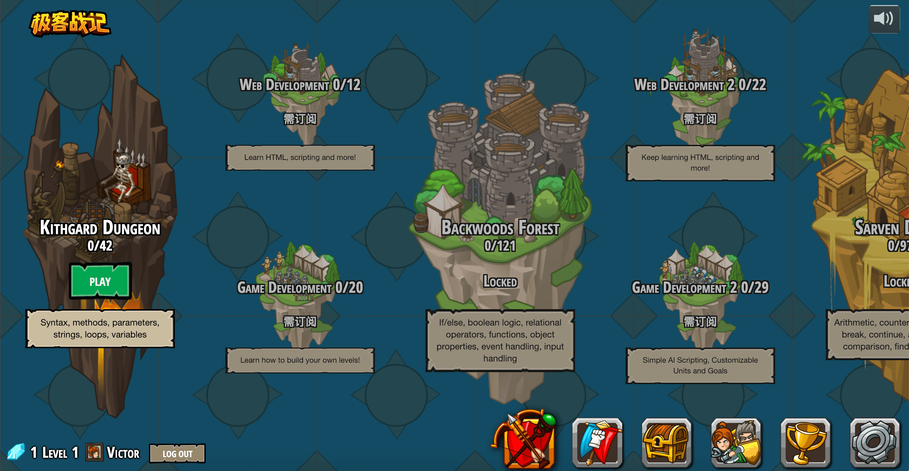
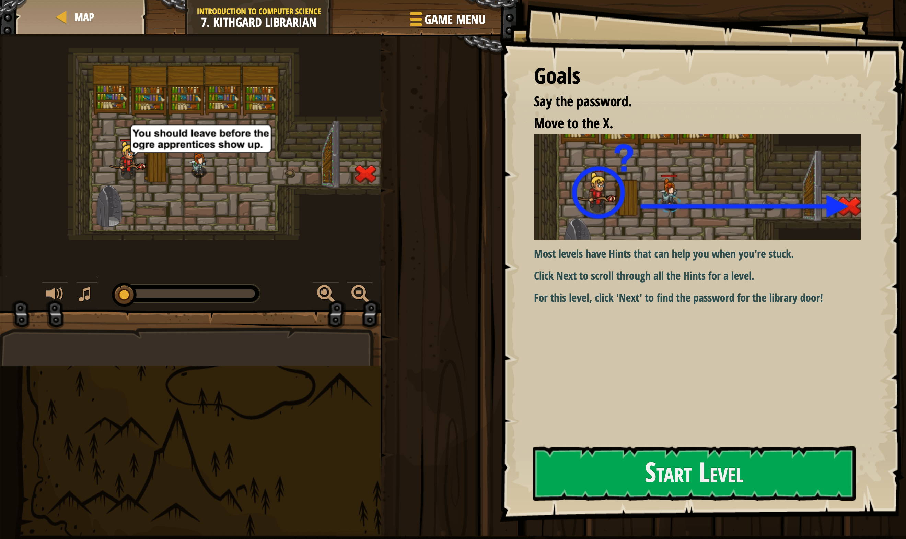
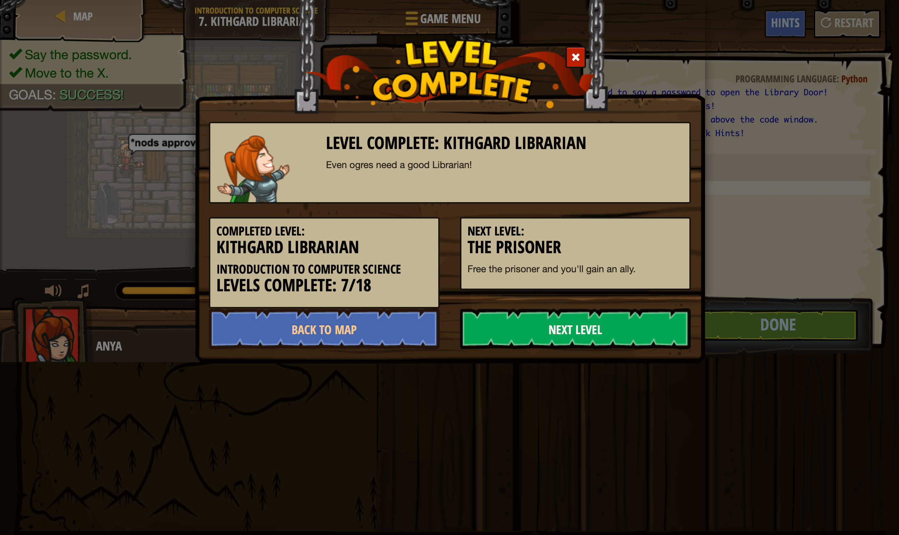
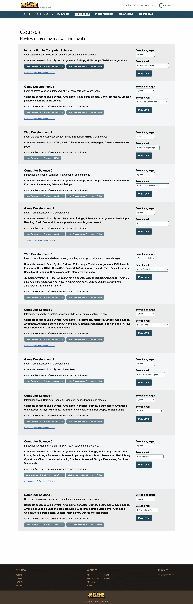

# CodeCombat简单体验

<link rel="stylesheet" href="https://yanwei.github.io/auto-number-title.css" />

yanwei, v0.1, 2018.12.19

## 先上总结

> 用半天时间，从老师端和学生端整体体验了从账号注册、激活，课程设置、加入课程、上课等全部过程。由于学生端无法跳过进度，并且账号没有完整的license，有些功能受限，因此主要从老师端体验了一下各个级别的课程。

* 游戏化体验极佳，引导和帮助也到位，对孩子的吸引力毋庸置疑
* 适合中高年龄段（10+）孩子，门槛较高，但是总体课程设置上基本做到循序渐进
* 没有低幼年龄段的课程（网站只提供了13岁+的选择）
* 老师端教辅材料非常丰富，包括的课程总体大纲、相关知识图谱、每节课的详细解析等
* 本地化工作尚未完成，除极少数页面，大多数都是英文
* 游戏背景、风格、关卡设定、任务设置等需要适应国内市场和教育机构落地的需要

## 入口

* 英文版：https://codecombat.com/
* 中文版：https://codecombat.163.com

用提供的两个体验账号分别注册了老师和学生身份。老师账号创建了班级和ClassCode，学生账号使用ClassCode加入班级。

此外，也可以开启独立账号，直接支付¥648元开通账号。不付费情况下可以免费体验课程的第一个等级。独立账号版本下，课程等级和教学版本基本相同，但是似乎稍有区别，比如，独立模式下没有`Game Development 3`。此外，第一关基本对应`Introduction to Computer Science`，但是似乎关卡数和教学版不一样多。因时间限制，没有逐个比对。

## 教学系统

### 学生端

可以查看自己的学习进度，或者加入新的班级。

#### 游戏化体验

总的游戏化体验非常好，各个关卡的通关提示、帮助等非常到位。加上声音和视觉上的及时反馈，总体效果不错。

每个关卡/任务开始之前的说明：

学习过程中随时可以查看提示：

过关后有奖励（截图动作慢了点，下部的成就奖励自动消失了，没有截到）：

#### 学习过程

代码方式（Pyton、JavaScript、CoffeeScript）的互动学习过程，不同于Scratch等模块化编程环境，学生需要自己手动键入代码。不过代码提示和自动补全做的挺好，编程效率较高。

### 老师端

#### 我的班级

可以查看班级的总体情况，总体进度，以及班级内学生的详细情况。包括学生的学习进度、课程掌握情况，能力评估等。

#### 我的课程

可以查看当前支持的完整课程体系，目前包含11个等级。

* Introduction to Computer Science
* Game Development 1
* Web Development 1
* Computer Science 2
* Game Development 2
* Web Development 2
* Computer Science 3
* Game Development 3
* Computer Science 4
* Computer Science 5
* Computer Science 6

每个等级有简要知识点说明，以及每节课的详细解析等。老师端还可以直接跳过学生端的限制，直接体验每一节课程的内容。

#### 教辅材料

提供了非常丰富的教辅材料。从课程总体大纲、相关知识图谱、每节课的详细解析等，非常齐全。

## 课程体系

时间限制，只能用老师端账号在11个等级中，每个等级随机抽1-2个关卡玩了玩。总体可玩性不错，难度适中并逐级递进。整个课程体系基于相似的游戏背景，从低到高，逐渐构筑一个较为复杂的游戏。

整个课程完整覆盖了编程中的基本概念和算法，以及Python、HTML、CSS、JavaScript等基本的语法知识点。并且通过游戏化方式，初步介绍了游戏开发中的一些基本概念和方法，如事件驱动、游戏策略等。

通过整体课程的学习，学生应该能够具备基本的编程知识和概念，具备进一步学习完整的编程语言、软件开发方法、算法和数据结构的基础。