# VipCode试听课体验流程

<link rel="stylesheet" href="https://yanwei.github.io/auto-number-title.css" />

<p align='right'>v1.0, Last Update: 2018.12.22</p>

```text
试听学生：男，8岁，小学2年级
试听时间：12月22日下午13:00（周六）
学习时长：40分钟
学习语言：智能硬件/机器人编程（Scratch）
上课形式：在线一对一
```

试听总结：

* 软硬件平台都是基于第三方，平台只是设计了课程内容，门槛不高
* 授课老师表现尚属正常，能把控整体节奏，和小朋友进行有效互动。但总体来说，授课技术含量并不高，非计算机专业毕业生经过短期培训即可上岗
* 小朋友对课程内容比较感兴趣（但这一条是平台无关的，只是对课程中的AI技术感兴趣而已）
* CC跟进服务到位，课前准备（包括技术支持课前主动联系调试设备）和课后回放都很及时
* 产品细节和体验流程不算太好，有较大提升空间。特别是基于第三方直播平台+编程工具，上课过程中需要微信登录、启动并切换软件、开启屏幕共享等操作，有一点麻烦。未来更好的在线服务应该向自有平台和整合方向发展，以求更流畅更方便的教学体验

## 试听流程

### 约课

在[官网](https://www.vipcode.com/)用手机号注册，当天对方CC来电，预约试听事宜，并加微信。

[点击查看CC提供的课前准备说明](vipcode/sop.png)

### 上课环境

* 直播工具：[百家云-云端课堂](http://www.baijiayun.com/class/)
* 编程工具：[慧编程mBlock](http://www.mblock.cc/zh-home/)

> 正式课程需要机器人硬件`Codey Rocky（程小奔）`，官方售价699元。购课会赠送机器人。

### 上课过程

* 讲师讲解AI的基础知识、应用场景等
* 讲师介绍课程的上课方式，正式课用到的硬件机器人等
* 利用mBlock的角色模拟功能，实现了两个简单的语音识别和人脸识别应用
* 课程总结

### 预习和复习

* 没有预习环节。这是个缺陷。
* 此外，还没有上课前就能看到课后习题，一共五道关于AI基本常识的选择题，比较简单，和上课内容也没有太大关系。
* 学习中心有“课堂回放”，但是无法观看，打开是空白页面。
* “学习报告”有一点程式化，试图特别针对小朋友和上课的情况进行总结，但不太准确和详细。学习内容总结也和上课的实际内容有一定偏差。

## 课程体系

按官方介绍，机器人编程的课程大纲分为10个单元，每个单元都有相对应的目标性学习，分别为：

1. 单元目标
2. 课程指令知识
3. 相对应要培养的能力
4. 实际操作的运用场景结合

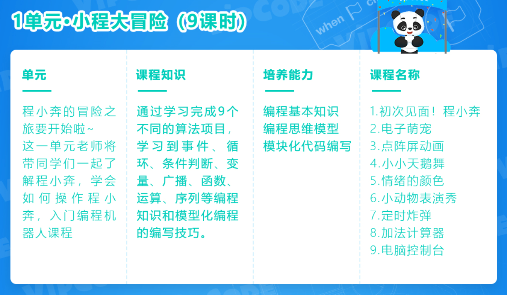
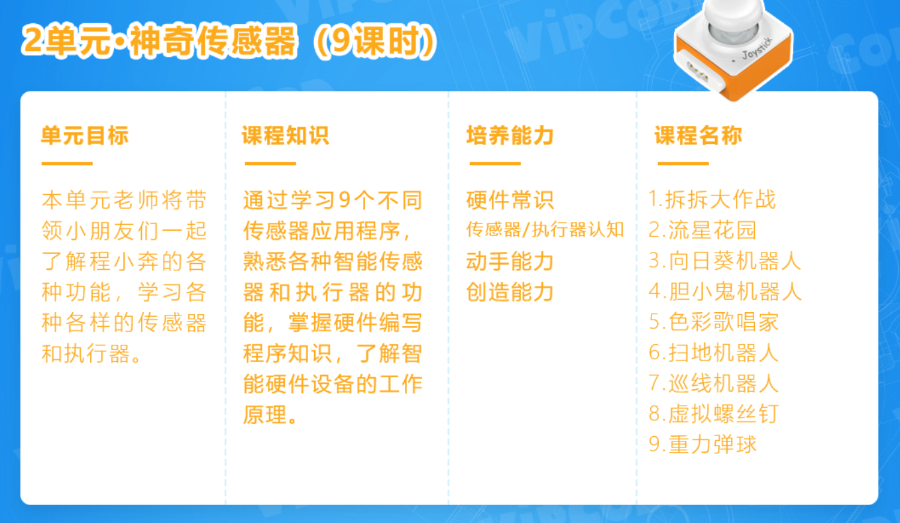
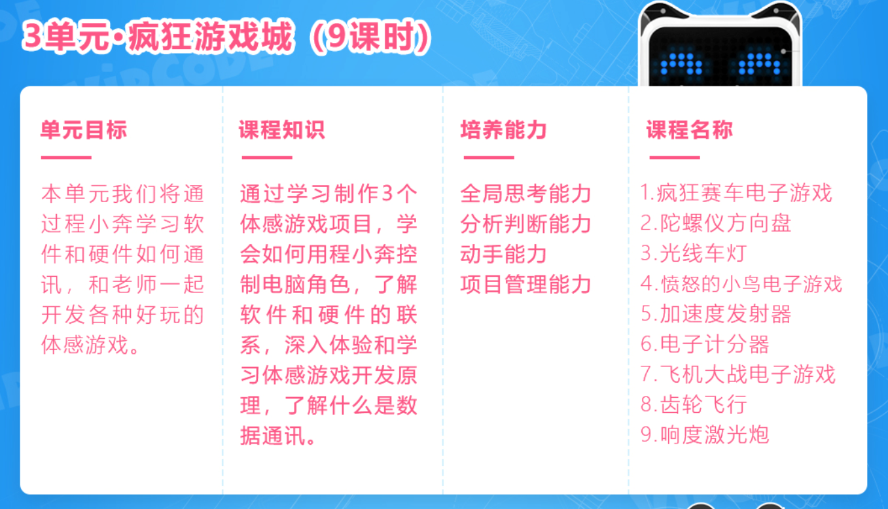
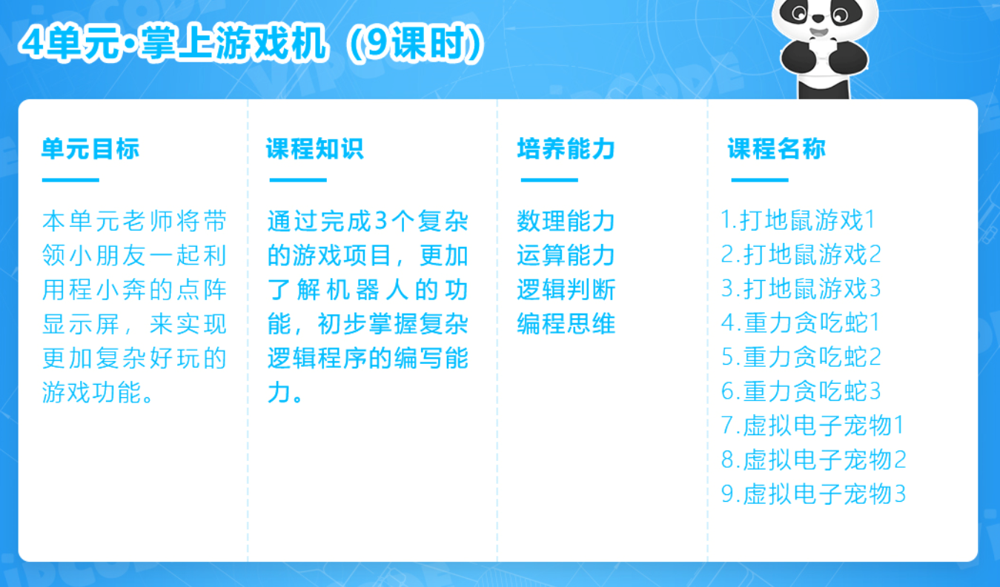
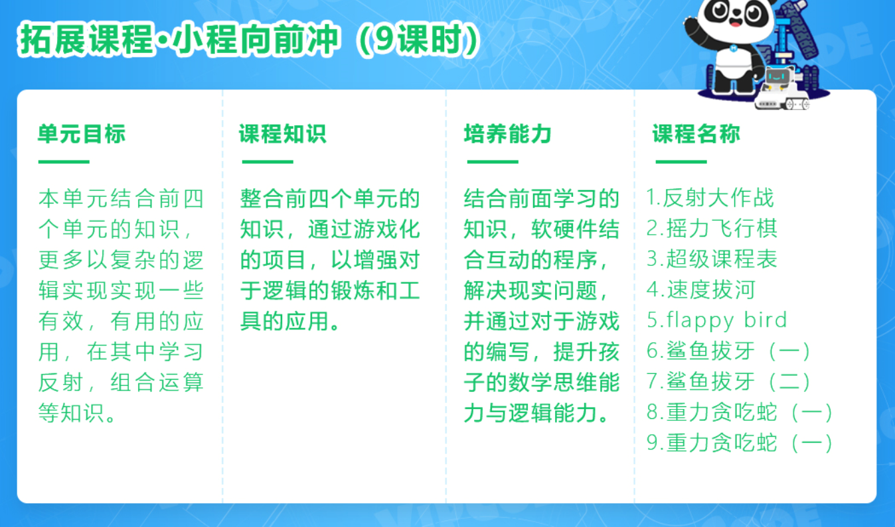
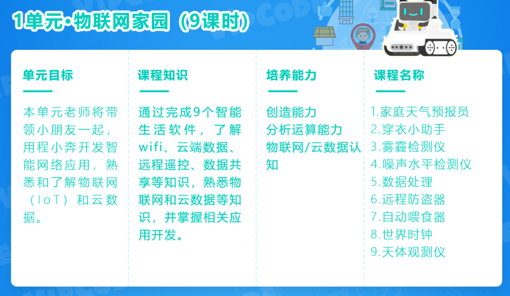
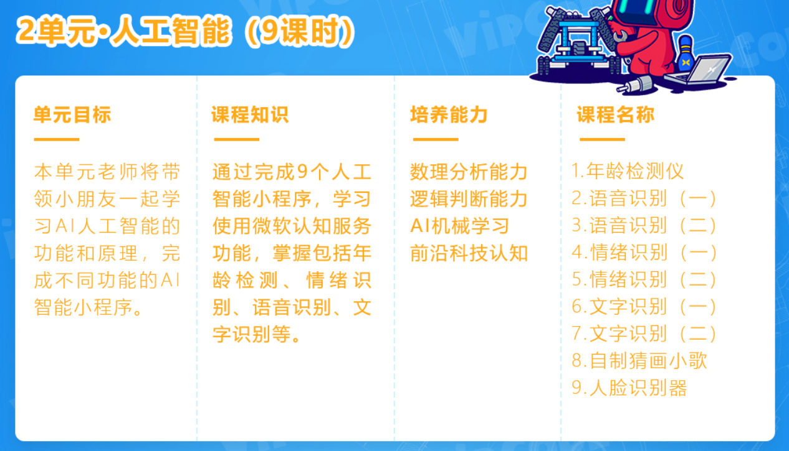
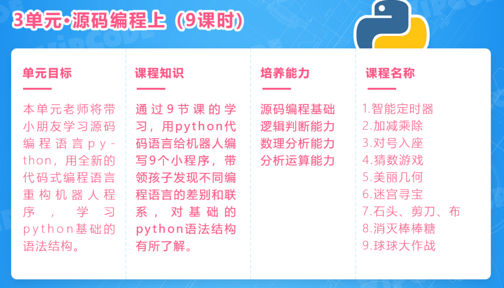
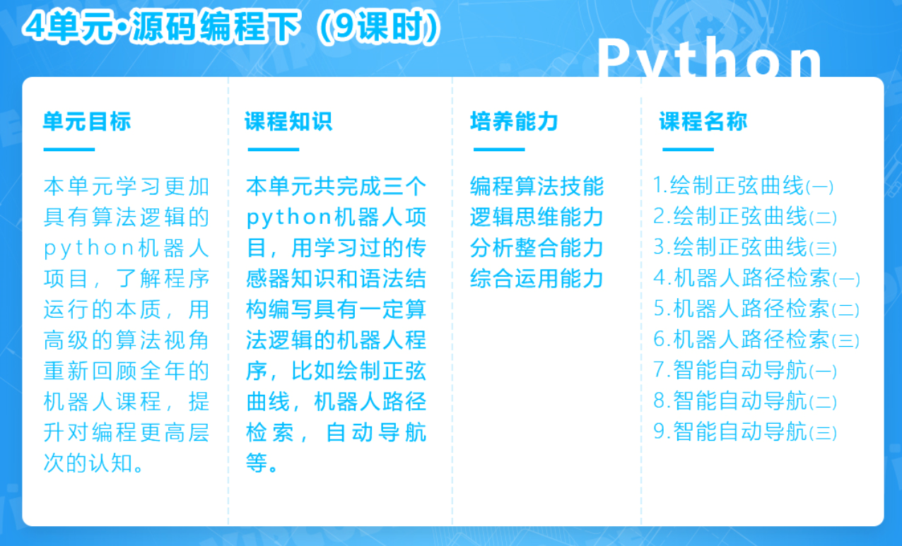
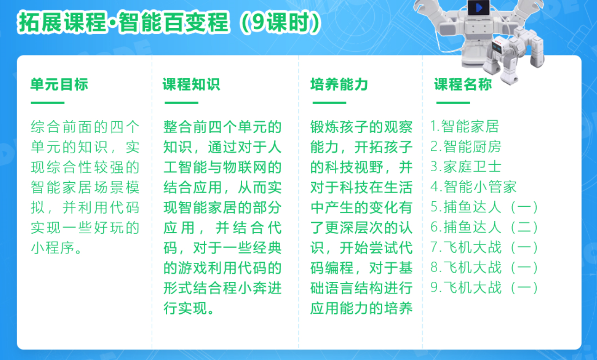

以上是宝贝即将学习的机器人编程的学习大纲~衔接Scratch过渡到Python的进阶式学习，中间会涉及到物联网、AI人工智能、云端数据我们都可以从课程大纲中去详细查看~

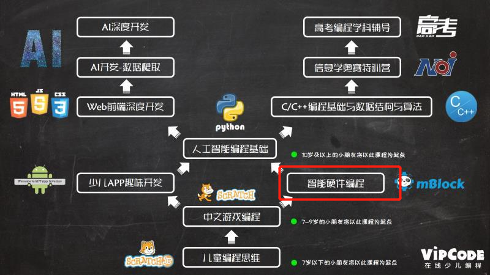

VIPCODE根据美国CSTA计算机认知规律和国内孩子们不同年龄段知识储备为基准研发的11阶课程体系，目前我家小朋友将挑战第三阶—智能硬件编程语言~学习完智能硬件编程可以进阶到Python的学习~

## 公司背景

* 北京未科教育科技有限公司
* A轮，投资方包括：
  * 创新工场
  * 软银中国资本
  * 蓝湖资本
  * 真格基金
