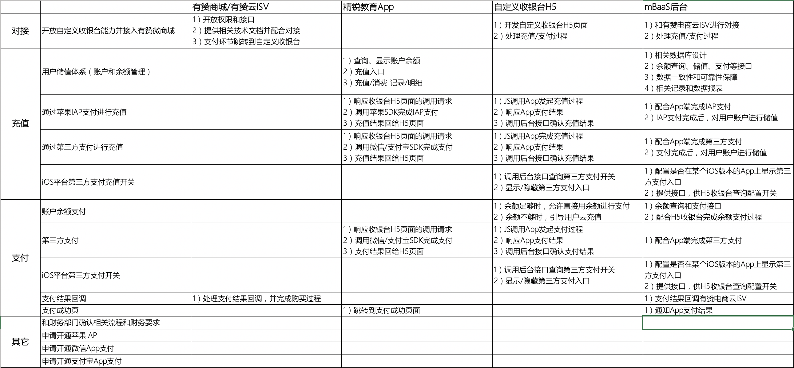

# 精锐教育app苹果内购技术解决方案——充值和支付流程

<link rel="stylesheet" href="https://yanwei.github.io/auto-number-title.css" />

## 背景

6月28日，苹果开发者账号收到苹果邮件，要求精锐教育app接入苹果内购（IAP）。邮件内容如下：

```text
Guideline 3.1.1 - Business - Payments - In-App Purchase

We noticed that your app or its metadata enables the purchase of content, services, or functionality in the app by means other than the in-app purchase API, which is not appropriate for the App Store.

Next Steps

While the payment system that you have included may conduct the transaction outside of the app, if the purchasable content, functionality, or services are intended to be used in the app, they must be purchased using in-app purchase, within the app - unless it is of the type referenced in guideline 3.1.3 of the App Store Review Guidelines.

In-App Purchase

It may be appropriate to revise your app to use the in-app purchase API to provide content purchasing functionality.

In-app purchase provides several benefits, including:

- The flexibility to support a variety of business models.
- Impacting your app ranking by consolidating your sales to one app rather than distributing them across multiple apps.
- An effective marketing vehicle to drive additional sales of new content.

For information on in-app purchase, please refer to the following documentation:

In-App Purchase for Developers (https://developer.apple.com/in-app-purchase/)
In-App Purchase Programming Guide (https://developer.apple.com/library/ios/documentation/NetworkingInternet/Conceptual/StoreKitGuide/)

For step-by-step instructions on in-app purchase creation within App Store Connect, refer to App Store Connect Help (https://help.apple.com/app-store-connect/#/devb57be10e7).

Please see attached screenshot for details.
```

[App Store审核指南](https://developer.apple.com/cn/app-store/review/guidelines/#in-app-purchase)中关于内购的规定如下：

```text
3.1.1 App 内购买项目：

如果您想要在 app 内解锁特性或功能 (解锁方式有：订阅、游戏内货币、游戏关卡、优质内容的访问权限或解锁完整版等)，则必须使用 App 内购买项目。App 不得使用自身机制来解锁内容或功能，如许可证密钥、增强现实标记、二维码等。App 及对应元数据不得包含指引客户使用非 App 内购买项目机制进行购买的按钮、外部链接或其他行动号召用语。

* App 可以提供 App 内购买货币，供客户在 app 内“打赏”数字内容提供商。

* 通过 App 内购买项目购买的所有点数和游戏货币不得过期，并且您应确保为所有可恢复的 App 内购买项目设计一套恢复机制。

* 请务必指定正确的可购买类型，否则您的 app 将被拒绝。

* App 可以允许用户将符合 App 内购买项目条件的物品赠予他人。此类礼品只能退款给原始购买者，而且不可交货。

* 通过 Mac App Store 分发的 app 可托管基于非 App Store 机制的插件或扩展。

* 提供“战利品箱”或其他随机虚拟物品购买机制的 app 必须在客户购买前，向客户披露每种类型物品的获取几率。

* 非订阅型 app 在提供完整解锁选项前可以提供按时间计算的免费试用期，方法是在“价格等级 0”中设置非消耗型 IAP 项目，并按照命名约定“XX 天试用”来命名。在开始试用之前，app 必须清楚指明试用期时长、试用期结束后不再能访问的内容或服务，以及用户为获得完整功能而需要支付的任何后续费用。进一步了解如何使用收据 (英文) 和设备检查 (英文) 来管理内容访问权限和试用期时长。
```

## 问题分析

* 精锐教育app内接入的家庭教育、UUabc、佳学慧等知识付费虚拟商品、线上消费的内容等，符合苹果内购要求，按《App Store审核指南》要求，必须接入苹果内购（IAP），通过IAP进行支付购买。

* 苹果近年来对内购的审查十分严格，一旦发现违规，处罚极其严重。包括app无法过审、下架甚至封号处罚等。

* 巨人网校在年初也遇到了同样问题，导致iOS app无法通过审核，后来不得不按要求接入内购，才顺利上线。

* 同时，苹果要求所有通过IAP购买的商品，必须在苹果后台上架并通过审核。由于商城内课程较多，每个课程都在苹果后台上架审核非常麻烦。

* 通过IAP内购支付，只支持苹果规定的价格档位：1、3、6、12、18、25、30等，无法满足灵活定价的需求。

* 因此，为了满足不同课程灵活定价的需求，IAP必须分两步走：
  * 通过IAP为账户充值固定金额的虚拟币
  * 通过账户余额购买虚拟商品

* 由于精锐教育app接入的是有赞商城，为了实现上述要求，需要利用有赞的自定义收银台功能，开发我们自己的收银台：
  * 在iOS平台上，对虚拟商品实现苹果内购（IAP）充值和账户余额支付
  * 非虚拟商品和Android系统中，支持微信、支付宝和银行卡等第三方支付渠道

具体功能要求如下。

## 功能要求

1. 用户账户储值
    * 支持通过苹果IAP、微信、支付宝等对账户进行储值（第三方充值仅限Android平台）
    * 仅支持固定储值额度：6、68、88、208、388等
    * 同一用户在Android和iOS端，储值不能互通（即iOS上储值不能在Android上查看和使用，反之亦然）
    * 但用户信息、积分、订单信息、学习记录等其它信息在不同的端之间保持统一
    * 暂不支持用户自助操作余额退款。可通过客服渠道人工处理

2. 整合有赞微商城
    * 通过有赞的自定义收银台机制，定制我们自己的收银台，在用户下单后通过账户余额或第三方支付渠道进行支付
    * 非虚拟商品直接使用微信、支付宝、银行卡等第三方支付渠道
    * 对虚拟商品，余额足够时，可以直接通过余额进行支付
    * 余额不够时：
        * iOS平台：调用苹果IAP进行充值，然后用余额完成购买
        * Android平台：调用第三方支付进行充值，或直接通过第三方支付进行购买

### 交互流程


### 业务流程


## 有赞自定义收银台技术方案


## 参考文档

* 苹果官方文档：<https://developer.apple.com/cn/in-app-purchase/>
* 有赞自定义收银台接口文档：<https://diy.youzanyun.com/extension-points/0>
* <https://xiaovv.me/2018/05/03/My-iOS-In-App-Purchase-Summarize/>
* <https://www.jianshu.com/p/30677a9ff6b2>
* <https://www.meiwen.com.cn/subject/stwwtxtx.html>
* 2017苹果内购价格表：<https://www.jianshu.com/p/aa713df30826>

## 工作分解和人力需求

1. 自定义收银台并接入有赞微商城（有赞、后台、H5）
2. 用户储值体系（账户和余额管理）（后台、App、H5）
3. 通过苹果IAP支付进行充值（后台、App、H5）
4. 通过第三方支付进行充值/支付（后台、App、H5）
5. iOS平台第三方支付充值开关（后台、H5）
6. 账户余额支付（后台、H5）
7. 相关管理后台、记录和数据报表（后台）



预计需要投入：

* 产品1人
* 设计1人
* iOS开发1人
* Android开发1人
* H5前端开发1人
* 后端Java开发1人
* 测试1人
