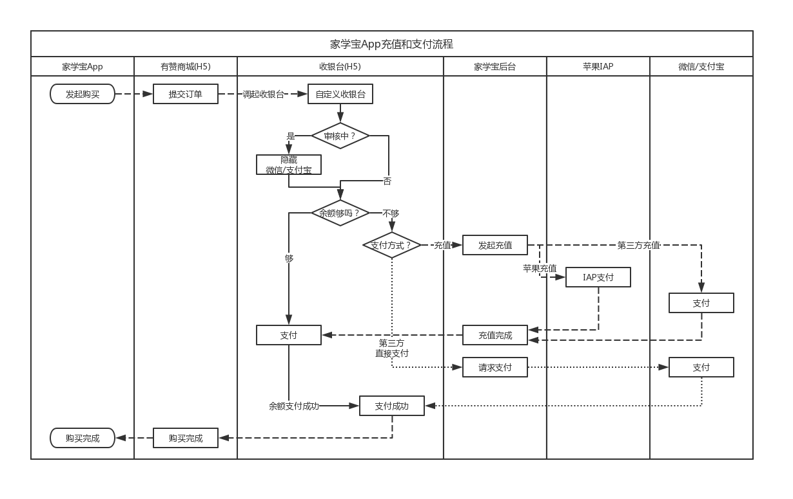
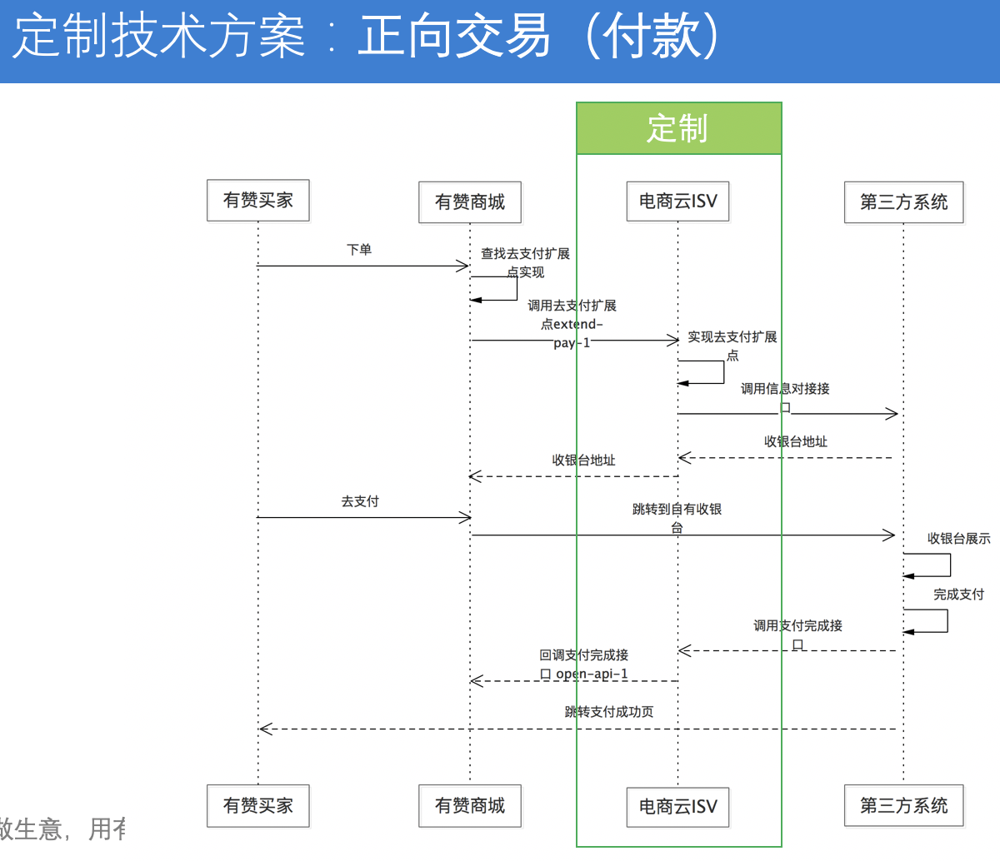

# 家学宝App充值和支付流程

<link rel="stylesheet" href="https://yanwei.github.io/auto-number-title.css" />

## 背景

* 家学宝App商城内主要是知识付费类虚拟商品，iOS版本按照苹果的应用上架要求，必须接入苹果内购（IAP），通过IAP进行支付购买，否则审核无法通过。
* 同时，苹果要求所有通过IAP购买的商品，必须在苹果后台上架并通过审核。由于商城内课程较多，每个课程都在苹果后台上架审核非常麻烦。
* 通过IAP内购支付，只支持苹果规定的价格档位：1、3、6、12、18、25、30等，无法满足灵活定价的需求。

## 功能要求

1. 用户账户储值
    * 支持通过苹果IAP、微信、支付宝等对账户进行储值
    * 仅支持固定储值额度：6、68、88、208、388等
    * 同一用户在Android和iOS端，储值不能互通（即iOS上储值不能在Android上查看和使用，反之亦然）
    * 但用户信息、积分、订单信息、学习记录等其它信息在不同的端之间保持统一
    * 暂不支持用户自助操作余额退款
2. 整合有赞微商城
    * 通过有赞的自定义收银台机制，定制家学宝自己的收银台，在用户下单后通过账户余额或第三方支付渠道进行支付
    * 余额足够时，可以直接通过余额进行支付
    * 余额不够时：
        * 可以调用苹果IAP或第三方支付进行充值
        * 也可以通过第三方支付进行直接支付
    * 在iOS平台上，可以通过后台开关，控制是否打开第三方平台（微信/支付宝）充值或支付功能，以应对苹果的审核

### 业务流程

### 交互原型

<https://org.modao.cc/app/06c5e5c008ee4a65d7e3630316e11cc4>

### 工作流

## 有赞自定义收银台技术方案

## 参考文档：

* 苹果官方文档：<https://developer.apple.com/cn/in-app-purchase/>
* 有赞自定义收银台接口文档：<https://diy.youzanyun.com/extension-points/0>
* <https://xiaovv.me/2018/05/03/My-iOS-In-App-Purchase-Summarize/>
* <https://www.jianshu.com/p/30677a9ff6b2>
* <https://www.meiwen.com.cn/subject/stwwtxtx.html>
* 2017苹果内购价格表：<https://www.jianshu.com/p/aa713df30826>
