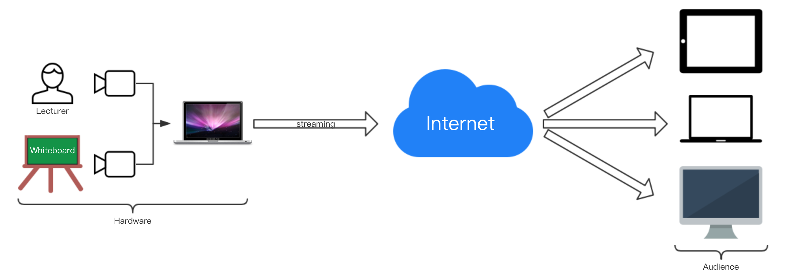
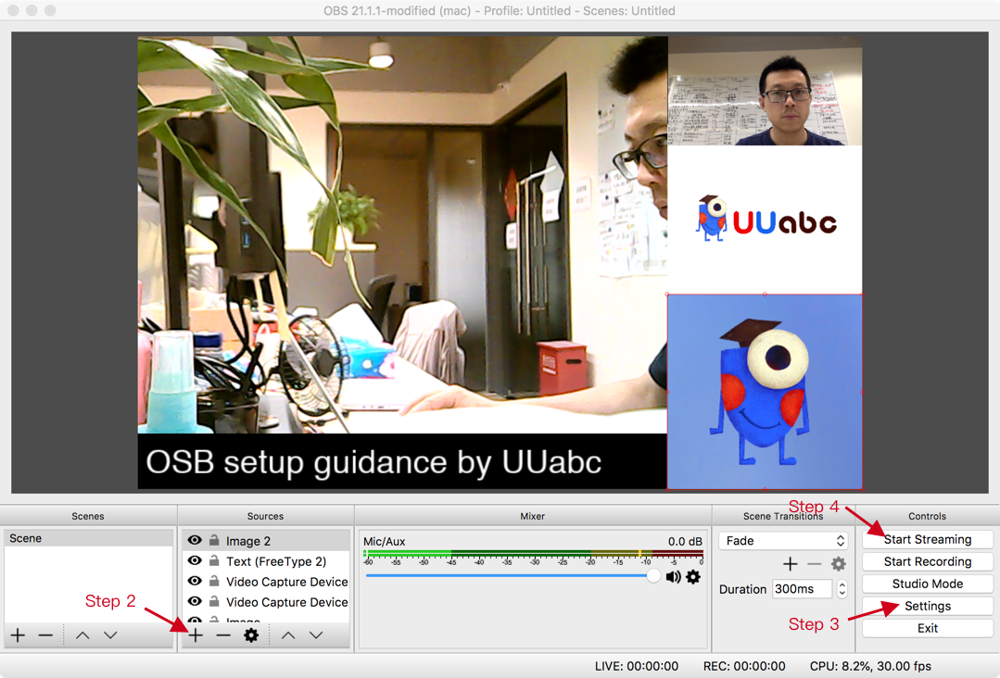
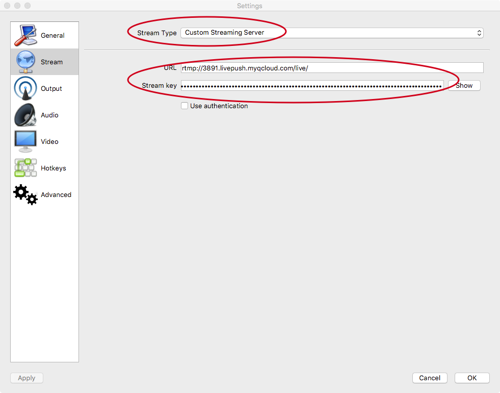

# Live Broadcast System

Rev 1.0, yanwei, 2018-8-5

## 1. Overview and Hardware Setup

## 2. Software Setup

Step 1) Download and install **OBS Studio** (Open Broadcaster Software) at **<https://obsproject.com>**

Step 2) Click the **'+'** button shown above to add images, texts, video capture devices and window captures to the scene and arrange them properly.

Step 3) Click the **'Settings'** button and setup the streaming server as shown below.

Item | Value
|:--- |:---|
Stream Type | Custom Streaming Server
URL | rtmp://3891.livepush.myqcloud.com/live/
Stream Key | 3891_user_73448aef_9f5d?bizid=3891&txSecret=7f6d82878806d49d6230abaf856d022a&txTime=5B6D3B81

Step 4) Click the **'Start Streaming'** button to start the broadcast.
