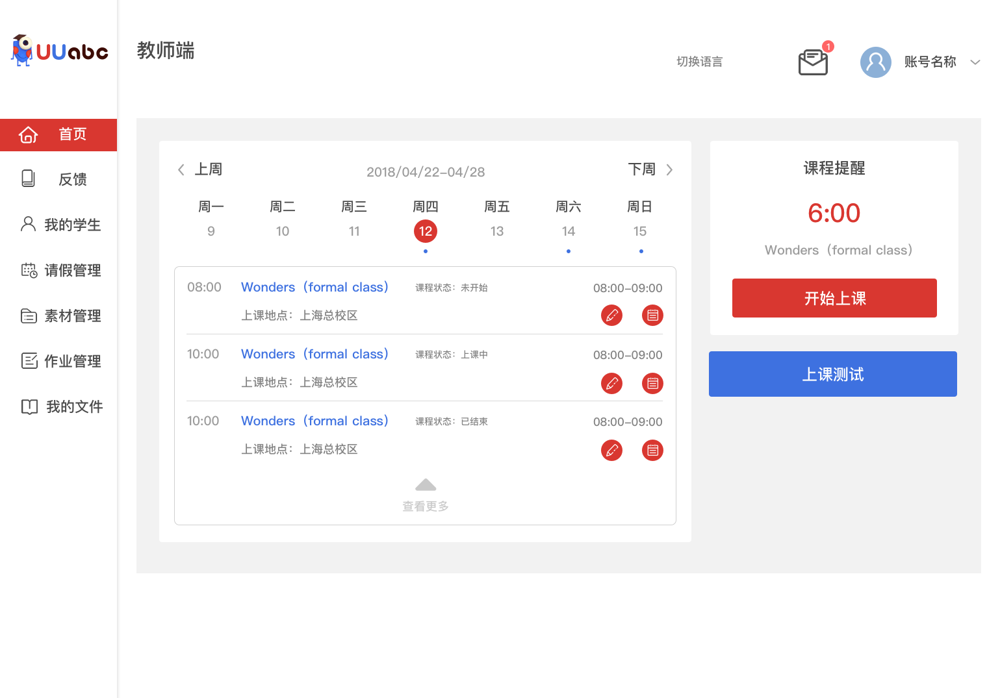
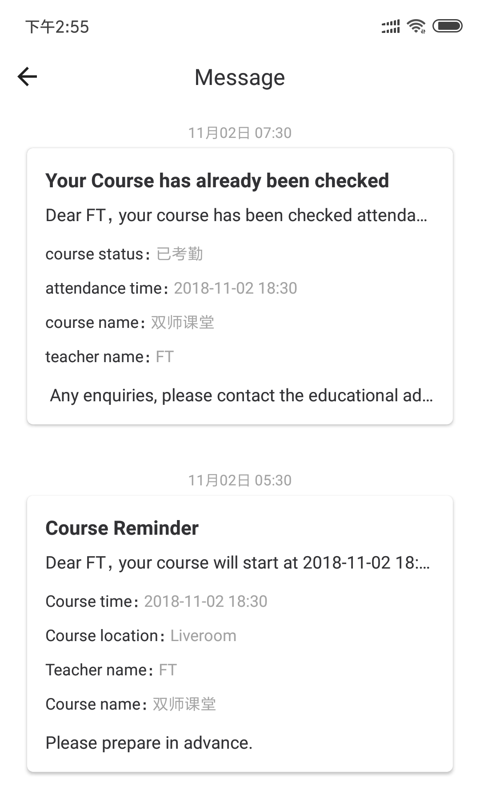
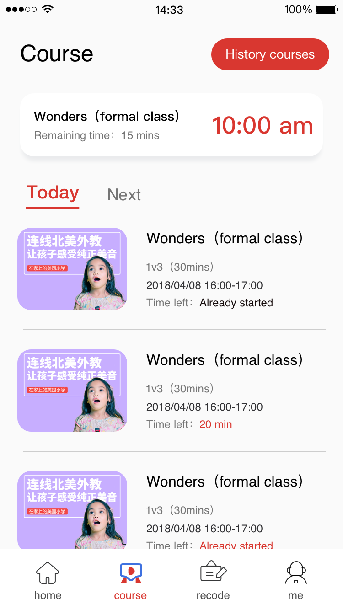
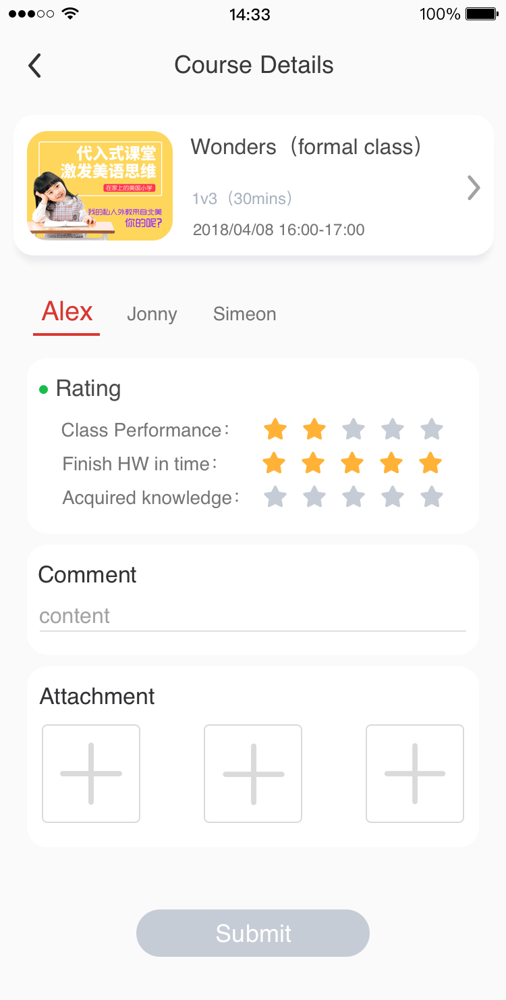

# Product Leaflet for the New Teacher Center & App

<link rel="stylesheet" type="text/css" href="https://yanwei.github.io/auto-number-title.css" />

> 形式：长图/单页

## Header

* Background Image + UUabc Logo
* Title: Platform Changes Are Coming!
<!-- * Slogan: **`UUabc, there is always a 'U' in 'US'`** -->
* What's New
  * Upgraded Teacher Center
  * Teacher App
  * New Scheduling System
  * Submit Referrals and Track Candidates
  * Open Course

## Main Features

### Upgraded Teacher Center and Teacher App

> A better calendar system for viewing scheduled and future classes.

> Adjust your schedule or ask for leave from within the teaching center / App.

**put screenshot here**

<!--  -->

### Never Miss Your Class

> Push notifications and automated reminders for scheduled classes.

**put screenshot here**

<!--  -->

### New Scheduling System

> Fixed students and teachers over the course of a season-long semester.

> Watch your students grow over the course of the “semester” to tailor your lessons to your students’ learning styles and to provide far more meaningful assessments!

**put screenshot here**

<!--  -->
<!--  -->

### Submit Referrals and Track Candidates

> Refer friends to UUabc and sign-up to teach from within the App.

**put screenshot here**

<!--  -->

### Get Ready for the 'Open Course'

> Teach lessons to larger audiences using (approved) materials on topics of your choice.

> Open Courses represent a great way for you to explore topics and skills that you're interested in will give you ample opportunity to build your teaching brand within the UUabc platform.

**put screenshot here**

`Scheduled to go live on January 20, 2019`

<!--  -->

## Coming Next...

* payment reports and payslip
* new training and evaluation system
* community for the teachers

## Footer

* The new teacher center and App will be available in early Dec. 2018.
* UUabc logo + Slogan
* Follow us: [Facebook](https://www.facebook.com/groups/official.site.uuabc), [Email](mailto:teacher.fm@uuabc.com>)
* Copyright (C) UUabc, All Rights Reserved.