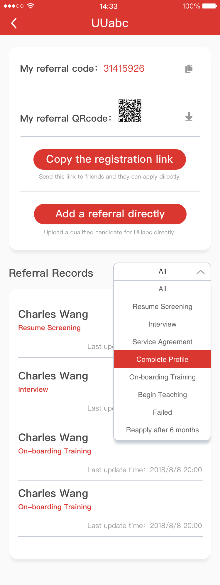

# Product Leaflet for the New Teacher Center & App

<link rel="stylesheet" type="text/css" href="https://yanwei.github.io/auto-number-title.css" />

> 形式：长图/单页

## Header
* Background Image + UUabc Logo
* Slogan: **`UUabc, there is always a 'U' in 'US'`**
* Tags for core features ??
    * New Design
    * Teacher's App
    * Track Candidates
    * Open Course

## Main Features
### Brand new 'Teacher Center'

> (English version screenshot needed)

### Finally, we have the 'Teacher App'

### Never miss your class

> app push notification

### Submit referrals and track candidates 

### Get ready for the 'Open Course'

> no screenshots right now, need some descriptions/rules for the 'Open Course' here

## Coming Next...

* payment reports and payslip
* new training and evaluation system
* community for the teachers (master teacher / KOL ?)

## Footer
* available date: Dec. 2018
* UUabc logo
* follow us: Facebook、Twitter、Email...
* last edit date / legal statement