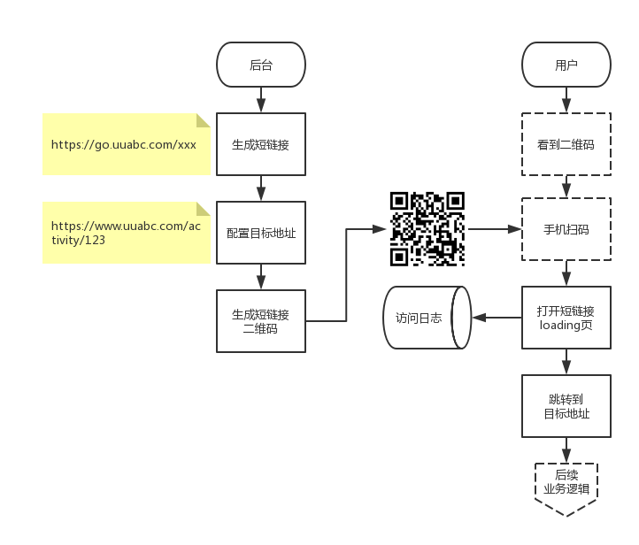

# 短链接服务
<link rel="stylesheet" type="text/css" href="/Users/yanwei/Documents/yanwei.github.io/auto-number-title.css" />

```json
{"Author":"yanwei", "LastUpdate":"2018-8-23", "Revison":"1.0"}
```

## 目标
用于广告推广、渠道投放、周边产品等场合，跟踪页面访问量和来源，或者生成二维码，便于用户扫码后跳转到指定的功能页面。

## 业务流程


### 生成短链接并配置目标地址
* 短链接格式：`http://go.uuabc.com/[slid]`

    ```slid = short link id，随机数字或字符串，不超过8个字符```

* 目标地址可以随时修改，修改时记录修改日志并允许查看修改记录

### 生成短链接二维码

### 短链接loading页面
* Loading动画（需UI设计）
* Loading页面需适配PC和移动端
* 记录访问日志（至少包含以下字段）

    访问时间 | 短链接地址/ID | 目标地址 | 用户IP | 设备类型 | User-Agent
    ---- | ---- | ---- | ---- | ---- | ----
    DateTime | URL / int | URL | IP Addr. | Android / iOS / Windows / Mac | User-Agent

* 1-2秒后自动跳转到目标地址

### 跳转到目标地址
目标地址为实际功能的落地页面，具体内容不在不文档讨论范围内。