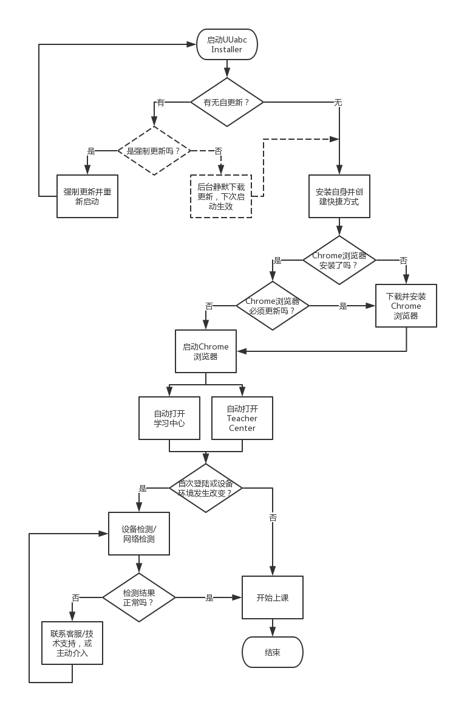

# UUabc Installer
<link rel="stylesheet" type="text/css" href="/Users/yanwei/Documents/yanwei.github.io/auto-number-title.css" />

```json
{"Author":"yanwei", "LastUpdate":"2018-8-23", "Revison":"1.0"}
```

## 目标
解决用户端和外教端安装浏览器、设置环境、设备检测、网络测试等方面的问题，降低服务门槛，提升用户体验。

分为学生端和教师端两个版本。两个版本基本功能一致，只在系统语言和启动Chrome浏览器后自动打开的URL地址有所区别。

## 功能列表


## 业务流程


## 功能需求
### Installer
* 软件为绿色版本，无需安装（Windows平台上最好只有一个exe文件，Mac平台上直接拖动到Applications目录下即可运行）
* Windows平台下自动复制到%AppData%目录并创建桌面和任务栏快捷方式
* 检查有无安装Chrome浏览器，如果没有，则自动下载并安装之（需UI设计）

### Launcher
* 启动Chrome浏览器，并自动打开学习中心或Teacher Center页面
* 在学习中心和Teacher Center中，完成设备检测和网络检测
    * 如果是首次打开，或设备环境发生了变化，则提示用户进行测试
    * 改成基于WebRTC的检测方式，而非Flash

### Updater
* 检查并执行自身的更新
* 检测Chrome浏览器是否必须更新并下载安装最新版本

### Security
* 申请应用程序签名
* 申请腾讯电脑管家、360等安全软件和杀毒软件的白名单认证

### 多语言支持
* 学生端版本支持中、英文，并自动适配操作系统语言
* 老师端版本支持英文

### 多平台支持
* 支持Windows和Mac平台
* Windows最低支持的版本为Windows Vista
* macOS最低支持的版本为10.8

### 数据埋点和统计
* 应用启动
* 应用自更新
* 下载Chrome浏览器
* 更新Chrome浏览器
* 启动Chrome浏览器
* 设备检测：过程和结果
* 网络检测：过程和结果