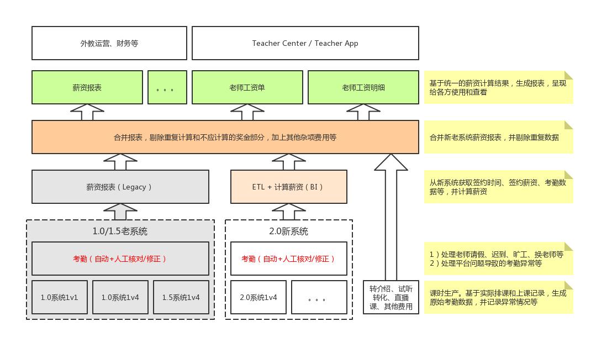

# 统一外教薪资系统

<link rel="stylesheet" href="https://yanwei.github.io/auto-number-title.css" />

v1.0, Last Update: 2018.12.17

## 目标

* 统一1.0、1.5、2.0等各个不同系统的外教薪资计算和报表
* 简化处理和计算逻辑，自动化主要步骤，降低人工成本和差错率
* 为业务部门和财务部门提供更详细更准确的薪资报表
* 适应未来可能的规则调整，做到“改变薪资规则无需发版，运营后台配置即可”

## 系统结构

## 功能说明

* 课时生产：在学生约课、系统排课、人工排课的基础上，由于发生实际上课行为而产生的基础数据。课时生产数据是进一步考勤和薪资计算的基础。
* 考勤管理
* 数据整合
* 薪资计算
  * 1.0系统1v1薪资
  * 1.0系统1v4薪资
  * 1.5系统1v4薪资
  * 2.0系统薪资
  * 直播课薪资
  * 奖金
  * 等待薪资
  * 罚款
* 其他费用
  * 转介绍奖金
  * 试听转化奖金
  * 其他
* 报表

## 外教签约信息

* 签约时长
* 签约薪资
* 等待薪资
* 扣款/罚款规定
* 数据来源
  * 老系统签约信息：老系统数据库
  * 新系统签约信息：待定

## 考勤数据

* 约课时间
* 理论上课时间
* 约课人数（学生ID）
* 老师ID
* 车位（time slot）信息
* 课程类型
* 课程ID/ClassID
* 实际上课时间
* 实际上课人数（学生ID）
* 消耗课时对应的合同/订单编号
* 学生是否失约
* 老师是否失约
* 课程状态
* 课程属性
* 进入教室时间
* 离开教室时间
* 是否按时提交评语

## 计算规则

[下载薪资计算规则](Payment-Rules.xlsx)

## 报表

### 考勤（课时）明细表

|分类|字段|含义|说明|
|---|---|---|---|
||ID|主键|唯一ID|
|课程信息|课程ID|ClassID|课程全局唯一编号（需考虑1.0/2.0系统编号范围独立）
||课程类型||1v4正式课、1v1正式课、1v4试听课、直播课|
||车位时间|理论排课时间|2018-12-17 19:00 - 2018-12-17 19:30|
||实际上课时间||2018-12-17 19:02 - 2018-12-17 19:32|
||实际上课时长||31分钟、20分钟|
||课程状态||正常、异常|
||课程属性||有效班课、取消课程、无效课程、一对一薪资课程|
||约课人数||4
||实际上课人数||3
|学生信息|学生ID
||学生进入教室时间
||学生离开教室时间
||学生是否迟到/失约
||学生提交评语时间
||消耗课时类型||1v1正式课时、1v4正式课时、直播课时、1v4市场课时、1v4赠送课时。。。|
||消耗课时数量||0、1、2.5|
||消耗课时来源|合同/订单/缴费单编号|
|老师信息|老师工号
||老师进入教室时间
||老师离开教室时间
||老师是否迟到/失约
||老师提交评语时间
|考勤信息|考勤操作||修改课程状态、修改课程类型。。。|
||考勤操作人|StaffID|101 (Hayley)|
||考勤时间||2018-12-17 19:45:23|

* 小班课每节课可能有多条记录
* 更换老师等情况下，也可能有多条记录，但最多只有其中一条记录为需要计算薪资的有效记录
* 考勤过程必须保证上述第二条成立

### 基于考勤明细的成本收益明细

|分类|字段|含义|说明|
|---|---|---|---|
||ID|主键|唯一ID|
||考勤明细表ID|||
||生产收入||人民币，按学生实际消耗的课时和合同/订单类型计算的收入。免费课时收入为0|
||薪资支出||美元，按学生分摊，不含奖金和其他费用。即，如果一节小班课有4个学生，则每一条考勤明细的薪资只有老师应付薪资的1/4|

* 可能有生产收入，但没有薪资支出的情况：如学生正常上课，但是老师迟到超过一定时限，所以不结算工资？这种情况下，是否也不应扣学生课时，或者先扣课时，再返回免费课时作为补偿？
* 反之，可能有薪资支出，但没有生产收入的情况：如平台故障，导致未能正常上课，这种情况下，需要给老师结算薪资，但是不能扣除学生课时，因此没有生产收入。

### 薪资报表（总表）

|分类|字段|含义|说明|
|---|---|---|---|
|基本信息|老师ID|老师唯一ID（工号）|新老系统保持统一|
||老师姓名|老师英文名|
||币种|按何种货币结算|目前统一按美元结算|
||计薪周期||一个自然月内可能分成多段|
||签约时长|计薪周期内累计签约时长|小时|
|基本薪资|1v1签约薪资||美元/小时|
||1v1上课时长||小时|
||1v1总薪资||美元|
||1v4签约薪资||美元/小时|
||1v4上课时长||小时|
||1v4总薪资||美元|
||直播课/公开课签约薪资||美元/小时（默认等于1v4薪资）|
||直播课/公开课上课时长||小时|
||直播课/公开课总薪资||美元|
|奖金|准时奖励标准|计薪周期内无迟到|1美元/小时|
||准时奖励总时长||小时|
||准时总奖金||美元|
||出勤奖励标准|计薪周期内无请假和旷工|1美元/小时|
||出勤奖励总时长||小时|
||出勤总奖金||美元|
||课后评价奖励标准|所有课后评价在24小时内完成|1美元/小时|
||课后评价奖励总时长||小时|
||课后评价总奖金||美元|
|等待薪资|高峰时间薪资标准||15美元/小时|
||高峰时间等待总时长||小时|
||高峰时间等待总薪资||美元|
|旷工罚款|罚款标准||美元/小时（一般为1v1签约薪资*2？）|
||旷工总时长||小时|
||旷工总罚款||美元|
|试听课转化|奖励标准||8美元/学生|
||转化学生数||个|
||试听转化总奖金||美元|
|转介绍奖励|>1个月奖励标准||150美元/老师|
||>1个月老师数||个|
||>1个月总奖金||美元
||>3个月奖励标准||50美元/老师|
||>3个月老师数||个|
||>3个月总奖金||美元
|其他费用|转账手续费||美元|
||市场费用||美元|
||其他||美元|
|总薪资|基于以上分项的总计||美元|
|累计无效时间|||小时|
|美国私塾费用|||美元|
|备注信息|
|开户名/PayPal账户名|
|银行账号/PayPal账号|
|开户行|||仅对银行账户有效|
|支行|||仅对银行账户有效|
|付款状态|||已支付/未支付|

### 按部门/项目拆分成本和收入

* 按类型拆分（1v1、1v4、直播课、试听课、等待时间、课时奖金、转介绍奖金、试听转化、其他费用）
* 按渠道拆分（市场合同、销售合同、拼团活动。。。）

### 老师工资单

[下载工资单模板](Payslip-Template-v3.3.xlsx)

## 项目分解和时间表

|ID|任务名称|任务描述|时间|负责人|前置任务|
|---|---|---|---|---|---|
|1||||||
