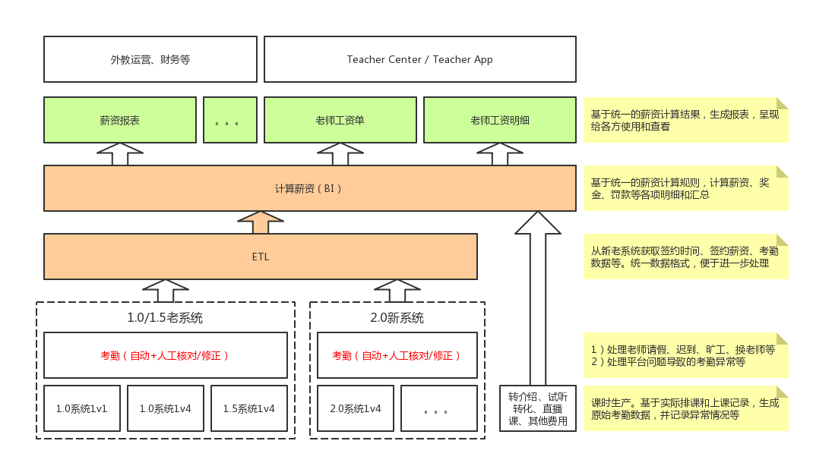

# 统一外教薪资系统

<link rel="stylesheet" href="https://yanwei.github.io/auto-number-title.css" />

v1.0, Last Update: 2018.12.01

## 目标

* 统一1.0、1.5、2.0等各个不同系统的外教薪资计算
* 简化处理和计算逻辑，降低人工成本和差错率
* 适应未来可能的规则调整，做到“改变薪资规则无需发版，运营后台配置即可”
* 更强大和灵活的报表系统

## 系统结构

## 功能说明

* 课时生产
* 考勤管理
* 数据整合
* 薪资计算
  * 1.0系统1v1薪资
  * 1.0系统1v4薪资
  * 1.5系统1v4薪资
  * 2.0系统薪资
  * 奖金
  * 等待薪资
  * 罚款
* 其他费用
  * 转介绍奖金
  * 试听转化奖金
  * 其他
* 报表

## 签约信息

* 签约时长
* 签约薪资
* 等待薪资

## 考勤信息

* 时间
* 老师
* 车位（time slot）
* 课程类型
* 课程ID
* 上课时间
* 上课人数（学生ID）
* 是否失约
* 课程状态
* 课程属性
* 进入教室时间
* 离开教室时间
* 是否按时提交评语

## 计算规则

参见excel文档。另附。

## 报表

* 薪资报表（总表）

|分类|字段|含义|说明|
|---|---|---|---|
|基本信息|老师ID|老师唯一ID（工号）|新老系统保持统一|
||老师姓名|老师英文名|
||币种|按何种货币结算|目前统一按美元结算|
||计薪周期||一个自然月内可能分成多段|
||签约时长|计薪周期内累计签约时长|小时|
|基本薪资|1v1签约薪资||美元/小时|
||1v1上课时长||小时|
||1v1总薪资||美元|
||1v4签约薪资||美元/小时|
||1v4上课时长||小时|
||1v4总薪资||美元|
||直播课签约薪资||美元/小时|
||直播课上课时长||小时|
||直播课总薪资||美元|
|奖金|准时奖励标准|计薪周期内无迟到|1美元/小时|
||准时奖励总时长||小时|
||准时总奖金||美元|
||出勤奖励标准|计薪周期内无请假和旷工|1美元/小时|
||出勤奖励总时长||小时|
||出勤总奖金||美元|
||课后评价奖励标准|所有课后评价在24小时内完成|1美元/小时|
||课后评价奖励总时长||小时|
||课后评价总奖金||美元|
|等待薪资|高峰时间薪资标准||15美元/小时|
||高峰时间等待总时长||小时|
||高峰时间等待总薪资||美元|
|旷工罚款|罚款标准||美元/小时（一般为1v1签约薪资*2？）|
||旷工总时长||小时|
||旷工总罚款||美元|
|试听课转化|奖励标准||8美元/学生|
||转化学生数||个|
||试听转化总奖金||美元|
|转介绍奖励|>1个月奖励标准||150美元/老师|
||>1个月老师数||个|
||>1个月总奖金||美元
||>3个月奖励标准||50美元/老师|
||>3个月老师数||个|
||>3个月总奖金||美元
|其他费用|转账手续费||美元|
||市场费用||美元|
||其他||美元|
|总薪资|基于以上分项的总计||美元|
|累计无效时间|||小时|
|美国私塾费用|||美元|
|备注信息|
|开户名/PayPal账户名|
|开户行|
|支行|
|银行账号/PayPal账号|
|付款状态|||已支付/未支付|

* 薪资明细表
* 项目拆分
* 老师工资单
* 老师工资明细
