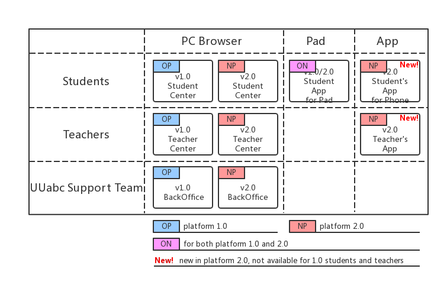

# Guidance for Teacher Service 2.0 (v2018.12.1)

<link rel="stylesheet" href="https://yanwei.github.io/auto-number-title.css" />

v1.0, Last Update: 2018.12.10

## Overview of the whole system: platform 1.0 and platform 2.0

### System overview

UUabc has released the version 2.0 platform in December 2018 which involves a new scheduling system, mobile phone App for the teachers, and self-registration & referral system for candidate teachers.

However, since we still have thousands of students attending the classical one-on-one and one-on-four classes, the version 1.0 platform will still be used for the next couple of months before the students are completely migrated to platform 2.0.

As a result, UUabc's students, teachers, and some of the support team will be divided into two sections.

The following diagram illustrates the differences and relationship between the old and new platforms:

### Schedule & milestone

|Milestone|Date|Event|
|---|---|---|
|M1|Mid. Dec. 2018|release of platform 2.0|
|M2|20 Dec. 2018 - 20 Jan. 2019|training for platform 2.0|
|M3|2 Jan. 2019 - 20 Jan. 2019|public test of platform 2.0|
|M4|21 Jan. 2019 - 24 Feb. 2019|the formal winter “semester”|
|M5|25 Feb. 2019 - 30 Jun. 2019|the formal spring “semester”|

## Teacher center and App

### Upgraded teacher center and new teacher App

> todo: screenshot

### New scheduling system

* Fixed students and teachers over the course of a season-long semester.
* Watch your students grow over the course of the “semester”.
* Provide far more meaningful assessments.

### Login

#### for platform 1.0 teachers only

> todo: screenshot of pc and app

[https://teacher.uuabc.com]()

* use email and password to login
* this is the 1.0 teacher center entrance and will be automatically re-directed to https://member.uuabc.com before 21 Jan. 2019.

#### for both platform 1.0 and 2.0 teachers

> todo: screenshot of pc and app

[https://member.uuabc.com]()

* use email and password to login (same as in platform 1.0)
* platform 1.0 teachers will be automatically re-directed to the 1.0 teacher center
* new teachers recuited after 21 Jan. 2019 (TBD) will enter the 2.0 teacher center directly
* before 1 May 2019 (TBD), teachers migrated from platform 1.0 will be prompted whether they would like to enter the 1.0 teacher center or the 2.0 teacher center everytime they sign in (todo: screenshot)
* and, after 1 May 2019 (TBD), all the platform 2.0 teachers will enter the 2.0 teacher center directly

### Check your schedule

> todo: screenshot of pc and app

### Get notified of your classes

> todo: screenshot of pc and app

#### Message center

> todo: screenshot of pc and app

### Start a lesson

> todo: screenshot of pc and app

#### About the classroom

> todo: screenshot of pc and app

### Asking for leave

> todo: screenshot of pc and app

### Records

> todo: screenshot of pc and app

#### Assessment and homework

> todo: screenshot of pc and app

### Submit referrals and track candidates

> todo: screenshot of pc and app

### Get ready for the 'Open Course'

> todo: screenshot of pc and app

### Register a new teacher account and submit your resume

> todo: screenshot of pc and app

## Backoffice (admin)

### Teacher recruitment

### Teacher training

### Teacher management
