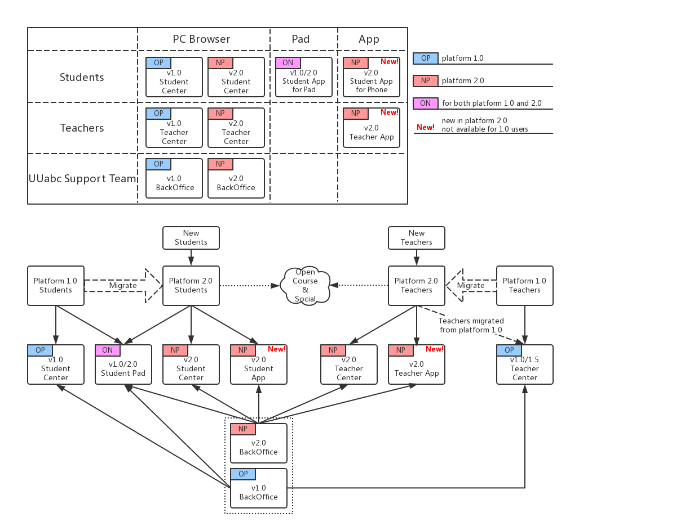
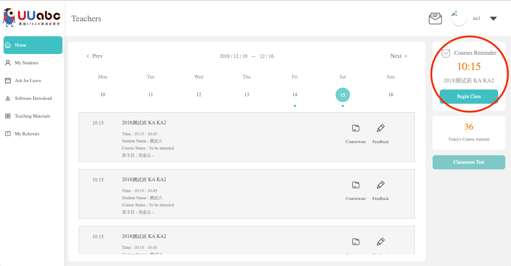
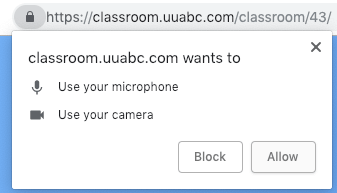
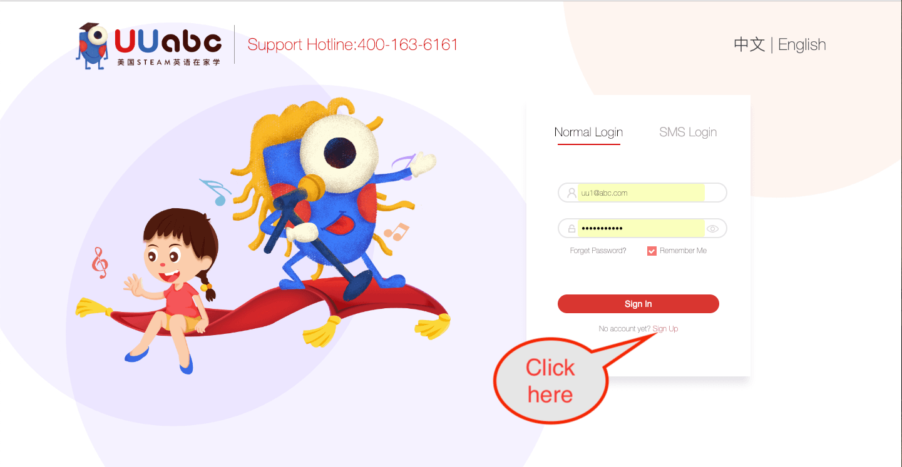
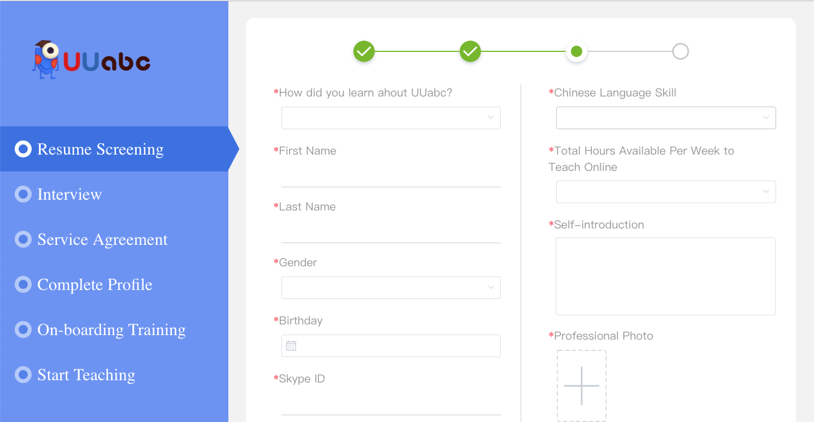

# Guidance for Teacher Center 2.0 (v2018.12.1)

<link rel="stylesheet" href="https://yanwei.github.io/auto-number-title.css" />

v0.1, Last Update: 2018.12.15

## Overview of the whole system: platform 1.0 and 2.0

### System overview

UUabc has released the version 2.0 platform in December 2018 which involves a new scheduling system, mobile phone App for the teachers, and self-registration & referral system for candidate teachers.

However, since we still have thousands of students attending the classical one-on-one and one-on-four classes, the version 1.0 platform will still be used for the next couple of months before the students are completely migrated to platform 2.0.

As a result, UUabc's students, teachers, and some of the support team will be divided into two sections.

The following diagram illustrates the differences and relationship between the old and new platforms:

### Schedule & milestone

|Milestone|Date|Event|
|---|---|---|
|M1|Middle Dec. 2018|release of platform 2.0|
|M2|20 Dec. 2018 - 20 Jan. 2019|training for platform 2.0|
|M3|2 Jan. 2019 - 20 Jan. 2019|public test of platform 2.0|
|M4|21 Jan. 2019 - 24 Feb. 2019|the formal winter “semester”|
|M5|25 Feb. 2019 - 30 Jun. 2019|the formal spring “semester”|

### Demo accounts and Apps

|URL|Account|Password|
|---|---|---|
|[2.0 Teacher Center](http://member.uuabc.com)|`uu1@abc.com`|`uu1@abc.com`|
|[2.0 Student Center](http://member.uuabc.com)|`18120000006`|`18120000006`|
|[2.0 Backoffice](http://member.uuabc.com/admin)|`201807@uuabc.com`|`201807@uuabc.com`|

> Teacher Apps for Android and iOS have already been submitted to Play Store and App Store, and are under review now. You will be informed once the Apps are available for downloading. So screenshots and guidances for the Apps are not included in this version of the document.

<!-- [Download Teacher App for iOS](https://itunes.apple.com/us/app/uuabc/id1235960740?mt=8)

[Download Teacher App for Android](https://play.google.com/store/apps/details?id=com.tencent.mm) -->

### System requirement

* Hardware
  * Windows or macOS compatible computer
  * High-speed and stable internet connection, and cable prefered instead of wi-fi
* Software
  * Windows 7 or later for a PC, and macOS 10.10 (Yosemite) or later for a Mac
  * Google Chrome is the only web browser that officially recommended by UUabc
  * and, please always keep the version of Chrome up-to-date

## Teacher center and App

### Upgraded teacher center and new teacher App

todo: screenshot for the App

### New scheduling system

* Fixed students and teachers over the course of a season-long semester.
* Watch your students grow over the course of the “semester”.
* Provide far more meaningful assessments.

### Login

#### for platform 1.0 teachers only

[Click here to open the 1.0 login page](https://teacher.uuabc.com)

* use email and password to login
* this is the 1.0 teacher center entrance and will be automatically re-directed to 2.0 teacher center before 21 Jan. 2019.

#### for both platform 1.0 and 2.0 teachers

[Click here to open the 2.0 login page](https://member.uuabc.com)

* use email and password to login (same as in platform 1.0, and note that only teachers migrated to platform 2.0 can login right now.)
* platform 1.0 teachers will be automatically re-directed to the 1.0 teacher center
* new teachers recuited after 21 Jan. 2019 (TBD) will enter the 2.0 teacher center directly
* before 1 May 2019 (TBD), teachers migrated from platform 1.0 will be prompted whether they would like to enter the 1.0 teacher center or the 2.0 teacher center everytime they sign in (as shown below)
* and, after 1 May 2019 (TBD), all the platform 2.0 teachers will enter the 2.0 teacher center directly

### Check your schedule

* as shown above, 2 classes are scheduled for December 14th.

### Get notified of your classes

> todo: screenshot of pc and app

#### Message center

> todo: screenshot of pc and app

### Start a lesson

If a lesson is about to start in 15 minutes, a "Begin Class" button will be shown in the "Courses Reminder" area.

Click "Begin Class" to enter the class room.

Click the "Allow" button to enable your microphone and camera when Chrome prompts.

Click the "UU" avatar in the courseware area.

Wait for your students and start the lesson.

#### About the classroom

> todo: screenshot of pc and app

### Asking for leave

And if some classes have been scheduled during your leaving time, you'll get a hint as shown below:

Click the "determine" button to confirm.

### Records

> todo: screenshot of pc and app

#### Assessment and homework

> todo: screenshot of pc and app

### Submit referrals and track candidates

Teachers can now submit candidates and track the status of the recruiting progress.

Fill in the detailed infomation of the candidate and click "Submit".

After you have submitted some candidates, you can check the recruiting progress in the "My Referrals" panel.

### Get ready for the 'Open Course'

> todo: screenshot of pc and app

### Register a new teacher account and submit your resume

[Open the 2.0 login page](https://member.uuabc.com) and click "Sign Up", or, [open the sign-up page for teachers directly](https://teacher.uuabc.com/recruit/#/joinus).

Use a valid email address to register a teacher's account. Follow the steps to check and enter the verification code, and password.

Read and agree with the Privacy Policy to continue.

Follow the instructions to submit your detailed information.

