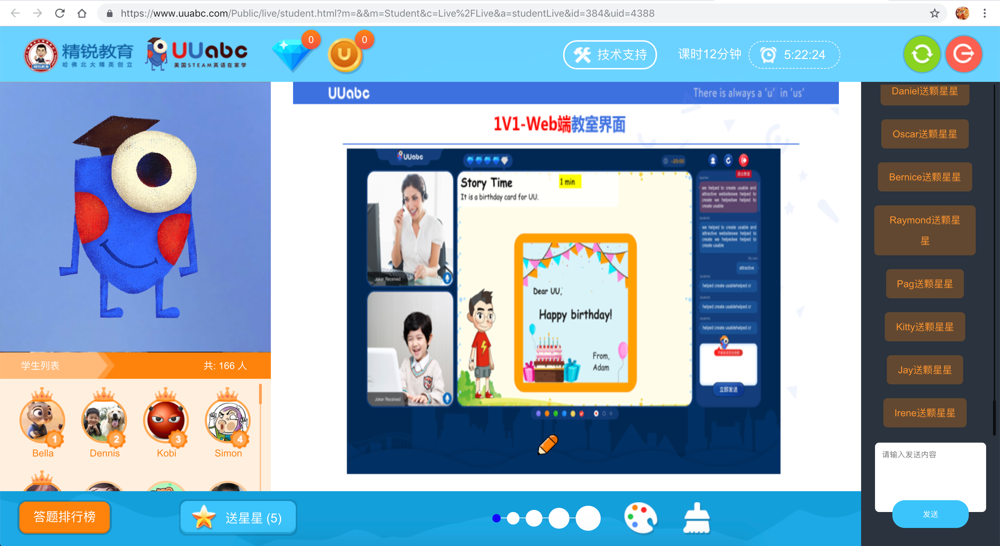

# A Simple Guidance of the Student Member Center

<!-- <link rel="stylesheet" href="https://yanwei.github.io/auto-number-title.css" /> -->

v1.0, Last Update: 2018.11.28

Dear Teacher,

Welcome to use UUabc's student member center to attend our online training. You will act as a real student to have a live open course.

## Step 1: Get your account and password

Check your email or ask Aaron UU to get the account and password for the training classroom.

## Step 2: Login

[Click here to open the student's login page](https://www.uuabc.com/Public/newlogin/index.html#/login)

Enter your account and password to login. Keep the new page opened and go to the next step.

## Step 3: Enter the classroom

[Click here to enter the clssroom](http://www.uuabc.com/shapeLive.html?cid=384)

> Note: This document is for preview only. The link above will be replaced with the real classroom URL after everything is ready.

