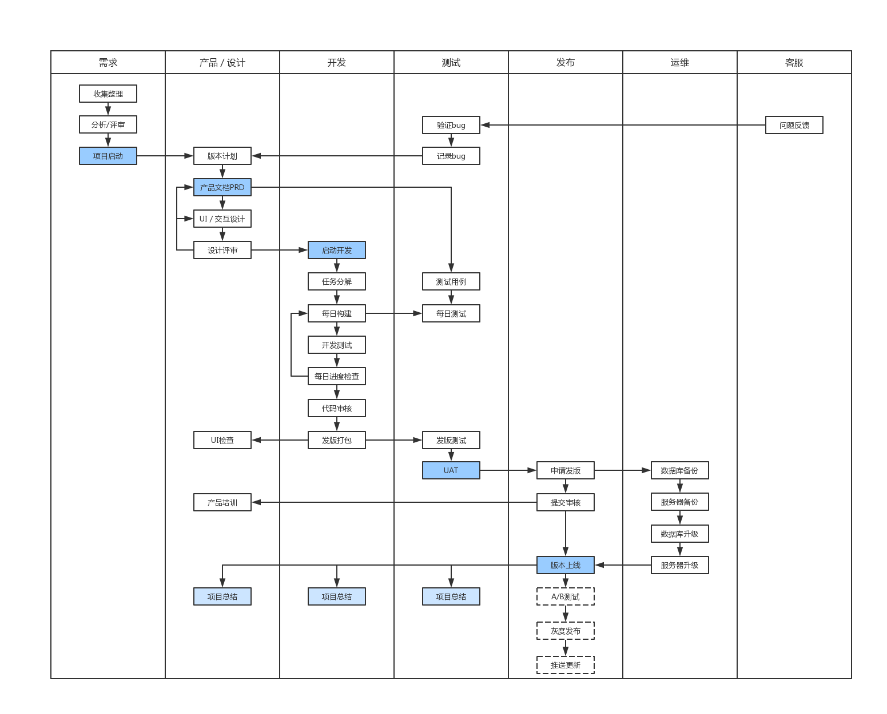
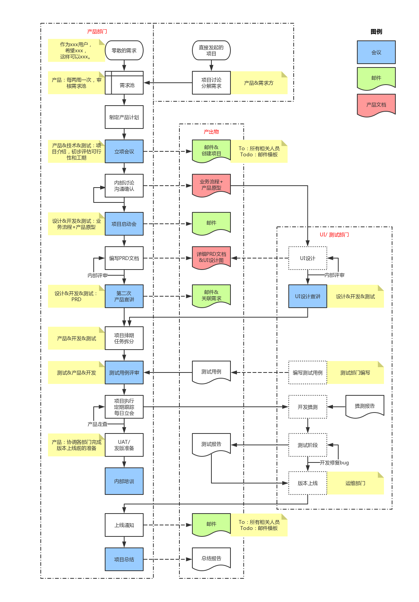

# 【爱贝迪-技术部】产品研发流程

<link rel="stylesheet" href="https://yanwei.github.io/auto-number-title.css" />

修订记录：

版本 | 日期 | 修订人 | 修订内容
--- | --- | --- | ---
v0.1 |2019.11.23 | Victor Yan | 创建本文档

- [【爱贝迪-技术部】产品研发流程](#%e7%88%b1%e8%b4%9d%e8%bf%aa-%e6%8a%80%e6%9c%af%e9%83%a8%e4%ba%a7%e5%93%81%e7%a0%94%e5%8f%91%e6%b5%81%e7%a8%8b)
  - [前言](#%e5%89%8d%e8%a8%80)
    - [目的](#%e7%9b%ae%e7%9a%84)
    - [适用范围](#%e9%80%82%e7%94%a8%e8%8c%83%e5%9b%b4)
    - [产品研发流程](#%e4%ba%a7%e5%93%81%e7%a0%94%e5%8f%91%e6%b5%81%e7%a8%8b)
  - [需求阶段](#%e9%9c%80%e6%b1%82%e9%98%b6%e6%ae%b5)
    - [收集整理](#%e6%94%b6%e9%9b%86%e6%95%b4%e7%90%86)
    - [需求分析](#%e9%9c%80%e6%b1%82%e5%88%86%e6%9e%90)
    - [需求评审](#%e9%9c%80%e6%b1%82%e8%af%84%e5%ae%a1)
  - [产品和设计阶段](#%e4%ba%a7%e5%93%81%e5%92%8c%e8%ae%be%e8%ae%a1%e9%98%b6%e6%ae%b5)
    - [版本计划](#%e7%89%88%e6%9c%ac%e8%ae%a1%e5%88%92)
    - [产品文档](#%e4%ba%a7%e5%93%81%e6%96%87%e6%a1%a3)
    - [UI和交互设计](#ui%e5%92%8c%e4%ba%a4%e4%ba%92%e8%ae%be%e8%ae%a1)
    - [设计评审](#%e8%ae%be%e8%ae%a1%e8%af%84%e5%ae%a1)
    - [UI检查](#ui%e6%a3%80%e6%9f%a5)
    - [产品设计流程](#%e4%ba%a7%e5%93%81%e8%ae%be%e8%ae%a1%e6%b5%81%e7%a8%8b)
  - [开发阶段](#%e5%bc%80%e5%8f%91%e9%98%b6%e6%ae%b5)
    - [项目启动](#%e9%a1%b9%e7%9b%ae%e5%90%af%e5%8a%a8)
    - [任务分解](#%e4%bb%bb%e5%8a%a1%e5%88%86%e8%a7%a3)
    - [每日构建](#%e6%af%8f%e6%97%a5%e6%9e%84%e5%bb%ba)
    - [开发测试](#%e5%bc%80%e5%8f%91%e6%b5%8b%e8%af%95)
    - [每日进度检查](#%e6%af%8f%e6%97%a5%e8%bf%9b%e5%ba%a6%e6%a3%80%e6%9f%a5)
    - [代码审核](#%e4%bb%a3%e7%a0%81%e5%ae%a1%e6%a0%b8)
    - [发版打包](#%e5%8f%91%e7%89%88%e6%89%93%e5%8c%85)
    - [源代码管理](#%e6%ba%90%e4%bb%a3%e7%a0%81%e7%ae%a1%e7%90%86)
  - [测试阶段](#%e6%b5%8b%e8%af%95%e9%98%b6%e6%ae%b5)
    - [验证bug](#%e9%aa%8c%e8%af%81bug)
    - [记录bug](#%e8%ae%b0%e5%bd%95bug)
    - [测试用例](#%e6%b5%8b%e8%af%95%e7%94%a8%e4%be%8b)
    - [每日测试](#%e6%af%8f%e6%97%a5%e6%b5%8b%e8%af%95)
    - [发版测试](#%e5%8f%91%e7%89%88%e6%b5%8b%e8%af%95)
    - [UAT](#uat)
  - [发布阶段](#%e5%8f%91%e5%b8%83%e9%98%b6%e6%ae%b5)
    - [申请发版](#%e7%94%b3%e8%af%b7%e5%8f%91%e7%89%88)
    - [App提交审核](#app%e6%8f%90%e4%ba%a4%e5%ae%a1%e6%a0%b8)
    - [版本上线](#%e7%89%88%e6%9c%ac%e4%b8%8a%e7%ba%bf)
    - [线上验证](#%e7%ba%bf%e4%b8%8a%e9%aa%8c%e8%af%81)
    - [灰度发布/推送更新](#%e7%81%b0%e5%ba%a6%e5%8f%91%e5%b8%83%e6%8e%a8%e9%80%81%e6%9b%b4%e6%96%b0)
  - [运维阶段](#%e8%bf%90%e7%bb%b4%e9%98%b6%e6%ae%b5)
    - [数据库备份](#%e6%95%b0%e6%8d%ae%e5%ba%93%e5%a4%87%e4%bb%bd)
    - [服务器备份](#%e6%9c%8d%e5%8a%a1%e5%99%a8%e5%a4%87%e4%bb%bd)
    - [数据库升级](#%e6%95%b0%e6%8d%ae%e5%ba%93%e5%8d%87%e7%ba%a7)
    - [服务器升级](#%e6%9c%8d%e5%8a%a1%e5%99%a8%e5%8d%87%e7%ba%a7)
    - [权限管理](#%e6%9d%83%e9%99%90%e7%ae%a1%e7%90%86)
  - [运营阶段](#%e8%bf%90%e8%90%a5%e9%98%b6%e6%ae%b5)
    - [问题反馈](#%e9%97%ae%e9%a2%98%e5%8f%8d%e9%a6%88)
  - [项目总结](#%e9%a1%b9%e7%9b%ae%e6%80%bb%e7%bb%93)

## 前言

为规范产品研发的工作流程，本着提高质量，兼顾效率的原则，编写本文档。

### 目的

* 规范从需求管理、产品设计、开发、测试、发布、运维和技术支持等涉及整个产品生命周期的相关流程和制度；

* 产品研发是为公司的业务服务的，因此，整个流程以满足用户和市场需求为前提，在确保产品质量的前提下，充分考虑开发进度的需要，简化现阶段不必要的流程和环节，以达到兼顾效率的原则；

* 此文档可作为指导、规范产品研发日常工作的指引，亦可作为技术部和其他部门之间沟通协作的方式、流程之依据。

### 适用范围

本文档用于技术部内部的工作流程，以及和相关兄弟部门间的协调。对技术部内部而言，本文档覆盖了包括需求管理、产品管理、UI设计、开发、测试、发版、运维和技术支持的方方面面。对产品而言，亦不限于App，后台服务器、网站、H5页面、内部管理系统（CRM / ERP）、第三方合作开发等，都在本文档的管辖范围内。

### 产品研发流程

## 需求阶段

### 收集整理

产品的需求可能来自公司内部、用户、市场、甚至竞品。

* 内部需求：来自公司内部各个层级和部门的需求，需统一汇总到产品负责人处，由后者进行整理汇总，并录入项目管理系统（如Teambition、禅道等）

* 外部需求：由客服部门、市场部门、客户发展部门等收集来的用户或商户的需求，需统一汇总到产品负责人处，由后者进行整理汇总，并录入项目管理系统；

* 竞品需求：产品负责人不定期分析竞品和参考产品的版本迭代情况，并据此提出对公司产品的改进意见，并以需求的形式录入项目管理系统。

> 为规范流程，便于追溯和管理，兄弟部门应以邮件、系统录入等正式方式向技术部提出需求。

**责任人：产品负责人** 
**阶段成果：需求池（录入项目管理系统）**

### 需求分析

技术部内部应定期组织需求分析会，对项目管理系统内的需求进行讨论分析，主要关注需求的实现难度、工作量、对系统其他方面的影响等，并记录分析结果，用于进一步做需求评审的参考。

> 需求分析的结果直接记录在项目管理系统上对应的需求中即可。

**责任人：产品负责人** 
**阶段成果：需求分析结果（录入项目管理系统）**

### 需求评审

公司定期组织需求沟通和评审会，确定需求的优先级，以及后续的版本计划，作为产品部门和设计部门进一步工作的依据。

> 需求评审的结果，将形成【产品计划】，并录入项目管理系统-计划，作为进一步工作之依据。

**责任人：产品负责人** 
**阶段成果：版本计划（录入项目管理系统）**

## 产品和设计阶段

### 版本计划

主要的版本计划来自需求评审。同时，测试负责人在日常工作中不断收集来自各个方面的问题（bug）反馈，经过验证后录入项目管理系统并统一管理。技术部内部需定期对当前存在的所有bug进行分析，确定严重程度和修复优先级，并把相关bug纳入版本计划中去。

> 对严重影响用户体验和产品运营的bug，由产品负责人评估问题的紧急程度，并决定是否需要发布修复问题的专门版本，而不受前述版本计划的限制。

**责任人：产品负责人** 
**阶段成果：版本计划（录入项目管理系统）**

### 产品文档

产品负责人根据版本计划，编写详细的产品需求文档，包括：需求／功能说明、业务流程、数据约束、界面原型、测试要求等，作为进一步UI设计、开发和测试的主要依据。

**责任人：产品负责人** 
**阶段成果：PRD文档（Axure、墨刀等文档）**

### UI和交互设计

UI负责人依据产品文档的描述，设计产品的界面、UI细节（尺寸标注和颜色标注等）和交互细节，作为进一步开发和测试的依据。在此过程中，需和产品负责人不断沟通，以确保设计结果符合产品的需求。

> UI负责人需编写和维护用于指导设计和开发的产品UI规范，包括但不限于颜色、字体、间隔、布局、交互风格等方方面面。

**责任人：UI负责人** 
**阶段成果：UI设计图**

### 设计评审

UI和交互设计完成后，应组织相关部门（包括需求方、开发负责人、测试负责人等）对产品原型和UI设计进行评审，并根据评审结果，对产品文档和UI设计进行修改调整。

**责任人：产品负责人** 
**阶段成果：评审意见（Word文档）**

### UI检查

UI负责人应在开发过程中不断和开发人员进行确认，安装并测试开发过程中的测试版本，以确保最终产品的UI实现符合设计要求和设计细节。对不符之处，作为bug提交给测试负责人，并由后者记录到项目管理系统中。

**责任人：UI负责人** 
**阶段成果：UI方面的bug（录入项目管理系统）**

### 产品设计流程

## 开发阶段

### 项目启动

针对前述形成的的版本计划、产品文档和UI设计文档，组织技术部内部的项目启动会，详细讲解该版本的需求，并组织对开发时间进行预估，设定预期的发版时间。

**责任人：产品负责人** 
**阶段成果：在项目管理系统内创建新项目，并设置项目的时间、团队、需求等**

### 任务分解

开发负责人仔细分析该版本的功能需求，考虑具体的实现方式和人员分配，撰写技术实现文档和接口文档。

**责任人：开发负责人** 
**阶段成果：在项目管理系统上基于需求分解任务，指定到人，并规定完成时间**

### 每日构建

开发人员按分配的任务进行开发，开发过程中需严格参照产品文档和UI设计图。每日下班前需提交当天编写的代码并编译出可运行的版本（Daily Build），供部门内测试并检查开发进度之用。

**责任人：开发负责人** 
**阶段成果：基于每日构建的可供测试的版本**

### 开发测试
开发人员应对自己编写的代码和实现的功能进行基本的测试（单元测试、冒烟测试），以确保代码能满足产品需求和UI设计的要求，代码可运行、没有明显的闪退和卡顿、没有明显的功能异常，可以作为产品负责人和测试负责人进一步测试的依据。

**责任人：开发负责人** 
**阶段成果：功能基本正常的测试版本**

### 每日进度检查

开发负责人应和产品负责人一道，基于每日构建的版本，结合项目管理系统上的任务完成情况，对当前项目的完成情况和进度进行评估，确保开发过程符合进度要求。如果出现明显影响项目进度的问题，应及时和相关人员进行沟通，共同寻求解决方案。

**责任人：开发负责人** 
**阶段成果：开发进度报告**

### 代码审核

开发负责人应定期组织相关开发人员对代码进行审核，包括但不限于代码风格、代码质量、代码性能、对需求的实现方式、数据合法性、边界条件、异常处理、线程同步、数据库设计和访问等，以期在开发过程中提前发现错误，减少bug，并达到提高团队开发水平的目的。

**责任人：开发负责人**

### 发版打包

开发人员完成所有功能需求的代码编写并通过相关部门的测试验收后，提交所有相关代码，并在代码库（git）中打上版本标签（tag），编译最终用于发版的正式版本。正式版本中必须删除（或跳过）用于测试的代码、场景和设置，经过测试负责人和产品负责人的最终验收测试后，由开发负责人提交发版申请。

> 发版打包前必须提交相关代码、打tag，并进行代码审核。发版打包不限于App，后台服务、内部管理系统等，均需遵守测试和发版的要求。Android版本由于需要区分渠道，所以开发人员会提供用于不同渠道的多个版本包（apk）。

**责任人：开发负责人** 
**阶段成果：发布候选版本（Release Candidate）**

### 源代码管理

所有源代码都以项目形式保存在项目所属的Git服务器上。对源代码的管理符合最小化授权原则：即只有需要负责维护修改代码时，才将对应的项目权限分配给有关开发人员。

* 开发人员必须每天提交修改的代码；

* 提交代码时必须同时提交修改说明；

* 代码库中的项目在任何时候必须是完整可编译的，禁止提交未经编译测试的代码；

* 发版前必须提交版本相关的所有完整代码，并打上版本标签（tag）；

* 源代码的权限分配符合最小化授权原则，即按需分配；

* 人员离职前需在将其电脑上的代码和资料进行备份操作后做删除处理，同时删除其对git库的访问权限。

**责任人：研发负责人**

## 测试阶段

### 验证bug

产品在日常运营过程中，会从包括用户、市场、内部人员等各个方面反馈各种问题，测试负责人负责收集来这些问题反馈，区分问题是改进性需求还是系统缺陷（bug），进行验证并将bug录入项目管理系统。对于改进性需求，还需和产品负责人进行沟通，记录相关需求，并在后续对有关需求进行分析和评审。

**责任人：测试负责人** 
**阶段成果：bug列表（录入项目管理系统）**

### 记录bug

测试负责人负责收集来自方方面面的问题，对这些问题进行及时验证，把bug录入项目管理系统，指派给相关的负责人，跟踪bug的解决情况，对修复后的bug进行及时验证。更进一步，测试负责人还需定期分析项目管理系统中录入的所有bug（特别是未解决的bug），帮助开发人员总结开发中存在的问题，以最终达到提高产品质量的目的。

**责任人：测试负责人** 
**阶段成果：bug分析报告**

### 测试用例

在项目启动后，测试负责人根据产品文档和UI设计文档，分析业务流程，对用户的使用场景和业务流程进行分解，形成测试用例，并作为进一步测试的依据。

> 测试用例不仅需要对功能和业务场景进行完整的覆盖，还需考虑特殊场景和意外情况，如用户操作错误、网络异常等。

**责任人：测试负责人** 
**阶段成果：测试用例（录入项目管理系统）**

### 每日测试

测试负责人每天对前一天的每日构建版本进行测试，检查主要的功能逻辑和UI实现是否符合产品要求，并就测试过程中发现的问题和开发人员进行及时沟通。测试发现的bug录入项目管理系统并跟踪处理情况。

**责任人：测试负责人** 
**阶段成果：bug列表（录入项目管理系统）**

### 发版测试

测试负责人基于测试用例，对开发部门提交的发布候选版本进行最终测试，验证版本的功能和性能是否符合产品需求。

> 除了测试当前版本中的新功能外，测试负责人还需在发版前对原有功能进行测试，确保在当前版本的开发过程中没有对原有功能造成“破坏”，这种测试叫“回归测试”。考虑到产品功能的复杂度，对产品中的所有功能进行完整的回归测试是一项非常费时的工作，为了兼顾效率，一般在发版前仅对主要功能进行回归测试。

**责任人：测试负责人** 
**阶段成果：版本测试报告**

### UAT

由产品负责人牵头，邀请相关核心干系人（需求部门、用户等），对系统进行整体验收，确保功能符合用户要求，同时，达到信息同步的目的。

**责任人：产品负责人**

## 发布阶段

### 申请发版

版本通过发版测试后，由开发负责人提出发版申请。发版申请需以邮件方式或书面方式提出，由需求提出方、产品负责人、UI负责人和测试负责人共同确认同意之后方可发版。

> 发版申请不限于App，后台服务、内部管理系统等，均需遵守测试和发版的要求。

**责任人：研发负责人**

### App提交审核

App的发版需要提交到应用市场审核。在App的发版申请通过后，需由相关人员把版本提交到对应的渠道。对iOS版本，由开发负责人直接把最终版本提交到App Store；对Android版本，由产品负责人把版本提交到各个分发渠道。

> 各个应用市场的审核规则和审核时间差别很大，相关负责人需在版本提交后关注版本审核的进度，及时解决可能出现的各种问题。

**责任人：产品负责人** 
**阶段成果：版本提交到各个应用市场**

### 版本上线

对App版本来说，应用市场审核通过即可上线。对后台服务器和内部系统而言，通过内部发版申请即可上线。版本上线后，需由相关负责人以邮件或企业微信的方式，发布内部通知，让所有相关人员及时了解到版本的动态。

> 版本上线的时间也是一个重要问题。一般来说，特别对后台发版而言，应避开用户使用的高峰时段、下班前、节假日前等时间，防止影响过多用户，以及版本出现问题时开发人员无法及时解决。

**责任人：产品负责人** 
**阶段成果：版本上线的书面通知**

### 线上验证

虽然在版本上线前已经进行了充分测试，但是由于系统的复杂性，并不能保证上线后各项功能100%正常。应该由测试负责人组织相关干系人，对上线后系统的核心功能进行检查，除了确保新上线的版本功能正常外，还应确保不会影响系统原有功能和业务。

> 如果线上验证失败，应立即组织相关干系人进行评估，启动回滚或应急处理机制。

**责任人：测试负责人**

### 灰度发布/推送更新

App版本上线后，多数应用市场都能对用户手机上的App进行自动更新。但是，对上线后仍然运行老版本的用户，需要按一定策略进行提示，敦促用户手动更新版本，以体验最新版本的功能。

* 紧急修复bug的版本。该bug可能在用户使用过程中产生严重问题；

* 长时间不更新的版本。比如用户依然在运行半年前的版本；

* 为特定活动而发布的版本。希望用户能尽早更新到新版本，以便参与活动。

**责任人：产品负责人**

## 运维阶段

### 数据库备份

出于数据安全性考虑，运维负责人应定期对数据库进行备份。目前主要是通过阿里云RDS的自动备份机制进行：每天夜间对所有数据自动进行备份，并在服务器上保存最近30天的完整备份。

同时，在服务器发版前，如果涉及到数据库结构和数据的修改，也应手动对数据库进行备份，防止因程序bug或操作错误导致的数据损坏。

> 事实上，任何对数据库进行表结构修改和批量修改的操作前，都必须对数据进行备份。

**责任人：运维负责人** 
**阶段成果：数据库备份文件（保存在阿里云上）**

### 服务器备份

同样，出于安全性考虑，运维负责人应对服务器进行备份。在服务器发版前，需要对服务器上的老版本进行备份，以便在新版本出现问题时可以迅速恢复至老版本。

**责任人：运维负责人** 
**阶段成果：服务器备份文件（保存在阿里云上）**

### 数据库升级

数据库的升级包括数据结构升级和数据升级两种情况。除了必须的数据库备份外，在进行升级前，必须由相关人员对升级操作相关的SDL和SQL语句进行审核，确保数据升级不会产生严重的错误。

***备份，备份！审核，审核！***

**责任人：研发负责人**

### 服务器升级

在服务器版本通过测试和发版申请后，由开发负责人在合适的时候（避开高峰、放假前等）对服务器版本进行升级。任何未经审批的发版都是绝对禁止的。

和App的版本上线一样，服务器新版本上线后，必须以邮件方式通知所有相关人员。

***备份，备份！审核，审核！***

**责任人：研发负责人**

### 权限管理

对服务器、数据库等的管理同样必须遵循最小化授权原则：即按需分配。如非必要，尽量不直接使用root（Linux）和Administrator（Windows）账号，而是创建对应的用户（User）账号。禁止任何人在自己的开发电脑上使用可读写账号（如rootuser）连接数据库，任何对数据库进行直接修改的操作，必须在获得审批通过之后，通过专用的跳板机进行。

**责任人：运维负责人**

## 运营阶段

### 问题反馈

用户可以通过很多方式反馈问题：校区、合作伙伴、App内的用户反馈等。测试负责人收集所有方面反馈来的问题，进行记录，并验证问题是否是改进性需求还是bug。技术部内部对这些改进性需求和bug进行分析（可能还要进行需求评审），并将相关需求和bug修改列入后续的版本计划中去。

**责任人：测试负责人** 
**阶段成果：需求和bug列表（录入项目管理系统）**

## 项目总结

技术部内部应在项目完成后进行总结。总结的范围包括但不限于：项目开发过程中出现的问题以及如何加以改进；如何提高开发效率和产品质量；如何更加高效的进行沟通等。

**责任人：产品负责人** 
**阶段成果：项目总结文档**
