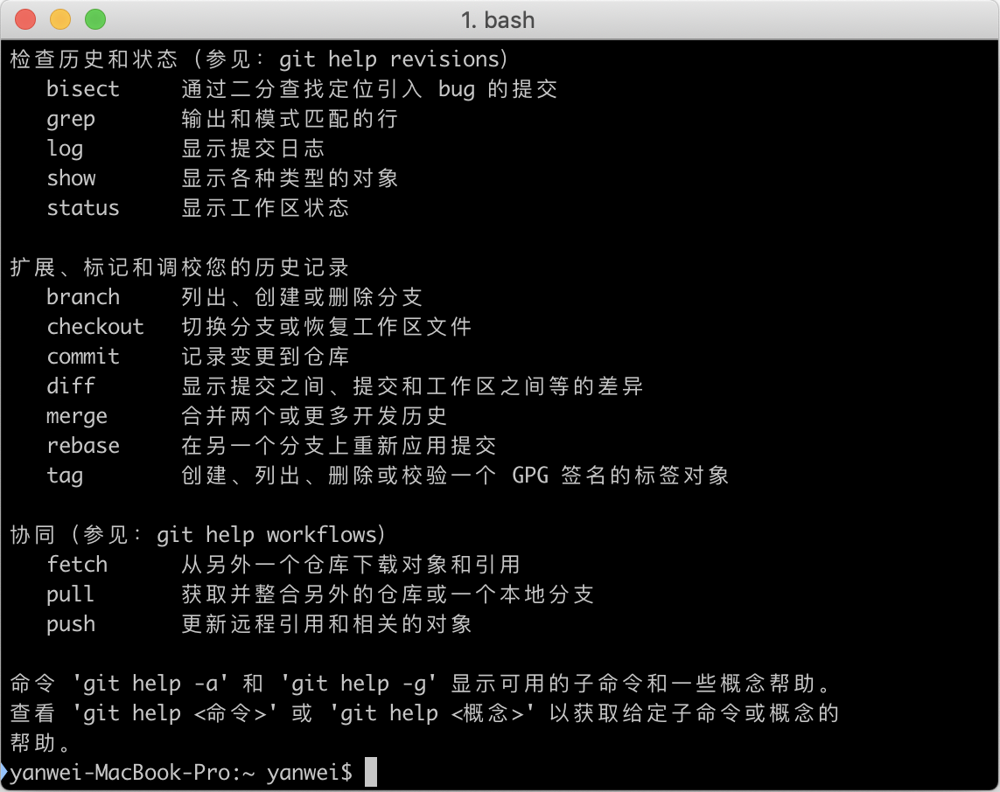
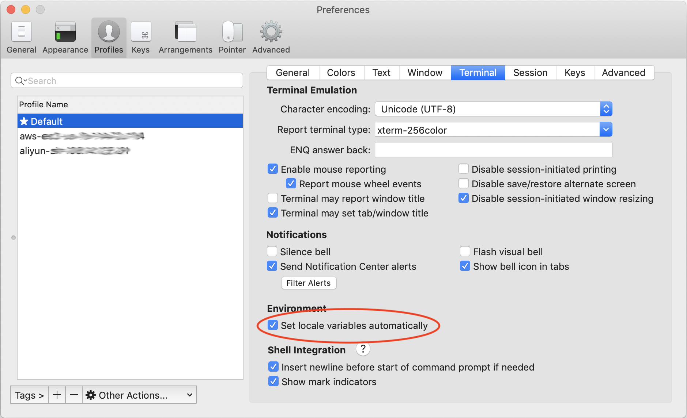
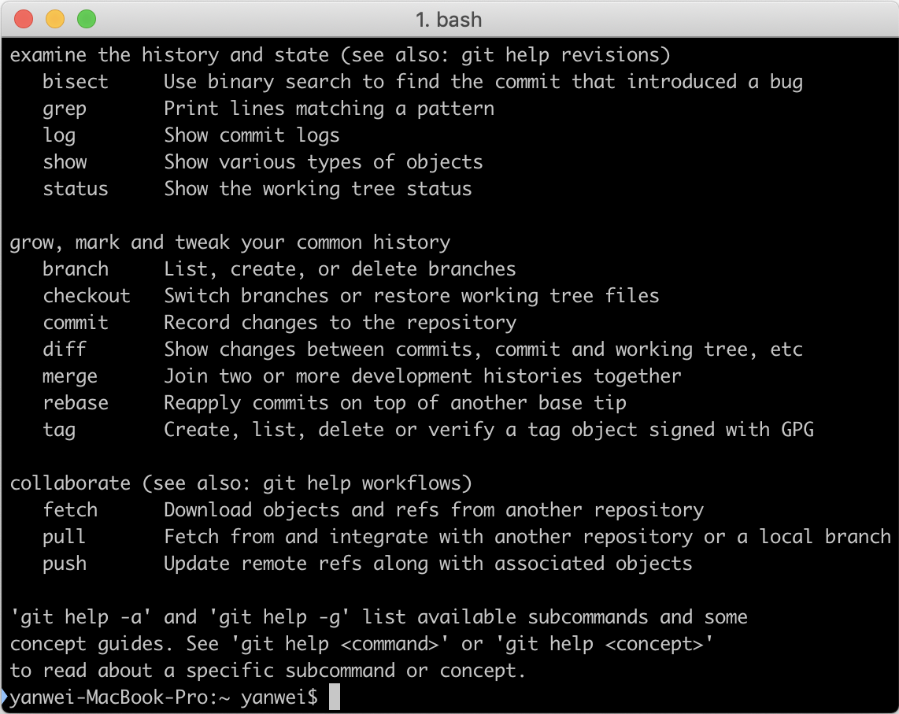

# 解决iTerm2中git命令行显示中文的问题

<link rel="stylesheet" href="https://yanwei.github.io/auto-number-title.css" />

```json
{"Author":"yanwei", "LastUpdate":"2018-11-17"}
```

```text
2018-11-17补充：
按本文修改设置后，iTerm2中命令行中文文件名无法显示了，vi打开包含中文的文件也显示乱码。这是个问题。。。
```

## 版本信息

```text
macOS Mojave 10.14.1
iTmer2 Build 3.2.5
```

## 问题

Mac上安装iTerm2后，运行git，发现命令提示是中文的。



但是在系统自带的Terminal中运行git，命令提示是英文的。

## 分析

在iTerm2中运行：

```bash
$ echo $LANG
zh_CN.UTF-8
```

在系统自带的Terminal中运行：

```bash
$ echo $LANG

```

说明iTerm2自动设置了`$LANG`环境变量。

## 解决

打开`Preferences --> Profiles`，选择`Default`，点击`Terminal`，清除选择`Set locale variables automatically`



重新启动iTerm2，再次运行git，整个世界清净了。


