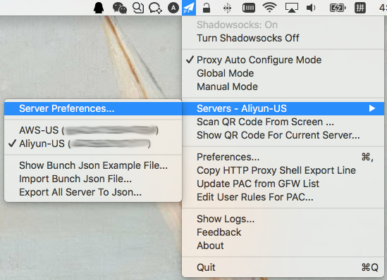
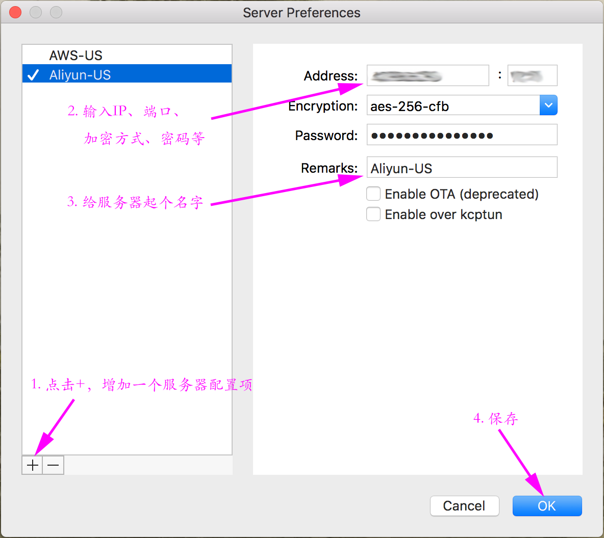
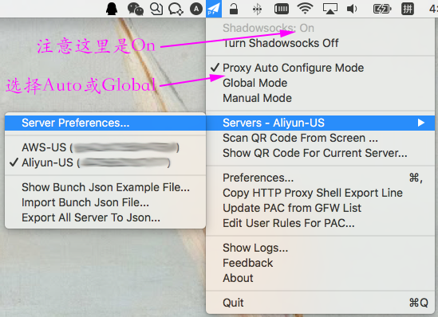

# 科学上网指南-使用篇（客户端）
```JSON
{"Author":"yanwei", "At":"Shanghai", "LastUpdate":"2017-09-14"}
```

## 说明
本文介绍基于Shadowsocks的解决方案。参考[Shadowsocks官网](https://shadowsocks.org/en/download/clients.html)。

## 准备条件
Shadowsocks服务器的IP、端口、密码、加密方式等。

## 安装Shadowsocks客户端
点击[这里](https://shadowsocks.org/en/download/clients.html)下载最新的客户端并进行安装。注意选择对应平台的版本。

这一步基本上没有难度，无论是Windows还是Mac，按常规方法安装就行了。如果出现无法下载的情况，可能需要请能够翻墙的朋友帮个忙。

## 设置
以Mac平台为例。点击顶部菜单栏中的“小飞机”图标：



点击“Server Preferences...”：



注意菜单栏中的选择：



## 最后
好了，现在打开Chrome或你常用的浏览器，就可以愉快的上网啦。

如果出现网站打不开的情况，试试退出Shadowsocks客户端并重新运行。